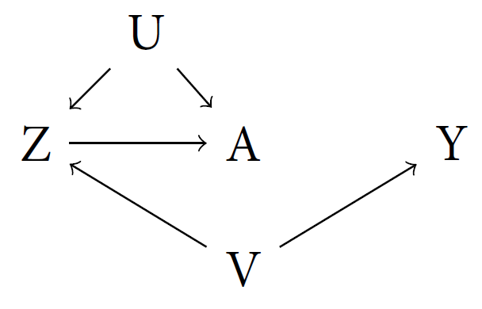
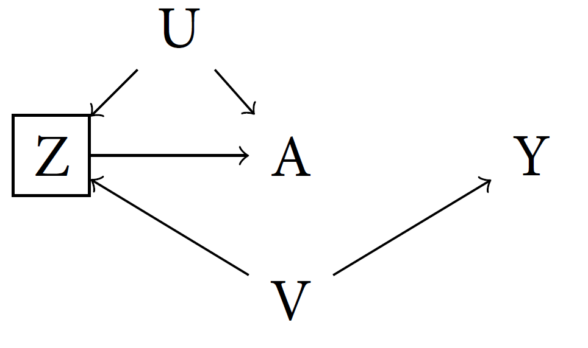
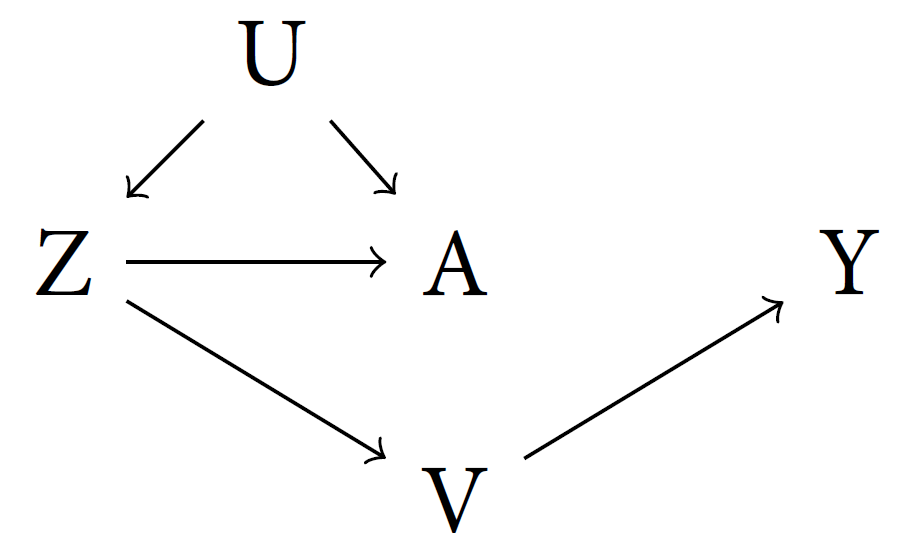

```{r setup, include=FALSE}
knitr::opts_chunk$set(echo = TRUE)

# Useful packages
library(tidyverse)
library(haven)

```

\begin{quote}\itshape
This problem set is due at \textbf{11:59 pm on Thursday, April 28th}.

Please upload your solutions as a .pdf file saved as ``Yourlastname\_Yourfirstinitial\_pset2.pdf''. In addition, an electronic copy of your .Rmd file (saved as ``Yourlastname\_Yourfirstinitial\_pset2.Rmd'') must be submitted to the course website at the same time. We should be able to run your code without error messages. In addition to your solutions, please submit an annotated version of this `.rmd` file saved as ``Yourlastname\_Yourfirstinitial\_pset2\_feedback.rmd'' and a corresponding PDF saved as ``Yourlastname\_Yourfirstinitial\_pset2\_feedback.pdf'' noting the problems where you needed to consult the solutions and why along with any remaining questions or concerns about the material. In order to receive credit, homework submissions must be substantially started and all work must be shown. Late assignments will not be accepted. In total your submissions should consist of four files.
\end{quote}

# Problem 1

In this problem we will revisit the Hyde (2003) study of election observers in Armenia that you examined in Problem Set 1. 

For the purposes of this problem, you will be using the `armenia2003.dta` dataset

The R code below will read in this data (which is stored in the STATA .dta format)
```{r, echo=T, message=F}
### Hyde (2007) Armenia dataset
armenia <- read_dta("armenia2003.dta")
```

See Problem Set 1 for a full description of the data. The relevant columns in the dataset are:

- `kocharian` - Round 1 vote share for the incumbent (Kocharian)
- `mon_voting` - Whether the polling station was monitored in round 1 of the election
- `turnout` - Proportion of registered voters who voted in Round 1
- `totalvoters` - Total number of registered voters recorded for the polling station
- `total` - Total number of votes cast in Round 1
- `urban` - Indicator for whether the polling place was in an urban area (0 = rural, 1 = urban)
- `nearNagorno` - Indicator for whether the polling place is near the Nagorno-Karabakh region (0 = no, 1 = yes)

## Part A

Divide the sample into five strata based on the total number of registered voters at each polling station (`totalvoters`): 

|Stratum|Total Registered Voters|
|-------|-----------------------|
|Tiny| `totalvoters` < 430|
|Small| 430 $\le$ `totalvoters` < 1192|
|Medium| 1192 $\le$ `totalvoters` < 1628|
|Large| 1628 $\le$ `totalvoters` < 1879|
|Huge | 1879 $\le$ `totalvoters` |

Estimate the average treatment effect of election monitoring in round 1 on incumbent vote share using a stratified difference-in-means estimator, stratifying on the total number of registered voters. Provide a 95\% asymptotic confidence interval and interpret your results. Can we reject the null of no average treatment effect at the $\alpha = 0.05$ level? Compare your answer to the unadjusted estimate from Problem Set 1 and discuss why they differ.

## Part B

In Table 4 of the paper, Hyde uses an estimator for the average treatment effect of a polling place receiving election monitors in round 1 on the incumbent's vote share in round 1 *conditional* on the total number of votes cast in the election (`total`). Will this approach be unbiased for the average treatment effect of election monitors on the incumbent's vote share if we believe that one of the mechanisms through which election monitoring operates is by reducing the incidence of ballot-stuffing (which inflates the number of "cast" votes in the election)?  Why or why not?


# Problem 2

Consider the following causal directed acyclic graph:

```{r, echo=FALSE, fig.cap="", out.width = '25%',fig.align="center"}

```

## Part A

List all of the paths from A to Y and identify those paths as causal or noncausal.

## Part B

Given the DAG in Figure 1, are A and Y dependent?

## Part C

```{r, echo=FALSE, fig.cap="", out.width = '25%',fig.align="center"}

```

Suppose that we control for Z (by regression, subclassification, etc), are A and Y dependent given Z?

## Part D

```{r, echo=FALSE, fig.cap="", out.width = '25%',fig.align="center"}

```

Suppose now that we flip the direction of the arrow from V to Z, so that Z $\implies$ V (Figure 3). In this revised DAG, are A and Y dependent?

## Part E

Suppose in this revised DAG we now control for Z. Are A and Y dependent given Z?

# Problem 3

In new democracies and post-conflict settings, Truth and Reconciliation Commissions (TRCs) are often tasked with investigating and reporting about wrongdoing in previous governments. Depending on the context, institutions such as TRCs are expected to reduce conflict (e.g. racial hostilities) and promote peace. 

In 1995, South Africa's new government formed a national TRC in the aftermath of apartheid. [Gibson 2004](https://pages.wustl.edu/files/pages/imce/jlgibson/ajps2004.pdf) uses survey data collected from 2000-2001 to examine whether this TRC promoted inter-racial reconciliation. The outcome of interest is respondent racial attitudes (as measured by the level of agreement with the prompt: "I find it difficult to understand the customs and ways of [the opposite racial group]".) The treatment is "exposure to the TRC" as measured by the individual's level of self-reported knowledge about the TRC. 

You will need to use the `trc_data.dta` file for this question. The code below reads the data into R

```{r trc, echo=T, warining=F, message=F}
trc <- read_dta("trc_data.dta")
```

The relevant variables are:

- `RUSTAND` - Outcome: respondent's racial attitudes (higher values indicate greater agreement)

- `TRCKNOW` - Treatment dummy (1 = if knows about the TRC, 0 = otherwise)

- `age` - Respondent age (in 2001)

- `female` - Respondent gender

- `wealth` - Measure of wealth constructed based on asset ownership (assets are fridge, floor polisher, vacuum cleaner, microwave oven, hi-fi, washing machine, telephone, TV, car)

- `religiosity` - Self-reported religiosity (7 point scale)

- `ethsalience` - Self-reported ethnic identification (4 point scale)

- `rcblack` - Respondent is black

- `rcwhite` - Respondent is white

- `rccol` - Respondent is coloured (distinct multiracial ethnic group)

- `EDUC` - Level of education (9 point scale)

## Part A

Estimate the average treatment effect of TRC exposure on respondents' racial attitudes under the assumption that TRC exposure is completely ignorable. Report a 95\% confidence interval for your estimate and interpret your results.

## Part B

Examine whether exposed and nonexposed respondents differ on the full set of observed covariates using a series of balance tests.
In which ways do exposed and nonexposed respondents differ? What does this tell you about whether the assumption that TRC exposure is completely ignorable is reasonable?

## Part C

Now assume that TRC exposure is conditionally ignorable given the set of observed covariates. Use an additive logistic regression model to estimate the propensity score for each observation. With this model, construct inverse propensity of treatment weights (IPTW) for each observation and compute a point estimate for the ATE.

## Part D

Using a pairs bootstrap (resampling individual rows of the data with replacement), obtain estimate for the standard error of your IPTW estimator for the ATE. Compute a 95\% confidence interval and interpret your findings. Compare your results in Parts C/D to your estimate from Part A and discuss.

## Part E

Now, instead of weighting, we will consider stratification on the propensity score directly.

Based on its estimated propensity score, assign each observation to one of six equally-sized strata (bins). Examine the stratum with the highest propensity scores and, within that stratum, carry out a series of balance tests between exposed and nonexposed respondents for the full set of observed covariates. How does the balance within this particular stratum compare to the overall balance you found in part B? 

## Part F

Estimate the average treatment effect using a stratified difference-in-means estimator based on your strata from Part E. Use the typical stratified variance estimator (don't bootstrap here) and report a 95\% confidence interval. Compare your results to your findings in Part A and your results from D.

# Problem 4

Consider an experiment with $N$ units. Each unit $i$ in the sample belongs to one of $G$ mutually exclusive strata. $G_i = g$ denotes that the $i$th unit belongs to stratum $g$. $N_g$ denotes the size of stratum $g$ and $N_{t,g}$ denotes the number of treated units in that stratum. Suppose that treatment is assigned via complete randomization within each block. Within each stratum, $N_{t,g}$ units are randomly selected to receive treatment and the remainder: $N_{c,g} = N_{g} - N_{t,g}$ receive control. Assume that the proportion of treated units in each stratum, $\frac{N_{t,g}}{N_g}$, varies depending on the stratum but is a known constant. After treatment is assigned, you record an outcome $Y_i$ for each unit in the sample. Assume consistency holds with respect to the potential outcomes: $$Y_i =D_i Y_i(1) + (1-D_i)Y_i(0)$$. In total, there are $N_t = \sum_{g=1}^G \frac{N_{t,g}}{N_{g}}$ treated units and $N_c = \sum_{g=1}^G \frac{N_{c,g}}{N_g}$ control units.

The probability that a unit $i$ receives treatment can be written as function of its group membership: $Pr(D_i = 1 | G_i) = \frac{N_{t,G_i}}{N_{G_i}}$.

Consider finite sample inference for the SATE $\tau$ (no sampling from a super-population, potential outcomes are fixed)

$$\tau = \frac{1}{N}\sum_{i=1}^N Y_i(1) - Y_i(0)$$

## Part A

Show that if $\frac{N_{t,g}}{N_g}$ is not the same for all $g$, the simple difference-in-means estimator $\hat{\tau}$ is biased for the SATE.

$$\hat{\tau} = \frac{1}{N_t}\sum_{i=1}^N Y_iD_i - \frac{1}{N_c}\sum_{i=1}^N Y_i(1-D_i)$$

Hint: Take the expectation of $\hat{\tau}$ conditional on potential outcomes $\mathbf{Y}(1)$, $\mathbf{Y}(0)$ and known group indicators $\mathbf{G}$.

## Part B

Consider the following weighted estimator where $w^{(1)}_i$ and $w^{(0)}_i$ are known constant weights for each observation: 

$$\hat{\tau}_{w} = \frac{1}{N_t}\sum_{i=1}^N Y_iD_iw^{(1)}_i - \frac{1}{N_c}\sum_{i=1}^N Y_i(1-D_i)w^{(0)}_i$$
Using your result from Part A, find an expression for both $w_i^{(1)}$ and $w^{(0)}_i$ that makes $\hat{\tau}_{w}$ unbiased for the SATE. Interpret the weights substantively - what do they represent?

Hint: Your weights will be a function of the group membership indicator $G_i$.
