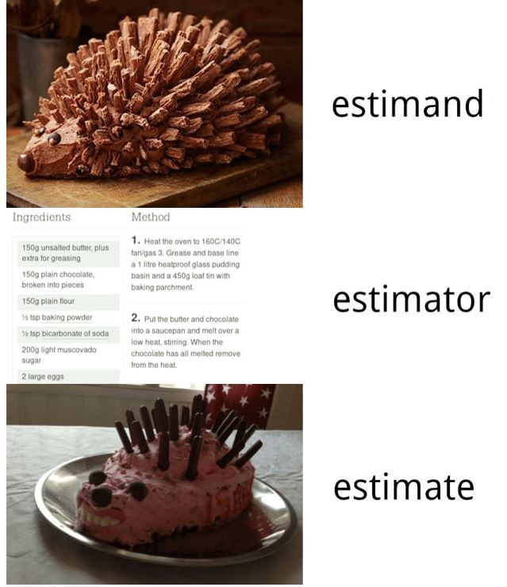

class: title-slide

# Welcome!
$$
  \require{cancel}
$$

---

# Course Overview

- Instructor: .maroon[Anton Strezhnev]
- TA: .maroon[Arthur Yu]
--

- Logistics:
  - Lectures M/W - 3:00pm - 4:20pm; Sections F - 9:30 - 10:20am
  - 3 Problem Sets (~ 2 weeks)
  - Take-home midterm and final (~ 1 week)
  - My office hours: Tuesdays 1pm-3pm (Pick 328)
  - Arthur's office hours: Fridays 10:30-12:30pm (Pick 312)
--

- What is this course about?
  - *Defining* causal effects w/ a structured statistical framework (potential outcomes)
  - *Outlining* assumptions necessary to identify causal effects from data
  - *Estimating* and conducting *inference* on causal effects
--

- Goals for the course
  - Give you the tools you need to develop your own causal
  research designs and comment on others' designs.
  - Equip you with an understanding of the fundamentals of causal inference
  to enable you to learn new methods.
  - Professionalization -- how did causal inference emerge as a field
  and how do different disciplines approach the topic.

---

# Course workflow 

- .maroon[Lectures]
  - Topics organized by week
  - Monday lecture: Introduction + higher-level overview
  - Wednesday lecture: More in-depth details + applications
    - You should do the readings prior to each week, but definitely be 
    sure to do them before the Wednesday.
--
- .maroon[Readings]
  - Mix of textbooks and papers - theory + application.
  - Organized on the syllabus by priority. .maroon[Try] to do all of them, but if 
  you need to prioritize, start with the first ones on the list for the week.
  - All readings available digitally on .maroon[Canvas]
  
---

# Course workflow

- .maroon[Problem sets] (25% of your grade)
  - Main component of the class -- meant to get you working with your colleagues and
  thinking hard about the material.
  - The goal is learning by doing. So we won't be grading on correctness but more 
  on effort.
  - Solutions **will be posted** a week after the problem set is released. You
  should work on the problem sets without them but check your work afterward.
  - In addition to your write-up, you will also submit a brief survey about which questions
  you found challenging and needed to consult the solutions for + any concepts that are still unclear
  - Collaboration is **strongly encouraged** -- you should ask and answer questions on our private class
  Stack Overflow (link + invitation in the syllabus).
  
---

# Course workflow

- .maroon[Exams] (65% of your grade)
  - Exams will be structured like the problem sets with three main differences:
      1. Slightly shorter (you have about 1 week to complete them instead of 2)
      2. You are graded on correctness (solutions obviously will not be posted)
      3. You may **not** collaborate with one another on the exams.
--
- .maroon[Participation] (10% of your grade)
  - It is important that you actively engage with lecture and section -- ask and answer questions.
  - Do the reading! Wednesdays will open with an informal quiz/discussion on topics from the assigned chapters/papers
  for that week.
  - Participating on Stack Overflow counts towards this as well.

---

# Class Requirements

  - **Overall**: An interest in learning and willingness to ask questions.
--

  - Generally assume some background in probability theory and statistics (e.g. an 
 intro course taught in most departments)
    - Regression a plus but not required -- if you know what $(X^{\prime}X)^{-1}X^{\prime}Y$ is, then 
  that is great, but not strictly necessary.
--

  - Main concepts to be familiar with:
    - properties of random variables
    - estimands and estimators
    - bias, variance, consistency
    - central limit theorem
    - confidence intervals; hypothesis testing

---

# A brief overview

  - **Week 1:** Introduction to potential outcomes
    - Defining causal estimands
--
  - **Week 2-3:** Experiments
    - Why they work, design, inference
--
  - **Week 4-5:** Selection-on-observables
    - Key assumptions, graphical models, how to think about confounding
    - Estimation via regression, weighting, matching + combinations
--
  - **Week 6-8:** Designs for dealing with unobserved confounding
    - Instrumental variables
    - Differences-in-differences
    - Regression discontinuity
--
  - **Week 9:** Causal mediation; Sensitivity analyses
  
---
class: title-slide

# Random variables and estimators

---

# Random variables

  - Understanding the behavior and properties of .maroon[random variables] is at the core of statistical theory.
  - A random variable $X$ is a mapping from a **sample space** to the real number line
    - Measure theory gives a more general and precise definition (mapping to a *measureable space*), but we'll only really
    work with real-valued r.v.s
--
  - Random variables have a *distribution* (which we may or may not assume we know) defined by the cumulative distribution function 
  (CDF)
  
  $$F(x) = Pr(X \le x)$$

---

# Random variables

  - Discrete random variables take on a countable number of values (e.g. Bernoulli r.v. can take on 0 or 1) and have a probability
  mass function (PMF)
  
  $$p(x) = Pr(X = x)$$
--

  - Continuous random variables take on an uncountable number of values (e.g. the Normal distribution on $(-\infty,  \infty)$).
  No PMF, but have a *density* function (PDF) that integrates to a probability
  
  $$Pr(X \in \mathcal{A}) = \int_{\mathcal{A}} f(x)dx$$
--

  - .maroon[Remember]: PMFs (and PDFs) sum (integrate) to $1$ over the support of the random variable.
  
---

# Expectations

  - One important property of a random variable is its expectation $E[X]$. We'll often make assumptions about the expectation
  of an R.V. while remaining agnostic about its true distribution.
--

  - The expectation is a *weighted average*. For a discrete r.v. $X$, we sum over the support of the random variable $\mathcal{X}$.
  
  $$E[X] = \sum_{x \in \mathcal{X}} x Pr(X = x)$$

  - For continuous r.v. we have an integral
  
  $$E[X] = \int_{x \mathcal{X}} x f(x) dx$$
--

  - Fun fact: we can get the expectation of any function of $g(X)$ just by plugging it into the integral
 
   $$E[g(X)] = \int_{x \mathcal{X}} g(x) f(x) dx$$
 
---

# Expectations

  - You'll probably not have to do any integration in this class. Rather, we'll derive expectations of functions of random variables
  via known properties  
--

  - Most important. **Linearity**. For any two random variables $X$ and $Y$ and constants $a$ and $b$
  
  $$E[aX + bY] = aE[X] + bE[Y]$$
--

  - Note that for any generic function $g()$, $E[g(X)] \neq g(E[X])$. If $g()$ is convex, by Jensen's inequality $E[g(X)] \ge g(E[X])$
--

  - For a binary r.v. $X \in \{0, 1\}$, it's helpful to remember the "fundamental bridge" between expectations and probability
  
  $$E[X] = Pr(X = 1)$$

---

# Variance

  - We also care about the *spread* of a random variable -- how far is the average draw of $X$ from its mean $E[X]$. 
  One measure of this is the variance.
  
  $$Var(X) = E[(X - E[X])^2]$$
--

  - Also written as
  
  $$Var(X) = E[X^2] - E[X]^2$$
--

  - Note that the square is a convex function. Which means that by Jensen's inequality $E[X^2] \ge E[X]^2$. Variances
  *cannot* be negative!
--

  - We also can define a *covariance* between two variables (does $X$ take high values when $Y$ takes high values?)
  
  $$Cov(X, Y) = E\left[(X - E[X])(Y - E[Y])\right] = E[XY] - E[X]E[Y]$$
---

# Variance

  - Again, you won't have to do the integral. Variances have some useful properties.
  - For a constant $a$
  
  $$Var(aX) = a^2Var(X)$$
--

  - For any two random variables $X$ and $Y$
  
  $$Var(X + Y) = Var(X) + Var(Y) + 2Cov(X,Y)$$
  $$Var(X - Y) = Var(X) + Var(Y) - 2Cov(X,Y)$$

--

  - For independent random variables $X$ and $Y$
  
  $$Var(X + Y) = Var(X) + Var(Y)$$
  $$Var(X - Y) = Var(X) + Var(Y)$$
  
---

# Conditional probabilities

  - We will also spend *a lot of time* with conditional distributions and conditional expectations of 
 random variables.
    - What's the probability that an individual enrolls in a job training program 
  given their income?
    - We represent the conditioning set using a vertical bar with the right-hand side 
denoting what is being conditioned on.
      - For example: $Pr(D_i = 1 | X_i = x)$

      
---

# Conditional probabilities

  - **Key concept** - Dependence and independence. If two variables are *independent*, the distribution of 
one does not change conditional on the other. We'll write this using the $\perp \!\!\! \perp$ notation. 

  - $Y_i \perp \!\!\! \perp D_i$ implies

  $$Pr(Y_i = 1 | D_i = 1) = Pr(Y_i = 1 | D_i = 0) = Pr(Y_i = 1)$$
--

  - Otherwise, the two variables are dependent: $Y_i \cancel{\perp \!\!\! \perp} D_i$.

  $$Pr(Y_i = 1 | D_i = 1) \neq Pr(Y_i = 1 | D_i = 0)$$
--

  - Two variables can be *conditionally independent* in that they are independent only when conditioning on
  a third variable. For example, we can have $Y_i \cancel{\perp \!\!\! \perp} D_i$ but $Y_i \perp \!\!\! \perp D_i | X_i$. This implies
  
  $$Pr(Y_i = 1 | D_i = 1, X_i = x) = Pr(Y_i = 1 | D_i = 0, X_i = x) = Pr(Y_i = 1 | X_i =x)$$
  
--

  - **Remember**: Conditional independence *does not* imply independence or vice-versa!
 
---

# Conditional expectations

  - A central object of interest in statistics is the **conditional expectation** function (CEF) $E[Y | X]$.
    - Given a particular value of $X$, what is the expectation of $Y$?
    - The CEF is a function of $X$.
--
  - All the usual properties of expectations apply to conditional expectations.
  - We also will often make use of the *law of total expectation*
  
  $$E[Y] = E[E[Y|X]]$$
--

  - Easiest to think about this in terms of discrete r.v.s
  
  $$E[Y] = \sum_{x \in \mathcal{X}} E[Y | X = x] Pr(X = x)$$

---

# Estimation

  - One critical use of statistical theory is understanding how to learn about things we
  .maroon[don't observe] using things that we .maroon[do observe]. We call this estimation.
    - e.g. What is the share of voters in Wisconsin who will turn out in the 2022 election?
    - What is the share of voters who turn out among those assigned to receive a GOTV phone call?
--
  - .maroon[Estimand]: The **unobserved** quantity that we want to learn about. Often denoted
  via a greek letter (e.g. $\mu$, $\pi$)
    - Often a "population" characteristic that we want to learn about via a sample.
      - But you'll learn another reason why we sometimes can't observe a quantity of interest
    even in a sample!
    - Important to define your estimand well. (Lundberg, Johnson and Stewart, 2022)
---

# Estimation

  - .maroon[Estimator]: The **function** of random variables that we will use to try to 
  estimate the quantity of interest. Often denoted with a hat on the parameter of interest
  (e.g. $\hat{\mu}$, $\hat{\pi}$)
    - Why are the variables random? 
      - Classic inference: We have a random sample from the population -- if we took another sample,
      we would obtain a different realization of our estimator.
      - Randomization inference: We have a randomly assigned treatment -- if we were to 
      re-run the experiment, we would observe a different treatment/control allocation.
--
  - .maroon[Estimate]: A single realization of our estimator (e.g. 0.3, 9.535)
    - We often report both point estimates ("best guess") and interval estimates (e.g. confidence intervals). 
    - Careful not to confuse properties of estimators with properties of the estimates themselves.

---

# Estimation

.center[]
  
---

# Estimation

  - The classic estimation problem in statistics is to estimate some unknown population mean 
  $\mu$ from an i.i.d. sample of $n$ observations $Y_1, Y_2, \dotsc, Y_n$.
--

    - We assume that each $Y_i$ is a draw from the target population with mean $\mu$.
    (identically distributed) -- therefore $E[Y_i] = \mu$
    - We'll also assume that conditioning on $Y_i$ tells us nothing about any other $Y_j$
    $Y_i \perp \!\!\! \perp Y_j$ (independently distributed) -- this implies $Cov(Y_i, Y_j) = 0$
--
  - .maroon[Our estimand:] $\mu$
  - .maroon[Our estimator:] The sample mean $\hat{\mu} = \bar{Y} = \frac{1}{n}\sum_{i=1}^n Y_i$
  - .maroon[Our estimate:] A particular realization of that estimator based on our observed sample (e.g. $0.4$)
--

  - Note that our estimator is a *random variable* -- it's a function of $Y_i$s which are random variables.
    - Therefore it has an expectation $E[\hat{\mu}]$ (assuming $Y_i$ has an expectation)
    - It has a variance $Var(\hat{\mu})$ (again, under regularity conditions)
    - It has a distribution (which we may or may not know).

---

# Estimation

  - How do we know if we've picked a good estimator? Will it be close to the truth? Will it be 
  systematically higher or lower than the target?
--

  - We want to derive some of its properties
    - Bias: $E[\hat{\mu}] - \mu$
    - Variance: $Var(\hat{\mu})$
    - Consistency: Does $\hat{\mu}$ converge in probability to $\mu$ as $n$ goes to infinity?
    - Asymptotic distribution: Is the sampling distribution of $\hat{\mu}$ well approximated by a known distribution?
  
---

# Unbiasedness

 - Is the expectation of $\hat{\mu}$ equal to $\mu$? 
 
 - First we pull out the constant.
 
 $$E[\hat{\mu}] = E\left[\frac{1}{n}\sum_{i=1}^n Y_i\right] = \frac{1}{n}E\left[\sum_{i=1}^n Y_i\right]$$
--

 - Next we use linearity of expectations
 
 $$\frac{1}{n}E\left[\sum_{i=1}^n Y_i\right] = \frac{1}{n}\sum_{i=1}^n E\left[Y_i\right]$$
--

 - Finally, under our i.i.d. assumption
 
 $$\frac{1}{n}\sum_{i=1}^n E\left[Y_i\right] = \frac{1}{n}\sum_{i=1}^n \mu = \frac{n \mu}{n} = \mu$$
--
 
 - Therefore, the bias, $\text{Bias}(\hat{\mu}) = E[\hat{\mu}] - \mu = 0$
 
---

# Variance

 - What is the variance of $\hat{\mu}$? Again, start by pulling out the constant.
 
 $$Var(\hat{\mu}) = Var\left[\frac{1}{n}\sum_{i=1}^n Y_i\right] = \frac{1}{n^2}Var\left[\sum_{i=1}^n Y_i\right]$$
--

 - We can further simplify by using our i.i.d. assumption. The variance of a sum of i.i.d. random variables is the sum of the variances.
 
 $$\frac{1}{n^2}Var\left[\sum_{i=1}^n Y_i\right] = \frac{1}{n^2}\sum_{i=1}^n Var\left[Y_i\right]$$
--

 - "identically distributed" 
 
 $$\frac{1}{n^2}\sum_{i=1}^n Var\left[Y_i\right] = \frac{1}{n^2}\sum_{i=1}^n \sigma^2 = \frac{n\sigma^2}{n^2} = \frac{\sigma^2}{n}$$
--
 
 - Therefore, the variance is $\frac{\sigma^2}{n}$
 
---

# Asymptotic behavior

  - As $n$ gets large, what can we say about the estimator $\hat{\mu}$. 
--

  - First, we can show that it is **consistent** -- it converges in probability to the true parameter $\mu$
    - Unbiasedness + Variance that goes to $0$ as $n$ gets large.
    - Some estimators may be biased but have bias terms that go to $0$ -- if variance also goes to $0$ these are
  still consistent.
--

  - Second, we can say something about the distribution of $\hat{\mu}$.
    - Remember, we've only made assumptions about $E[Y_i]$ and $Var(Y_i)$ (that they exist). We have made
  no assumptions on the distribution of $Y_i$. $Y_i$ can be normal, poisson, bernoulli, or whatever!
    - However, we know something about sums and means of random variables -- they are well-approximated
  by a normal distribution. .maroon[The Central Limit Theorem]!
    - So in large samples, the **sampling distribution** of $\hat{\mu}$ is close to normal. This lets us construct 
  confidence intervals and do inference with this approximation and be confident that we won't be far off!

---

class: title-slide

# The potential outcomes model

---

# Thinking about causal effects

- Two types of causal questions (Gelman and Rubin, 2013)
--

- **Causes of effects**
  - What are the factors that cause some outcome $Y$?
  - "Why?" questions: Why do states go to war? Why do politicians get re-elected?
--

- **Effects of causes**
  - If $X$ were to change, what might happen to $Y$?
  - "What if?" questions: What if a pair of states were democratic, would that change
  their chances of going to war? What if a politician were an incumbent, would that
  affect their re-election probability?
--

- We'll spend more time on the **effects of causes**
  - Why? Because we can connect them to well-defined statistical quantities of
  interest (e.g. an "average treatment effect")
  - "Causes of effects" are still important questions, and theoretical inquiry 
  can lead you towards possible causes to evaluate.

---

# Defining a causal effect

  - Historically, causality was seen as a *deterministic* process.
    - Hume (1740): Causes are regularities in events of "constant conjunctions"
    - Mill (1843): Method of difference
--
  - This became problematic -- empirical observation alone does not demonstrate causality.
    * Russell (1913): Scientists aren't interested in causality! 
--
  - How do we talk about causation that both incorporates *uncertainty* in measurement
  and clearly defines what we mean by a "causal effect"?
--

  - .maroon[Rubin] (1974) - formalizes a framework for understanding causation from
  a statistical perspective. Inspired by earlier Neyman (1923) and Fisher (1935) on randomized
  experiments.
--

  - We'll spend most of our time with this approach, often called the .maroon[Rubin Causal Model]
  or .maroon[potential outcomes] framework.
  
---

# Causality and interventions

  - Causal effects are effects of .maroon[interventions]
    - What happens to an outcome when a treatment is changed.
--
  - It's very difficult to learn about vague causal statements:
    - What is the effect of growth on democracy?
    - What is the effect of exercise on health?
--
  - The .maroon[potential outcomes] framework clarifies:
    1. **What** action is doing the causing?
    2. Compared to **what** alternative action?
    3. On **what** outcome metric?
    4. How would we learn about the effect from data?
  
---

# Statistical setup.

  - Population of units
    - Finite population or infinite super-population
--
  - Sample of $N$ units from the population indexed by $i$
--
  - Observed outcome $Y_i$
--

  - Binary treatment indicator $D_i$.
    - Units receiving "treatment": $D_i = 1$
    - Units receiving "control": $D_i = 0$
--
  - Covariates (observed prior to treatment) $X_i$
  
---

# Potential outcomes

  - Let $D_i$ be the value of a .maroon[treatment] assigned to each individual.
  - $Y_i(d)$ is the value that the outcome would take if $D_i$ were set to $d$.
    - For binary $D_i$: $Y_i(1)$ is the value we would observe if unit $i$ were *treated*.
    - $Y_i(0)$ is the value we would observe if unit $i$ were under *control*
  - We model potential outcomes as .maroon[fixed] attributes of the units.
--

  - .maroon[Notation alert!] -- Sometimes you'll see potential outcomes written as:
    - $Y_i^1$, $Y_i^0$ or $Y_i^{d=1}$, $Y_i^{d=0}$
    - $Y_{i0}$, $Y_{i1}$
    - $Y_1(i)$, $Y_0(i)$ 
--
  - Causal effects are contrasts in potential outcomes.
    - Individual treatment effect: $\tau_i = Y_i(1) - Y_i(0)$
    - Can consider ratios or other transformations \(e.g. $\frac{Y_i(1)}{Y_i(0)}$\)

---

# Consistency/SUTVA

  - How do we link the potential outcomes to observed ones?
  - Consistency/Stable Unit Treatment Value (SUTVA) assumption
    
    $$Y_i(d) = Y_i \text{ if } D_i = d$$
--

  - Sometimes you'll see this w/ binary $D_i$ (often in econometrics)
  
    $$Y_i = Y_i(1)D_i + Y_i(0)(1-D_i)$$
--
  
  - Implications
    1. No interference -- other units' treatments don't affect $i$'s potential outcomes.
    2. Single version of treatment
    3. $D$ is in principle manipulable -- a "well-defined intervention"
    4. The means by which treatment is assigned is irrelevant (a version of 2)

---

# Positivity/Overlap

  - We also need some assumptions on the treatment assignment mechanism $D_i$.
  - In order to be able to observe *some units'* values of $Y_i(1)$ or $Y_i(0)$ treatment can't be deterministic. For all $i$:
    
    $$ 0 < Pr(D_i = 1) < 1 $$
--

  - If no units could ever receive treatment or control it would be impossible to learn about $E[Y_i | D_i = 1]$ or $E[Y_i | D_i = 0]$
  - This is sometimes called a **positivity** or overlap assumption.
    - Pretty trivial in a randomized experiment, but can be tricky in observational studies when $D_i$ is perfectly determined by some covariates $X_i$
  
---

# A missing data problem

- It's useful to think of the causal inference problem in terms of *missingness*
in the complete table of potential outcomes.

Unit  $i$  | Treatment  $D_i$  | $Y_i(1)$ | $Y_i(0)$ | Observed $Y_i$   |
:---------:|:-----------------:|:--------:|:--------:|:----------------:|
 $1$       |  $1$              |  $5$     |   ?      |    $5$           |
 $2$       |  $0$              |  ?       |  $-3$    |    $-3$          |
 $3$       |  $1$              |  $9$     |   ?      |    $9$           |
 $\vdots$  |   $\vdots$        |  $\vdots$| $\vdots$ |      $\vdots$    |
 $N$       |  $0$              |   ?      |   $8$    |   $8$            |
--

- If we could observe both $Y_i(1)$ and $Y_i(0)$ for each unit, then this would be easy!
- But we can't - we only observe what we're given by $D_i$
- .maroon[Holland (1986)] calls this "The Fundamental Problem of Causal Inference"

---

# Causal Estimands

  - All causal inference starts with a definition of the estimand.
--

  - The individual causal effect: $\tau_i$ 
  
    $$\tau_i = Y_i(1) - Y_i(0)$$
--
    - **Problem**: Can't identify this without extremely strong assumptions!
    - "The Fundamental Problem of Causal Inference"
--
  - The **average treatment effect** (ATE): $\tau$
  
    $$\tau = E[Y_i(1) - Y_i(0)]$$
--
      - What is the *expected* effect of the treatment?
      
  
---

# Causal Estimands

  - The **conditional average treatment effect** (CATE): $\tau(x)$
  
    $$\tau(x) = E[Y_i(1) - Y_i(0) | X_i = x]$$
--
      - The average treatment effect for the sub-population with a particular set of covariate values $X_i = x$
 
--

  - The **average treatment effect on the treated** (ATT): $\tau_{\text{ATT}}$
  
    $$\tau_{\text{ATT}} = E[Y_i(1) - Y_i(0) | D_i = 1]$$
--
      - The average treatment effect among those units that were *assigned* treatment.
      
      - Why do we care about this?
        - Sometimes more policy-relevant.
        - Often easier to identify in selection-on-observables designs.
      
  
---

# Causal Estimands

  - The **risk ratio** (RR) for binary outcomes:
  
  $$RR = \frac{Pr(Y_i(1) = 1)}{Pr(Y_i(0) = 1)}$$
--

  - Political science and social sciences rarely use these.
  - Medicine *loves* risk ratios (e.g. Vaccine effectiveness = 1 - RR)
 
---

# Finite Population Estimands

  - For these estimands we have two sources of uncertainty
    - Sampling from a population.
    - Random assignment of treatment (unobserved P.O.s)
--
  - What if we're just interested in doing inference on the treatment effect in the 
  sample, or there is no population from which we sample from?
    - We can define analogues of the ATE for the sample -- the *sample average treatment effect*

    $$\tau_{\text{SATE}} = \frac{1}{N} \sum_{i=1}^N Y_i(1) - Y_i(0)$$
---

# Finite Population Estimands

  - There's *still* uncertainty -- we don't observe all of the potential outcomes. But now we
  don't have to justify generalizing to the population.
    - Under random sampling, the SATE is unbiased for the (population) ATE or PATE.
    - Large literature on when and how we can generalize absent random sampling ("transportability")
--
  - Inference justified on the basis of *randomization* of the treatment.
    - A lot of the same tools for inference in classical super-population sampling transfer over nicely.
      
---

# Causal vs. Associational Estimands

.center[]

---

# Identification

  - In statistics, we often talk about whether a parameter is *identifiable*. 
    - A parameter is "point identified" if, having access to infinite data, the parameter could only take on a single value.
    - In other words, no other value of the parameter could generate the same observable data.
--
  - In statistical models, non-identifiability arises when different values of the parameter could give rise to the same observable data
    - In classical regression: More parameters than observations.
    - Or perfectly collinear regressors

---

# Causal Identification

  - **Causal identification**: Can we learn about the value of a causal effect from the observed data.
    - Can we express the causal estimand \(e.g. $\tau = E[Y_i(1) - Y_i(0)]$\) entirely in terms of *observable* quantities
--
  - Causal identification comes prior to questions of estimation 
    - It doesn't matter whether you're using regression, weighting, matching, doubly-robust estimation, double-LASSO, etc...
    - If you can't answer the question "What's your identification strategy?" then no amount of fancy stats will solve your problems.
--
  - Identification requires *assumptions* about the connection between the observed data $Y_i$, $D_i$ and the unobserved counterfactuals $Y_i(d)$
    - Under what assumptions will the observed difference-in-means *identify* the average treatment effect?
    
---

# Conclusion

- Causal effects are contrasts in .maroon[counterfactuals]
- The potential outcomes framework gives us a tool for defining statistical *estimands* 
in terms of functions of individual effects of treatment.
  - The potential outcome $Y_i(d)$ denotes the outcome $Y_i$ we would observe for unit
  $i$ if they were assigned treatment $d$
  - Implicitly making a consistency/SUTVA assumption to link *observed* to *counterfactual*
- .maroon[Fundamental problem of causal inference]: We're going to need more assumptions -- don't get 
to directly observe individual treatment effects.
- Consistency and positivity only get us part of the way there.
- Next week: What additional assumptions do we need to **identify** causal effects from the observed
data. Why randomized experiments satisfy those assumptions.

