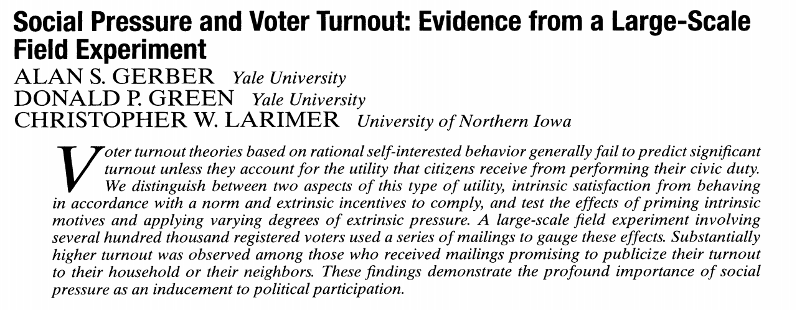

class: title-slide

# Identifying causal effects
$$
  \require{cancel}
$$

---

# Last week

  - We defined fundamental causal quantities in terms of *potential outcomes*
    - The individual treatment effect $\tau_i = Y_i(1) - Y_i(0)$
  - Why can we not identify individual treatment effects (w/o strong assumptions)?
    - Fundamental problem of causal inference!
    - Observed data only reveal $Y_i(1)$ or $Y_i(0)$ (under consistency)

---

# This week

  - What assumptions do we need to identify treatment effects from the data?
    - Consistency + positivity aren't enough!
  - We need some statement about how the treatment was assigned.
    - Ignorability/exogeneity: $\{Y_i(1), Y_i(0)\} {\perp \! \! \! \perp} D_i$
  - Why does a randomized experiment get us this assumption by design?

---

# Identifying the ATT

  - Suppose we want to identify the Average Treatment Effect on the Treated (ATT)
  
  $$\tau_{\text{ATT}} = E[Y_i(1) - Y_i(0) | D_i = 1]$$

  - Let's see what our consistency/SUTVA assumption gets us!
--
  
  - First, let's use linearity:
  
  $$\tau_{\text{ATT}} = E[Y_i(1) | D_i = 1] -  E[Y_i(0) | D_i = 1]$$
--

  - Next, consistency
  
  $$\tau_{\text{ATT}} = E[Y_i | D_i = 1] -  E[Y_i(0) | D_i = 1]$$

---

# Identifying the ATT

  - Still not enough though. We have an *unobserved* term $E[Y_i(0) | D_i = 1]$. Why can't we observe this directly?
  
    $$\tau_{\text{ATT}} = E[Y_i | D_i = 1] -  E[Y_i(0) | D_i = 1]$$
--
  
  - Let's see what the difference would be between the ATT and the simple difference-in-means $E[Y_i | D_i = 1] - E[Y_i | D_i = 0]$. Add and subtract $E[Y_i | D_i = 0]$
  
  $$\tau_{\text{ATT}} = E[Y_i | D_i = 1] -  E[Y_i(0) | D_i = 1] - E[Y_i | D_i = 0] + E[Y_i | D_i = 0]$$
--
  - Rearranging terms
  
  $$\tau_{\text{ATT}} = \bigg(E[Y_i | D_i = 1] -  E[Y_i | D_i = 0]\bigg) - \bigg(E[Y_i(0) | D_i = 1] -  E[Y_i | D_i = 0]\bigg)$$

---

# Identifying the ATT

  - Now we have an expression for the ATT in terms of the difference-in-means and a bias term
  
      $$\tau_{\text{ATT}} = \underbrace{\bigg(E[Y_i | D_i = 1] -  E[Y_i | D_i = 0]\bigg)}_{\text{Difference-in-means}} - \underbrace{\bigg(E[Y_i(0) | D_i = 1] -  E[Y_i(0) | D_i = 0]\bigg)}_{\text{Selection-into-treatment bias}}$$
--
  
  - What does this bias term represent? How can we interpret it?
--

    - How much higher are the potential outcomes under control for units that receive treatment vs. those that receive control.
    - Sometimes called a **selection-into-treatment** problem -- units that choose treatment may have higher or lower potential outcomes than those that choose control.
---

# Identifying the ATC

  - We can use the same exact approach for the ATC and we get a similar expression with a slightly different selection-into-treatment bias term \( $Y_i(1)$ instead of $Y_i(0)$ \)
  
      $$\tau_{\text{ATC}} = \underbrace{\bigg(E[Y_i | D_i = 1] -  E[Y_i | D_i = 0]\bigg)}_{\text{Difference-in-means}} - \underbrace{\bigg(E[Y_i(1) | D_i = 1] -  E[Y_i(1) | D_i = 0]\bigg)}_{\text{Selection-into-treatment bias}}$$
      
--
  - By law of total expectation, we could get the bias for the ATE (this is on your problem set!)
  
  $$\underbrace{E[Y_i(1) - Y_i(0)]}_{\text{ATE}} = \underbrace{E[Y_i(1) - Y_i(0)|D_i = 1}_{\text{ATT}}]Pr(D_i = 1) + \underbrace{E[Y_i(1) - Y_i(0)|D_i = 0]}_{\text{ATC}}Pr(D_i = 0)$$
  
---

# Selection-into-treatment bias

  - Can use theory to "sign the bias" of the difference-in-means.
    - Suppose $Y_i$ was an indicator of whether someone voted in an election and $D_i$ was an indicator for whether they received a political mailer.
    - Consider a world where the mailer was sent out non-randomly to everyone who had signed up for a politician's mailing list. 
    - If we took the difference in turnout rates between voters who received the mailer and voters who did not receive the mailer, would we be over-estimating or under-estimating the effect of treatment? Why?
    

---

# Ignorability/Unconfoundedness

  - What assumption can we make for the difference-in-means to identify the ATE?
--

  - The selection-into-treatment bias for both the ATT and the ATC is $0$
  
  $$E[Y_i(0) | D_i = 1] = E[Y_i(0) | D_i = 0]$$
  $$E[Y_i(1) | D_i = 1] = E[Y_i(1) | D_i = 0]$$
--

  - This will be true under an assumption that treatment is assigned **independent** of the potential outcomes.
 
 $$\{Y_i(1), Y_i(0)\} {\perp \! \! \! \perp} D_i$$

  - Common names for this assumption:  **exogeneity**, **unconfoundedness**, **ignorability**
    - In simple terms: Treatment is not systematically more/less likely to be assigned to units that have higher/lower potential outcomes.

---

# Ignorability/Unconfoundedness

  - What does ignorability give us?
--
  
  - By independence
  
  $$E[Y_i(1) | D_i = 1] = E[Y_i(1)]$$
  $$E[Y_i(0) | D_i = 0] = E[Y_i(0)]$$
    - Technically we only need the above ("mean ignorability") and not full ignorability but there are few cases where we can justify former but not latter.
--
  - Combined with consistency, we get: 
  
  $$E[Y_i | D_i = 1] = E[Y_i(1)]$$
  
  $$E[Y_i | D_i = 0] = E[Y_i(0)]$$

--

  - The observed data identify the ATE!
  
---

# Ignorability/Unconfoundedness

  - To summarize:
--
  
  $$E[Y_i | D_i = 1] - E[Y_i | D_i = 0]$$
  
  $$E[Y_i(1) | D_i = 1] - E[Y_i(0) | D_i = 0]$$
  $$E[Y_i(1)] - E[Y_i(0)]$$
  
  $$E[Y_i(1) - Y_i(0)] = \tau$$
  
--
  
---

# Ignorability/Unconfoundedness

.center[]

---
class: title-slide

# Experiments

---

# Randomized experiments

  - What sort of research design justifies ignorability?
    - One design is a randomized experiment!
--
  - An .maroon[experiment] is any study where a researcher knows and controls the 
  treatment assignment probability $Pr(D_i = 1)$
--

  - A .maroon[randomized experiment] is an experiment that satisfies:
    - Positivity: $0 < Pr(D_i = 1) < 1$ for all units
    - Ignorability: $Pr(D_i = 1| \mathbf{Y}(1), \mathbf{Y}(0)) = Pr(D_i = 1)$ 
      - Another implication of $\mathbf{Y}(1), \mathbf{Y}(0) {\perp \! \! \! \perp} D_i$
      - Treatment assignment probabilities do not depend on the potential outcomes.

---

# Natural experiments

  - The term "natural experiment" gets used a lot in the social sciences.
    - Often used to lend *additional* credibility to a particular observational empirical design.
--
  - What constitutes a .maroon[natural experiment]? Titiunik (2020) argues for three factors
    - Probability of treatment assignment is **not** directly controlled by the researcher.
    - Probability of treatment assignment is **unknown** to the researcher.
    - Probability of treatment assignment is **probabilistic** due to some external event that is outside of subjects' control.
--
  - The credibility of a natural experiment depends on how much we believe that "external event" is unrelated to subjects' potential outcomes.
    - Essentially, another way of trying to justify $\{Y_i(1), Y_i(0)\} {\perp \! \! \! \perp} D_i$
    
---

# Types of experiments

  - Lots of ways in which we could design a randomized experiment where ignorability holds:
--

  - Let $N_t$ be the number of treated units, $N_c$ number of controls
  - .maroon[Bernoulli randomization]:
    - Independent coin flips for each $D_i$. $Pr(D_i = 1) = p$
    - $D_i {\perp \! \! \! \perp} D_j$ for all $i$, $j$.
    - $N_t$, $N_c$ are random variables
--
  - .maroon[Complete randomization]
    - Fix $N_t$ and $N_c$ in advance. Randomly select $N_t$ units to be treated.
    - Each unit has an equal probability to be treated.
    - Each assignment with $N_t$ treated units is equally likely to occur
    - $D_i$ is independent of potential outcomes, but treatment assignment is slightly dependent across units.
    
---

# Types of experiments

  - .maroon[Stratified randomization]
    - Using covariates $X_i$, form $J$ total blocks or strata of units with similar or identical covariate values.
    - Completely randomize *within* each of the $J$ blocks
    - If treatment probabilities are identical within each block, can analyze as though completely random.
--
  - .maroon[Cluster randomization]
    - Each unit $i$ belongs to some larger cluster. $C_i = \{1, 2, \dotsc, C\}$, $C < N$.
    - Treatment is assigned at the cluster level -- randomly Select some number of clusters to be treated, remainder control.
    - If units share cluster membership, they get the same treatment \( $C_i = C_j \leadsto D_i = D_j$ \)
---

# Complete randomization

  - How do we do estimation and inference under complete randomization?
--
  
  - We'll start with the finite-sample setting and illustrate the Neyman (1923; 1990) approach to inference for the SATE.
  - Define our quantity of interest, the sample average treatment effect
  
  $$\tau_{\text{SATE}} = \frac{1}{N}\sum_{i=1}^N Y_i(1) - Y_i(0)$$
  - Our estimator is the sample difference-in-means.
  
  $$\hat{\tau} = \frac{1}{N_t} \sum_{i=1}^N Y_i D_i - \frac{1}{N_c} \sum_{i=1}^N Y_i (1 - D_i)$$ 
  
---
  
# Finite sample inference

  - Why is $\hat{\tau}$ a random variable even when we don't assume sampling from a population?
--

    - Because the treatment is randomized!
    - Different randomizations would lead to different realizations of $\hat{\tau}$.
--
  - Consider a study with $N_t = 3$, $N_c = 3$ and suppose we could see the true "table of science"
  - Under one realization of the treatment $\mathbf{D}$, we have:
  
Unit  $i$  | Treatment  $D_i$  | $Y_i(1)$ | $Y_i(0)$   | Observed $Y_i$   |
:---------:|:-----------------:|:--------:|:----------:|:----------------:|
 $1$       |  $1$              |  $5$     |   $0$      |    $5$           |
 $2$       |  $0$              |  $2$     |  $-3$      |    $-3$          |
 $3$       |  $1$              |  $9$     |   $4$      |    $9$           |
 $4$       |  $0$              |  $4$     |   $-1$     |    $-1$          |
 $5$       |  $0$              |  $1$     |   $-4$     |    $-4$          |
 $6$       |  $1$              |  $2$     |   $-3$     |    $2$           |
 
--

  - For this randomization, our realization of $\hat{\tau}$ (our estimate) would be:
  
  $$\frac{1}{3}(5 + 9 + 2) - \frac{1}{3}(-3 - 1 - 4) = 8$$

---

  
# Finite sample inference

  - How about another, equally likely realization?
  
Unit  $i$  | Treatment  $D_i$  | $Y_i(1)$ | $Y_i(0)$ | Observed $Y_i$   |
:---------:|:-----------------:|:--------:|:--------:|:----------------:|
 $1$       |  $1$              |  $5$     |   $0$    |    $5$           |
 $2$       |  $1$              |  $2$     |  $-3$    |    $2$           |
 $3$       |  $0$              |  $9$     |   $4$    |    $4$           |
 $4$       |  $0$              |  $4$     |   $-1$   |    $-1$          |
 $5$       |  $0$              |  $1$     |   $-4$   |    $-4$          |
 $6$       |  $1$              |  $2$     |   $-3$   |    $2$           |
 
--

  - For this randomization, our realization of $\hat{\tau}$ would be:
  
  $$\frac{1}{3}(5  + 2 + 2) - \frac{1}{3}(4 - 1 - 4) = \frac{10}{3}$$

---

# Finite sample inference

  - Overall all possible randomizations, what is the distribution?
--
  
  - We can run a quick simulation and find out
  
```{r}
### Define the data frame
data <- data.frame(Y_1 = c(5,2,9,4,1,2), 
                   Y_0 = c(0, -3, 4, -1, -4, -3))

## Simulate the sampling distribution
nIter = 10000
sate_est = rep(NA, nIter)
set.seed(60637)

for(i in 1:nIter){
  data$D = sample(rep(c(0,1), each=3))
  data$Y = data$D*data$Y_1 + (1-data$D)*data$Y_0
  sate_est[i] = mean(data$Y[data$D==1]) - mean(data$Y[data$D==0])
}
```

---

# Finite sample inference

```{r, echo=F, fig.width=10, fig.height=8, fig.align='center'}
hist(sate_est, xlab="Estimated SATE", main="")
abline(v=5, lty=2, col="red")

```

---

# Finite sample inference

  - Of course, in real data, we only get one estimate. Need to rely on theory to understand the *distribution* that 
  estimate came from in order to do inference
--

    - Is $\hat{\tau}|\mathbb{Y}(1), \mathbb{Y}(0)$ unbiased for the SATE?
    - What is the sampling variance $Var(\hat{\tau})$ under a finite sample (fixed $\mathbb{Y}(1)$, $\mathbb{Y}(0)$)?
    - What should our estimator of the sampling variance $\widehat{Var(\hat{\tau})}$ be?
  
---

# Unbiasedness

  - We can show that conditional on the potential outcomes $\hat{\tau}$ is unbiased for the SATE. First, by linearity of expectations

  $$E[\hat{\tau}| \mathbb{Y}(1), \mathbb{Y}(0)] = \frac{1}{N_t} \sum_{i=1}^N E\bigg[Y_i D_i \bigg| \mathbb{Y}(1), \mathbb{Y}(0)\bigg] - \frac{1}{N_c} \sum_{i=1}^N E\bigg[Y_i (1 - D_i) \bigg| \mathbb{Y}(1), \mathbb{Y}(0) \bigg]$$ 

--
  - By consistency $Y_iD_i = Y_i(1)D_i$ and $Y_i(1-D_i) = Y_i(0)(1-D_i)$
  
    $$E[\hat{\tau}| \mathbb{Y}(1), \mathbb{Y}(0)] = \frac{1}{N_t} \sum_{i=1}^N E\bigg[Y_i(1) D_i \bigg| \mathbb{Y}(1), \mathbb{Y}(0)\bigg] - \frac{1}{N_c} \sum_{i=1}^N E\bigg[Y_i(0) (1 - D_i) \bigg| \mathbb{Y}(1), \mathbb{Y}(0)\bigg]$$ 

--

  - Conditional on the potential outcomes, $Y_i(1)$ and $Y_i(0)$ are constants
  
    $$E[\hat{\tau}| \mathbb{Y}(1), \mathbb{Y}(0)] = \frac{1}{N_t} \sum_{i=1}^N Y_i(1) E\bigg[ D_i\bigg| \mathbb{Y}(1), \mathbb{Y}(0)\bigg] - \frac{1}{N_c}  \sum_{i=1}^N Y_i(0) E\bigg[(1 - D_i) \bigg| \mathbb{Y}(1), \mathbb{Y}(0)\bigg]$$ 
  
---


# Unbiasedness

  - $D_i$ has a known distribution under complete randomization and its expectation is $Pr(D_i = 1)$, which is just $N_t/N$

  $$E[\hat{\tau}| \mathbb{Y}(1), \mathbb{Y}(0)] = \frac{1}{N_t} \sum_{i=1}^N Y_i(1) \frac{N_t}{N} - \frac{1}{N_c} \sum_{i=1}^N Y_i(0)  \frac{N_c}{N}$$ 
--

  - Pulling out the constants
  
$$E[\hat{\tau}| \mathbb{Y}(1), \mathbb{Y}(0)] = \frac{1}{N} \sum_{i=1}^N Y_i(1)  - \frac{1}{N} \sum_{i=1}^N Y_i(0)$$ 
--

  - Combining the sums, we have the SATE. Therefore the difference-in-means under complete randomization is unbiased for the SATE!

$$E[\hat{\tau}| \mathbb{Y}(1), \mathbb{Y}(0)] = \frac{1}{N} \sum_{i=1}^N  Y_i(1)  -  Y_i(0)$$ 

---

# Sampling variance

- What's the variance of $\hat{\tau}$ going to be (conditional on the sample)? Slightly tricky since $D_i$ is not independent of $D_j$. 

--

 $$Var(\hat{\tau}| \mathbb{Y}(1), \mathbb{Y}(0)) = \frac{S^2_t}{N_t} + \frac{S^2_c}{N_c} - \frac{S^2_{\tau_i}}{N}$$
 where 
 
 $$S_t^2 = \frac{1}{N-1} \sum_{i=1}^N \bigg(Y_i(1) - \bar{Y(1)}\bigg)^2$$
  $$S_c^2 = \frac{1}{N-1} \sum_{i=1}^N \bigg(Y_i(0) - \bar{Y(0)}\bigg)^2$$
  
  and 
 
  $$S_{\tau_i}^2 = \frac{1}{N-1} \sum_{i=1}^N \bigg((Y_i(1) - Y_i(0))- (\bar{Y(1)} - \bar{Y(0)}) \bigg)^2$$

  - For the full proof, see Abadie and Imbens (2015) Chapter 6, Appendix A
 
 
---
 
 
 # Sampling variance

- Can we estimate the sampling variance? Well $S^2_t$ and $S^2_c$ can be estimated from their sample analogues (just the sample variances within treated/control groups)

 $$s_t^2 = \frac{1}{N_t-1} \sum_{i:D_i = 1} \bigg(Y_i(1) - \bar{Y_t^{\text{obs}}}\bigg)^2$$
  $$s_c^2 = \frac{1}{N_c-1} \sum_{i:D_i = 0} \bigg(Y_i(0) - \bar{Y_c^{\text{obs}}}\bigg)^2$$

--

- However the $S^2_{\tau_i}$ term can't be estimated directly from the sample. Why?

--
  - The fundamental problem of causal inference! Can't observe individual treatment effects.

---

 # Neyman variance
 
 - Neyman suggested just ignoring that third term and using our familiar estimator
 
$$\widehat{\mathbb{V}}_{\text{Neyman}} = \frac{s_t^2}{N_t} + \frac{s_c^2}{N_c}$$
--
 
 - What are its properties?
  - We know it's **conservative** for the true variance since $S_{\tau_i}^2 \ge 0$.
  - If treatment effects are constant, it's unbiased!
  - Confidence intervals using the Neyman standard error $\sqrt{\widehat{\mathbb{V}}_{\text{Neyman}}}$ will be no smaller than they should be.
  
---
  
 # Population inference
 
 - Suppose we don't condition on $\mathbb{Y}(1)$, $\mathbb{Y}(0)$ and are interested in the PATE.
  - The difference-in-means is still unbiased (under random sampling)!
 - What happens to the true variance? 
  - The $S_{\tau_i}^2$ term drops out of the variance of $\hat{\tau}$
  - Intuition: With random sampling from a target population, can think of treated group and control group as two separate $N_t$ and $N_c$ size samples from the population $Y_i(1)$ and $Y_i(0)$ respectively.
  - Neyman variance is unbiased for the sampling variance of the ATE in this setting (that third term goes away)

---

 # Illustration: Gerber, Green and Larimer (2008)
 

.center[]


---

 # Illustration: Gerber, Green and Larimer (2008)
 
 - Gerber, Green and Larimer (2008) want to know what causes people to vote.
    - What sorts of encouragements will get people to turn out more or less?
--
 - Five treatment conditions in a randomized GOTV mailer experiment:
    - No mailer (0)
    - "Researchers will be studying your turnout" mailer (Hawthorne) (1)
    - "Voting is a civic duty" mailer (Civic Duty) (2)
    - "Your and your neighbors' voting history" mailer (Neighbors) (3)
    - "Your turnout history" mailer (Self) (4)
--
 - Gerber, Green and Larimer first analyze households. Why?
    - Is $Y_i(d)$ well-defined for an individual? Somewhat tricky - likely spillovers across household members.
    - Treatment is randomized by household.


---

 # Illustration: Gerber, Green and Larimer (2008)
 
```{r, echo = F, message=F, warnings=F}
library(tidyverse)
library(haven)
library(estimatr)
library(knitr)
options(digits=3)
```

```{r, message=F, warning=F, cache=T}
# Load the data
data <- read_dta('assets/data/ggr_2008_individual.dta')

# Aggregate to the household level
data_hh <- data %>% group_by(hh_id) %>% summarize(treatment = treatment[1], voted = mean(voted))

# For each treatment condition, calculate N and share voting
kable(data_hh %>% group_by(treatment) %>% summarize(N = n(), voted = mean(voted)))

```

---
 # Illustration: Gerber, Green and Larimer (2008)
 
- Let's estimate the ATE of the "Neighbors" treatment relative to control

```{r, message=F, warning=F}
# Estimated ATE of Neighbors (3) vs. Control (0)
ate_est_neighbors = mean(data_hh$voted[data_hh$treatment == 3]) -
  mean(data_hh$voted[data_hh$treatment == 0])

ate_est_neighbors
```
- Now let's use our Neyman variance

```{r, message=F, warning=F}
# Estimate the sampling variance
var_ate = var(data_hh$voted[data_hh$treatment == 3])/sum(data_hh$treatment == 3) +
  var(data_hh$voted[data_hh$treatment == 0])/sum(data_hh$treatment == 0)

# Square root to get estimated SE
sqrt(var_ate)
```

---

 # Illustration: Gerber, Green and Larimer (2008)

- 95% asymptotic confidence interval and p-value against null of no ATE.

```{r, message=F, warning=F}
# Confidence interval (assuming asymptotic normality)
ate_95CI = c(ate_est_neighbors - qnorm(.975)*sqrt(var_ate),
  ate_est_neighbors + qnorm(.975)*sqrt(var_ate))

ate_95CI

# P-value H_0: \tau = 0, H_a: \tau \neq 0
p_val = 2*pnorm(-abs(ate_est_neighbors/sqrt(var_ate)))

p_val

```

---

# Illustration: Gerber, Green and Larimer (2008)
 
- Fun fact: You can get this via regression! Samii and Aronow (2012) show that the Neyman variance is equal to the heteroskedasticity-robust regression w/ HC2 correction, which is the default used in the `lm_robust` routine in the `estimatr` package

```{r, message=F, warning=F}
lm_robust(voted ~ I(treatment==3), data=data_hh %>% filter(treatment == 3|treatment == 0))

```

---

class: title-slide

# Randomization tests

---

# Randomization inference

- Neyman framework:
  - **Estimand**: Average Treatment Effect: $\tau = E[Y_i(1) - Y_i(0)]$
  - Difference-in-means estimator: Known expectation and sampling variance
  - **Hypothesis test.** Null of no ATE $H_0: \tau = 0$
  - Large sample/asymptotic theory to get the distribution on $\hat{\tau}$ to calculate p-values
--

- Fisher randomization:
  - Can we get a p-value under some null hypothesis without the large-sample assumptions?
  - What does randomization alone justify?
  - Exact p-values under a *sharp* null of no individual treatment effect $Y_i(1) = Y_i(0)$ for all $i$.
  - "Randomization test" or "permutation test" approach: a flexible framework for inference under any known randomization scheme

---

# Running example - Exercise incentives

  - .maroon[Charness and Gneezy (Econometrica, 2008)]: Does paying people to go to the gym cause
them to go more once the incentives run out?
  - **Randomized Experiment**: 120 UChicago Undergraduates -- 40 received no incentives, 80 were given 25 dollars if they went to the
  gym once in the following week, 40 of those received 100 dollars if they went 8 times in the next 4 weeks
    - 3 treatment conditions; complete randomization: (Control, Small incentives, Intensive incentives)
  - **Outcome**: Average weekly gym attendance after incentives ran out (6-12 weeks after start)
  - Question: Did incentives affect gym attendance even after they ran out? Can incentives create habits?
  
---

# Running example - Exercise incentives

  - Treatment is a multi-level indicator $D_i \in \{\text{Control}, \text{Low}, \text{High}\}$
  
```{r exercise, message=F, warnings=F}
# Load in exercise dataset
exercise <- read_csv("assets/data/exercise.csv")

# Make a 3-level treatment variable
exercise <- exercise %>% mutate(treatment = case_when(Control == 1 ~ "Control",
                                                      High == 1 ~ "High",
                                                      TRUE ~ "Low"))

# Summarize the data
kable(exercise %>% group_by(treatment) %>% summarize(N=n(), outcome = mean(After)))

```
  
---

# Running example - Exercise incentives

  - On average, we see that students receiving the "High" incentives treatment work out about $.7$ more times per week in that 7-week post-incentives period.
  - We probably could do normal Neyman large-sample inference here and our normal approximation would be fine.
  - But can we justify a p-value purely on the basis of randomization?
  - .maroon[Randomization testing] = p-values on the basis of knowing the distribution of possible treatment assignments $\mathbf{D} = \{D_1, D_2, \dotsc, D_N\}$ 
  - Benefits:
    - Inferences are **exact** (or exact up to monte carlo simulation error)
    - Inferences are free of distributional assumptions/asymptotic theory
  - Drawbacks:
    - Null hypothesis that we'll use is a bit odd: **sharp** null of no individual effects.
  
---

# Hypothesis testing review

  - Four steps to conducting a hypothesis test
  
    - Define the null hypothesis.
      - Neyman framework: $H_0: \tau = 0$
      - Need a baseline null in order to calculate a probability for the data/test statistic
      - The probability of observing a particular value of the test statistic depends on what is "true" about the underlying parameter.
      - **Our thought experiment**: *If* the null were true, *How* likely would we see what we observe (or more extreme).
    - Choose a test statistic
      - In classical hypothesis testing, we pick something that has useful statistical properties:
      
            $$T = \hat{\tau}/\sqrt{\widehat{Var({\hat{\tau}})}}$$
      
---

# Hypothesis testing review

  - Determine the distribution of the test statistic under the null
      - In classical testing, in large samples, $T \sim \mathcal{N}(0, 1)$
      - In smaller samples, you may have made further assumptions (e.g. outcome is normally distributed) to show that $T$ follows a $t-$ distribution
      - We need a distribution to get probabilities!
    
  - What is the probability of observing the test statistic $T$ that you observe in-sample (or a more extreme value) given the known distribution under the null?
        - That's a **p-value**!

---
# What's different about randomization testing?

  - Randomization tests are a kind of hypothesis test but with 2 main differences from our usual null hypothesis testing for the ATE.
  
    1. Different null hypothesis
      - We'll assume a sharp null of no individual effect
      - Different from null of no ATE
    2. No assumptions/asymptotics to derive the distribution of $T$
      - We can instead literally just calculate the value under each possible realization of $\mathbf{D}$
      - And we know the distribution of $\mathbf{D}$ because we control it in an experiment.
      - In practice, since there are often a lot of possible realizations of $\mathbf{D}$, we'll approximate
      by monte carlo sampling.
  
---

# Sharp null of no effect.

  - The sharp null hypothesis states:
  
  $$H_0: \tau_i = Y_i(1) - Y_i(0) = 0 \text{  } \forall i$$
  - Sharp null implies no ATE
    - But no ATE does not imply no sharp null 
  - Why do we make this assumption? 
    - Because now the observed data tells us **everything** we need to know about the potential outcomes
  
---

# The sharp null

 - Remember our table of science? For a single realization of $\mathbf{D}$ we only observe half the potential outcomes?

Unit  $i$  | Treatment  $D_i$  | $Y_i(1)$ | $Y_i(0)$   | Observed $Y_i$   |
:---------:|:-----------------:|:--------:|:----------:|:----------------:|
 $1$       |  $1$              |  $5$     |   ?        |    $5$           |
 $2$       |  $0$              |  ?       |  $-3$      |    $-3$          |
 $3$       |  $1$              |  $9$     |   ?        |    $9$           |
 $4$       |  $0$              |  ?       |   $-1$     |    $-1$          |
 $5$       |  $0$              |  ?       |   $-4$     |    $-4$          |
 $6$       |  $1$              |  $2$     |   ?        |    $2$           |

  - But what does the sharp null imply about the unobserved potential outcomes? Can we fill in those question marks?

---

# The sharp null

 - Yes! Under the sharp null, $Y_i(1) = Y_i(0)$

Unit  $i$  | Treatment  $D_i$  | $Y_i(1)$ | $Y_i(0)$   | Observed $Y_i$   |
:---------:|:-----------------:|:--------:|:----------:|:----------------:|
 $1$       |  $1$              |  $5$     |  $5$       |    $5$           |
 $2$       |  $0$              |  $-3$    |  $-3$      |    $-3$          |
 $3$       |  $1$              |  $9$     |   $9$      |    $9$           |
 $4$       |  $0$              |  $-1$    |   $-1$     |    $-1$          |
 $5$       |  $0$              |  $-4$    |   $-4$     |    $-4$          |
 $6$       |  $1$              |  $2$     |   $2$      |    $2$           |

  - Why is this useful? 
  - Because now we can calculate the value of our test statistic *not only* under the observed $\mathbf{D}$ but under all other possible
  realizations of $\mathbf{D}$!

---

# The sharp null

 - Consider this alternate randomization. Under the null, the observed $Y_i$ remain the same. 

Unit  $i$  | Treatment  $D_i$  | $Y_i(1)$ | $Y_i(0)$   | Observed $Y_i$   |
:---------:|:-----------------:|:--------:|:----------:|:----------------:|
 $1$       |  $1$              |  $5$     |  $5$       |    $5$           |
 $2$       |  $1$              |  $-3$    |  $-3$      |    $-3$          |
 $3$       |  $1$              |  $9$     |   $9$      |    $9$           |
 $4$       |  $0$              |  $-1$    |   $-1$     |    $-1$          |
 $5$       |  $0$              |  $-4$    |   $-4$     |    $-4$          |
 $6$       |  $0$              |  $2$     |   $2$      |    $2$           |

  - But our test statistic (e.g. a difference-in-means) will change because of the new assignment.

---

# The test statistic

 - Our test statistic is any function of treatment assignments $\mathbf{D}$ and observed outcomes $\mathbf{Y}$.
 - Lots of choices with different degrees of **power** for different kinds of treatment effects.
 - We want to pick a test statistic that will return large values when the null is false and small values when it is true.
 - One good option: (absolute) difference-in-means
  
  $$t(\mathbf{D}, \mathbf{Y}) = \bigg|\frac{1}{N_t} \sum_{i=1}^N Y_i D_i - \frac{1}{N_c} \sum_{i=1}^N Y_i (1 - D_i) \bigg|$$
  - Well-powered when treatment effects are (roughly) constant
  
- What sorts of alternatives might this be bad for?
  - Offsetting positive and negative effects will return small values of $t(\mathbf{D}, \mathbf{Y})$ as would no effects.
- We might pick a different test statistic in this case!

---

# The randomization distribution

  - Under the sharp null, we can calculate $t(\mathbf{D}, \mathbf{Y})$ for every possible realization of $\mathbf{D}$.
    - Why? Because under the sharp null, observed $Y_i$ is unaffected by treatment assignment.
  - Then to get a distribution for $t(\mathbf{D}, \mathbf{Y})$, we just need to know the distribution of $\mathbf{D}$. We know this by designing the experiment!
--

  - .maroon[Complete randomization]
    - Every possible realization of $\mathbf{D}$ with $N_t$ treated units and $N_c$ control units
--
  - .maroon[Bernoulli]
    - Every possible realization of $\mathbf{D}$ is equally likely
    - Wait though! The test statistic is undefined when $N_c = 0$ or $N_t = 0$. We implicitly condition on observing at least one treated/control unit even under bernoulli randomization which places some restrictions on $\mathbf{D}$ (see Branson and Bind, 2019 in Statistical Methods in Medical Research)
    - In practice, we'll usually analyze bernoulli trial experiments and do inference *conditional* on the observed $N_t$ and $N_c$ which is a complete randomization design. In large samples, the difference doesn't matter.
--
  - .maroon[Stratified] or .maroon[Cluster] randomized
    - Stratification/clustering can be thought of as placing further restrictions on possible values of $\mathbf{D}$
      - Only assignments where strata are perfectly balanced
      - Only assignments where units sharing a cluster share the same treatment.

---

# Calculating p-values

  - We get our p-value by comparing the observed test statistic for our particular sample $t^*$ to the distribution of $t(\mathbf{D}, \mathbf{Y})$
  - For complete randomization, each of the $K$ possible realizations of $\mathbf{D}$ is equally likely, so we just enumerate all possible assignments $\mathbf{d} \in \Omega$ and calculate the share that are greater than our observed test statistic.
  
  $$Pr(t^* \ge t(\mathbf{D}, \mathbf{Y})) = \frac{\sum_{\mathbf{d} \in \Omega} \mathbb{I}(t(\mathbf{d}, \mathbf{Y}) \ge t^*)}{K}$$
  - This is our p-value, which we compare to some threshold level $\alpha$ and reject the null when it's below that level.

---

# Monte carlo approximation

  - For small samples, we could enumerate every possible treatment vector and actually just calculate $t(\mathbf{D}, \mathbf{Y})$.
  - In large samples, that's tedious! 
    - For the exercise example, just comparing High vs. Control incentives would involve ${80 \choose 40} \approx 1.07 \times 10^{23}$ unique assignments!
  - We'll typically use a monte carlo approximation to the exact p-value.
    - This is also easier for more complicated randomization schemes.
  - **Procedure:** 
    - For $K$ iterations:
      1. Draw a realization of the treatment vector $\mathbf{d}_k$ from the known distribution of $\mathbf{D}$.
      2. Calculate the test statistic $t_k = t(\mathbf{d}_k, \mathbf{Y})$
    - Our p-value is the share of these $K$ test statistics that are greater than the observed $t^*$
  - Think of the monte carlo procedure as generating an arbitrarily large number of samples from the sampling distribution of the test statistic under the null.
  
---

# Putting it all together

  - To do randomization inference under the sharp null
  
    1. Choose a test statistic
    2. Calculate the observed test statistic in your sample $t^* = t(\mathbf{D}, \mathbf{Y})$
    3. Draw another treatment vector $\mathbf{d}_1$ from the known distribution of $\mathbf{D}$
    4. Calculate $t_1 = t(\mathbf{d}_1, \mathbf{Y})$
    5. Repeat 3 and 4 as long as you want to get $K$ samples from the distribution of the test statistic under the null
    6. Calculate $p = \frac{1}{K}\sum_{i=1}^K \mathbb{I}(t_k \ge t^*)$

---

# Application: Incentives to exercise

  - Let's look at a test for the effect of high vs. control incentives in the Charness and Gneezy (2008) experiment.
  
```{r high vs control,  message=F, warning=F}
# Subset to high vs. control
exercise2 <- exercise %>% filter(treatment != "Low")

# Calculate the observed test stat (absolute diff-in-means)
t_observed <- abs(mean(exercise2$After[exercise2$treatment == "High"]) -
  mean(exercise2$After[exercise2$treatment == "Control"]))

t_observed
```

---

# Application: Incentives to exercise
  
```{r high vs control 2}
# For each iteration, sample a new treatment vector
nIter <- 1e5
set.seed(60637) # Set a random seed
t_stat <- rep(NA, nIter)
for (k in 1:nIter){
  # Permute treatment (complete randomization)
  exercise2$treatmentPerm = sample(exercise2$treatment)
  # Calculate test-stat
  t_stat[k] <- abs(mean(exercise2$After[exercise2$treatmentPerm == "High"]) -
  mean(exercise2$After[exercise2$treatmentPerm == "Control"]))
}

# P-value
mean(t_stat >= t_observed)

```

---

# Application: Incentives to exercise
  
```{r echo=F, fig.width=8, fig.height=6, fig.align='center'}

# Visualize the sampling distribution
data.frame(test = t_stat) %>% ggplot(aes(x = test)) + geom_histogram(bins=30) +
  geom_vline(xintercept = t_observed, col="red", lty=2) + xlab("Test statistic") + ylab("Frequency") + theme_bw()

```

---

# Alternate test statistics

  - Depending on the distribution of treatment effects, we might be interested in using different test statistics.
  - For example, a difference in quantiles
  
```{r quantile,  message=F, warning=F}
# Calculate the observed test stat (absolute diff in 75th quantile)
t_obs_quant <- abs(quantile(exercise2$After[exercise2$treatment == "High"], .75) -
  quantile(exercise2$After[exercise2$treatment == "Control"], .75))

t_obs_quant
```

---

# Quantile test statistic

```{r quantile 2}
# For each iteration, sample a new treatment vector
nIter <- 1e5
set.seed(60637) # Set a random seed
t_stat_quant <- rep(NA, nIter)
for (k in 1:nIter){
  # Permute treatment (complete randomization)
  exercise2$treatmentPerm = sample(exercise2$treatment)
  # Calculate test-stat (75% quantile difference)
  t_stat_quant[k] <- abs(quantile(exercise2$After[exercise2$treatmentPerm == "High"], .75) -
  quantile(exercise2$After[exercise2$treatmentPerm == "Control"], .75))
}

# P-value
mean(t_stat_quant >= t_obs_quant)

```

---

# Quantile test statistic

```{r echo=F, fig.width=8, fig.height=6, fig.align='center'}

# Visualize the sampling distribution
data.frame(test = t_stat_quant) %>% ggplot(aes(x = test)) + geom_histogram(bins=30) +
  geom_vline(xintercept = t_obs_quant, col="red", lty=2) + xlab("Test statistic") + ylab("Frequency") + theme_bw()

```

---

# Difference in distributions

- We've focused on differences in *mean* outcomes between groups, but what if means remain the same but the distributions change?
- How do we compare distributions of treated/control outcomes? We look at their empirical cumulative distribution functions (eCDFs)

$$\widehat{F_c(y)} = \frac{1}{N_c} \sum_{i:D_i = 0} \mathbb{I}(Y_i \le y)$$
$$\widehat{F_t(y)} = \frac{1}{N_t} \sum_{i:D_i = 1} \mathbb{I}(Y_i \le y)$$
- But how do we summarize the difference between two eCDFs? A common method is to take the absolute maximum difference between the two functions across all possible values of y. The *Kolmogorov-Smirnov* statistic is


$$t_{\text{KS}} = \sup_{y}|\widehat{F_t(y)} - \widehat{F_c(y)}|$$

---

# Difference in distributions

- Let's just visualize first the difference in the eCDFs 

```{r ecdf}
# ecdf() function will create a function given the inputs
ecdf_high <- ecdf(exercise2$After[exercise2$treatment == "High"])
ecdf_control <- ecdf(exercise2$After[exercise2$treatment == "Control"])

# They're functions -- you give them a value of y, they'll give you a probability
ecdf_high(1)
ecdf_high(median(exercise2$After[exercise2$treatment == "High"]))

```

---

# Difference in distributions

```{r fig.width=7, fig.height=5, fig.align="center"}
# ggplot has a function for plotting ECDFs
exercise2 %>% ggplot(aes(x=After, colour=treatment)) + stat_ecdf(geom="step") +
  scale_colour_manual("Treatment", values=c("Red", "Blue")) + xlab("Average weekly gym visits") +
  ylab("") + theme_bw()

```

---

# Randomization test with a KS test statistic

```{r ks 1,  message=F, warning=F}
# Calculate the observed test stat (KS-stat)
t_obs_ks <- ks.test(exercise2$After[exercise2$treatment == "High"],
  exercise2$After[exercise2$treatment == "Control"])$statistic

t_obs_ks
```

---

# Randomization test with a KS test statistic

```{r ks 2,  message=F, warning=F}
# For each iteration, sample a new treatment vector
nIter <- 1e5
set.seed(60637) # Set a random seed
t_stat_ks <- rep(NA, nIter)
for (k in 1:nIter){
  # Permute treatment (complete randomization)
  exercise2$treatmentPerm = sample(exercise2$treatment)
  # Calculate test-stat (KS-statistic)
  t_stat_ks[k] <- ks.test(exercise2$After[exercise2$treatmentPerm == "High"],
  exercise2$After[exercise2$treatmentPerm == "Control"])$statistic
}

# P-value
mean(t_stat_ks >= t_obs_ks)

```

---

# Randomization test with a KS test statistic

```{r echo=F, fig.width=8, fig.height=6, fig.align='center'}

# Visualize the sampling distribution
data.frame(test = t_stat_ks) %>% ggplot(aes(x = test)) + geom_histogram(bins=30) +
  geom_vline(xintercept = t_obs_ks, col="red", lty=2) + xlab("Test statistic") + ylab("Frequency") + theme_bw()

```
---

# Inverting tests to get confidence intervals

 - Randomization tests alone give us p-values but no confidence intervals.
 - One approach: "invert" the test -- for what values of a "treatment effect" would we fail to reject the null
    - A $100(1-\alpha)\%$ confidence interval contains the set of parameter values for which an $\alpha$-level hypothesis test
    would fail to reject the null.
--
 - Slight complication: We now need to actually define a "treatment effect" parameter:
    - For example, assume a *constant additive effect* for all units
    
      $$Y_i(1) - Y_i(0) = \tau_0$$
    - Our confidence set would be all of the values of $\tau_0$ for which we'd fail to reject the null
    - Calculate via a grid search through possible values of $\tau_0$.
 
---

# Randomization tests in practice
 
 .center[]
 
---

# Randomization tests in practice
 
 .center[]
 
---


# Conclusion

  - We've learned two frameworks for estimating and conducting inference for treatment effects in randomized experiments
  - Neyman
    - Define an estimand, the ATE: $\tau = E[Y_i(1) - Y_i(0)]$
    - Choose an estimator, the difference-in-means
    - Estimator has known mean and variance, do hypothesis tests under large-sample assumptions on its distribution (normality)
  - Fisher
    - Forget the estimation process, let's just do an (exact) test.
    - Sharp null of no effect ( $Y_i(1) = Y_i(0) \text{ } \forall i$ )
    - No large-sample approximations -- justified by randomization alone
  - Usually we want to actually get an estimate of some well-defined quantity (like an ATE or conditional ATE) so we'll mostly
  work in the Neyman setting, but Fisher randomization tests can be useful in complex assignment settings.
 
---
