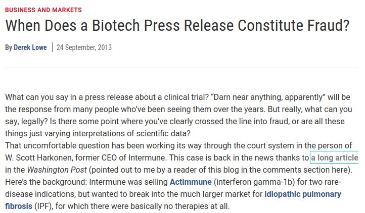
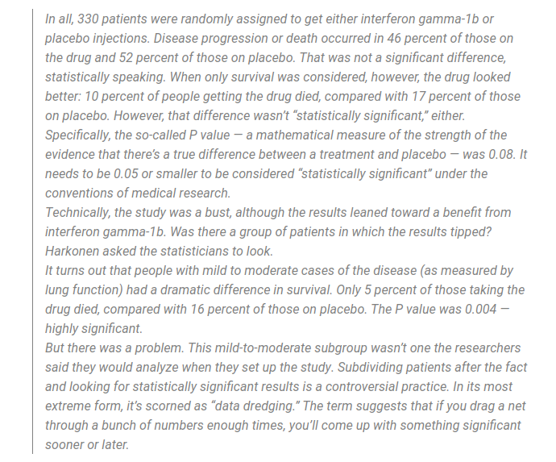

# Last week

  - Why randomized experiments work
    - Guarantee treatment $D_i$ is independent of potential outcomes $\{Y_i(1), Y_i(0)\}$
--
  - Inference for treatment effects
    - **Fisher**: Can get exact p-values under the sharp null just knowing the 
    distribution of treatment assignments.
    - **Neyman**: Know the variance for the difference-in-means
    
    $$ \widehat{Var(\hat{\tau})} = \frac{S^2_t}{N_t} + \frac{S_c^2}{N_c}$$

---

# This week

  - When and why do we use covariates in designing/analyzing an experiment
    - Balance checks 
    - Stratification/blocking -- improving precision
    - Conditional ATEs -- treatment effect heterogeneity
--
  - When should we *not* condition on covariates?
    - When they're **post-treatment**!

---

class: title-slide

# Balance checking
$$
  \require{cancel}
$$

---

# Balance tests

  - One reason to use covariates even in completely randomized designs is to check
whether the experiment **actually** did what it was supposed to do.
--

  - Under any valid randomization scheme:

$$X_i {\perp \! \! \! \perp} D_i$$


$$E[X_i | D_i = 1] = E[X_i | D_i = 0]$$
--
  
  - If we correctly randomized treatment, then the expectation (and the distribution)
of covariates should be the same in treatment and control.
--

  - But in any given sample, we'll observe a difference just by chance -- how do we
know if this is a problem?
    - Usually use some sort of hypothesis test assuming a null of no imbalance
    - Corrections for multiple testing.

---

# Against balance tests

  - One view in some experimentally-focused fields is that you should **never** waste time 
  checking balance
--

  - Senn (1994) *Statistics in Medicine*
    1. Randomization ensures balance over all randomizations.
    2. Observing any particular imbalance in our sample doesn't disprove 1
  - Essentially, if we **know** that treatment was randomly assigned then balance tests
  are pointless. We may have gotten unlucky, but we know how treatment assignment was conducted and 
  so any imbalance *is* actually due to chance.
--

  - But what if we did screw up? What if the randomization software had a bug? What if there was
  some implementation issue?
    - Worthwhile to check if this is the case!
--
  - But how to interpret a "failed" balance test? 
    - A reason to go back and check the randomization process -- if we think that it *did* actually work
    as intended, we may just have gotten unlucky.
    - $p < .05$ probably shouldn't be the threshold if we really believe treatment was randomized.

---


# Against balance tests

  - Another more nuanced argument is that you shouldn't use balance tests to decide
  whether to include or not include covariates.
--

  - Mutz, Pemantle and Pham (2019)
    - Often researchers run a lot of univariate balance tests in an experiment.
    - If a test for some covariate fails, they include that covariate in adjustment.
    - This process risks raising false-positive rates through researcher "degrees-of-freedom"
--
  - This is correct, but is less an argument against *balance testing* per-se and
  more against ad-hoc or data-dependent covariate choices.
--

  - Choose your covariates to adjust for **ex-ante** (even if you're not explicitly blocking)
  and don't choose them based on the results of balance tests
    - Also, balance tests don't make sense as a criteria for covariate inclusion since
    if we do believe randomization, we've addressed confounding.
    - We want covariates that are predictive of $Y$

---

# Univariate balance tests

  - Most often, you'll see tables with bivariate tests for differences in covariate means

```{r, echo = F, message=F, warnings=F}
library(tidyverse)
library(haven)
library(estimatr)
library(knitr)
library(sandwich)
options(digits=3)
```

```{r, echo=F, message=F, warning=F, cache=T}
# Load the data
data <- read_dta('assets/data/ggr_2008_individual.dta')

```
  
```{r}
data_neighbors <- data %>% filter(treatment == 0|treatment ==3)
data_neighbors$neighbor <- as.integer(data_neighbors$treatment == 3)
covs <- c("sex", "hh_size", "p2002", "p2004", "g2000", "g2002")
balance_tab <- data.frame()
for (cov in covs){
  balance_reg <- lm_robust(formula(paste(cov, "neighbor", sep = " ~ ")), data=data_neighbors)
  balance_tab <- rbind(balance_tab, tidy(balance_reg) %>% filter(term == "neighbor") %>% select(covariate = outcome, diff = estimate, tstat = statistic, pval = p.value))
}
kable(balance_tab)
```

---

# Multivariate balance tests

- Sometimes we want just a single test statistic with multiple covariates (to address multiple-testing problems)
- Permutation tests are great for this! 
--

 - A possible test statistic: the Wald test for the joint hypothesis that all coefficients in a regression of treatment on
  the covariates is $0$. (Lin, Green and Coppock, 2016 recommend this).
--
  
```{r}
# Get our observed test statistic
fit <- lm(neighbor ~ sex + hh_size + p2002 + p2004 + g2000 + g2002, data=data_neighbors, singular.ok = FALSE)

# Robust wald stat
# Code from https://alexandercoppock.com/Green-Lab-SOP/Green_Lab_SOP.html
Rbeta.hat <- coef(fit)[-1]
RVR <- vcovHC(fit, type <- 'HC0')[-1,-1]
W_obs <- as.numeric(Rbeta.hat %*% solve(RVR, Rbeta.hat))  # Wooldridge, equation (4.13)

```

---

# Multivariate balance tests
  
```{r, echo=F, message=F, warning=F, cache=T, fig.width=10, fig.height=8, fig.align='center'}

set.seed(60637)
sims <- 100
W_sims <- numeric(sims)

for(i in 1:sims){
  data_neighbors$neighborPerm <- sample(data_neighbors$neighbor)
  fit_sim <- lm(neighborPerm ~ sex + hh_size + p2002 + p2004 + g2000 + g2002, data=data_neighbors, singular.ok = FALSE)

  Rbeta.hat <- coef(fit_sim)[-1]
  RVR <- vcovHC(fit_sim, type <- 'HC0')[-1,-1]
  W_sims[i] <- as.numeric(Rbeta.hat %*% solve(RVR, Rbeta.hat))
}

# Obtain p-value
p <- mean(W_sims >= W_obs)

hist(W_sims, main = paste("P-value: ", p, sep=""))
abline(v=W_obs, lty=2, col="red")

```

---

# Guidelines for balance testing

  - Testing for balance to assess whether randomization occurred as intended: .green[Good]
    - Careful with multiple testing/false positives.
    - $p < .05$ is probably too high of a threshold, but you should probably be concerned if $p < 1 \times 10^{-6}$
    - What do do if a balance check fails? Check your experiment!
--
  - Testing for balance to pick which covariates to adjust for: .red[Bad]
    - "Garden of forking paths"
    - You should choose covariates ex-ante (even if not blocking)
    - Pick covariates that predict $Y$ -- balance checks are the wrong criteria.
  
---

class: title-slide

# Stratification/blocking in experiments
$$
  \require{cancel}
$$


---

# Using covariates in experiments

- Sometimes we have covariate information $X_i$ that predicts $Y_i$. Should we use this?
  - Yes: If $X_i$ predicts $Y_i$ well, we can get a more precise ATE estimator.
  - Covariates aren't relevant for **bias** in an experiment, but they can help with **variance**.
--

- **Stratification**/**Block-randomization**: 
  - Consider a partition of our sample that puts our $N$ units into $G$ mutually-exclusive strata.
  - With discrete covariates, can think of each unique combination of the covariates.
  - With continuous covariates we coarsen them into bins.
  - Each stratum $g$ has $N_g$ units.
  - Treatment is completely randomized within each stratum: $N_{t,g}$ units receive treatment, $N_{c,g} = N_g - N_{t,g}$ receive control.
  
---

# Using covariates in experiments

- Pair-randomized experiment
  - Stratified design with $N_g = 2$ for all groups.
  - 1 unit gets treated, 1 gets control.
  - Sometimes called a "matched-pair design"
  - Variance estimation is different from stratification.
--

- Goal of stratification:
  - Get rid of possible randomizations where covariates are **imbalanced** between treated and control
- "Pruning" the space of randomizations. Consider $N=100$, $N_t = 50$ with two blocks. 
  - Under complete randomization there are ${100 \choose 50} \approx 1.01 \times 10^{29}$ possible assignments
  - Under blocking: ${50 \choose 25} + {50 \choose 25} \approx 2.53 \times 10^{14}$.
  
---

# Estimation under block-randomization

- Our estimator for the .maroon[stratum-specific] treatment effect $\hat{\tau_g}$ is just the difference-in-means
  
$$\hat{\tau_g} = \underbrace{\bar{Y}_{t,g}}_{\text{treated mean in stratum g}} - \underbrace{\bar{Y}_{c,g}}_{\text{control mean in stratum g}}$$
--

- And we can estimate the sampling variance using the within-stratum Neyman variance estimator

$$\widehat{Var(\hat{\tau_g})} = \frac{S_{t,g}^2}{N_{t,g}} + \frac{S_{c,g}^2}{N_{c,g}}$$

where $S_{t,g}^2$, $S_{c,g}^2$ are the sample variance of $Y$ within the treated group and control group respectively in stratum $g$.
--

- Imagine: We ran $G$ independent mini-experiments and analyzed them separately. Each is unbiased for the conditional ATE (CATE) and has its own standard error.
  
---

# Estimation under block-randomization

- How do we aggregate to get an estimate of the SATE? Take a weighted average by stratum size

$$\hat{\tau} = \sum_{g = 1}^G \hat{\tau_g} \times \frac{N_g}{N}$$
--

- And the sampling variance?

$$\widehat{Var_{\text{strat}}(\hat{\tau})} = \sum_{g = 1}^G \widehat{Var(\hat{\tau_g})}  \times \left(\frac{N_g}{N}\right)^2$$
--

- When is the variance of the blocked design going to be lower than the variance under complete randomization?
  - When the strata explain some of the variance in $Y$ (the population $\sigma^2_{t,g} < \sigma^2_{t}$ and $\sigma^2_{c,g} < \sigma^2_{c}$ ) 

---
# Re-randomization

- Suppose instead of blocking, I instead had some distance metric on $X_i$ for covariate imbalance between treated and control group.
- I re-ran the complete randomization process a bunch of times and took the randomization with the smallest value on my imbalance metric.
- Is this legit? Will it induce bias in the ATE estimator? 

---

# Can blocking hurt?

- Long debate over where it's possible to go wrong blocking. Athey and Imbens (2017) argue no downside to blocking.
--

- This answer depends on the framework for inference.
  - Pashley and Miratrix (2021) give an extensive review under alternative sampling/inference schemes.
--

- Athey and Imbens result holds under stratified random sampling from the population and equal treatment probability w/in strata.
  - Intuition: In the worst case scenario, stratification is just a two-stage randomization process equivalent to complete randomization. 
--

- This also does not guarantee that the *estimated* standard error will be smaller -- with an irrelevant covariate, 
we will have fewer degrees of freedom as we are estimating multiple parameters. Estimated SEs under stratification
might be higher.
--

- Athey and Imbens suggest falling back on the conservative complete randomization SE, but this will only work if treatment probabilities
are constant across strata 
  - With imbalanced treatment probabilties across strata, we only have ignorability **conditional** on stratum.

---


# Post-stratification

- Suppose we didn't stratify ex-ante but have some covariates that we observe? Can we analyze 
*as-though* we had stratified on these?
  - Yes: **Post-stratification**
--

- Key difference from stratification: Number of treated/control w/in stratum is random and not fixed. Stratum sizes also not fixed.
--

- Miratrix, Sekhon and Yu (2013) 
  - Usually not a problem -- relative to blocking ex-ante, the differences in variances are small.
  - Problems with many strata + poorly predictive strata. 
  - Unlike the Athey and Imbens setting, benefits not guaranteed, but often doesn't hurt with good covariate choice.

---

# Post-stratifying on a relevant covariate

```{r exercise, echo=F, message=F, warnings=F}
# Load in exercise dataset
exercise <- read_csv("assets/data/exercise.csv")

# Make a 3-level treatment variable
exercise <- exercise %>% mutate(treatment = case_when(Control == 1 ~ "Control",
                                                      High == 1 ~ "High",
                                                      TRUE ~ "Low"))

# Subset to the "low exercise" group
exerciseLow <- exercise %>% filter(Control==1|treatment == "Low")

# Subset to high vs. control
exercise2 <- exercise %>% filter(treatment != "Low")

```

- Let's go back to our UChicago Exercise experiment. We observe exercise in the pre-treatment period, let's stratify on that!

--

```{r}
# What cutpoints to pick?
quantile(exercise2$Before, c(0, .25, .5, .75))
# Okay, about 50% are 0 let's just stratify on an indicator of *any* exercise!
exercise2$AnyBefore <- as.integer(exercise2$Before != 0)

# Our conditional ATEs
ate_noexercise <- mean(exercise2$After[exercise2$treatment == "High"&exercise2$AnyBefore == 0]) -
  mean(exercise2$After[exercise2$treatment == "Control"&exercise2$AnyBefore == 0])
ate_someexercise <- mean(exercise2$After[exercise2$treatment == "High"&exercise2$AnyBefore == 1]) -
  mean(exercise2$After[exercise2$treatment == "Control"&exercise2$AnyBefore == 1])

ate_strat <- ate_noexercise*mean(exercise2$AnyBefore == 0) +
  ate_someexercise*mean(exercise2$AnyBefore == 1)
ate_strat

```

---

# Post-stratifying on a relevant covariate

- Now to estimate the sampling variance

```{r}

var_noexercise <- var(exercise2$After[exercise2$treatment == "High"&exercise2$AnyBefore == 0])/sum(exercise2$treatment == "High"&exercise2$AnyBefore == 0) +
  var(exercise2$After[exercise2$treatment == "Control"&exercise2$AnyBefore == 0])/sum(exercise2$treatment == "Control"&exercise2$AnyBefore == 0) 

var_someexercise <- var(exercise2$After[exercise2$treatment == "High"&exercise2$AnyBefore == 1])/sum(exercise2$treatment == "High"&exercise2$AnyBefore == 1) +
  var(exercise2$After[exercise2$treatment == "Control"&exercise2$AnyBefore == 1])/sum(exercise2$treatment == "Control"&exercise2$AnyBefore == 1) 

var_strat <- var_noexercise*mean(exercise2$AnyBefore == 0)^2 + var_someexercise*mean(exercise2$AnyBefore == 1)^2

sqrt(var_strat)

# How does it compare to unadjusted?
lm_robust(After ~ I(treatment == "High"), data=exercise2)

```


---

# An irrelevant covariate

```{r}
# Unadjusted
lm_robust(After ~ I(treatment == "High"), data=exercise2)

# Post-stratifying on gender
lm_lin(After ~ I(treatment == "High"), covariates = ~ Male, data=exercise2)

```

---

# Using covariates in a regression

- What if we can't construct strata (e.g. continuous covariates). What happens if we just throw them into a linear regression? With a single covariate:

$$E[Y_i | D_i, X_i] = \alpha + \tau D_i + \beta X_i$$
- Is this fine even if we don't believe the linearity assumptions? 
--

- Lin (2013): With a slight twist on the model, yes!
- Define $\tilde{X_i}$ as the de-meaned $X_i$: $\tilde{X_i} = X_i - \bar{X_i}$

$$E[Y_i | D_i, \tilde{X}_i] = \alpha + \tau D_i + \beta \tilde{X}_i + \gamma \tilde{X}_i D_i$$
- Our OLS estimate of $\tau$, $\hat{\tau}$ is our ATE estimator
--

- Intuition: Think of fitting separate regressions in the treated and control group. Worst case scenario, they just predict the mean and $\hat{\tau}$ is just a difference-in-means.
- Mathematically equivalent to post-stratification in the discrete covariate case.

---

# Lin (2013) estimator

```{r}
# Lin(2013) with continuous pre-treatment Before
lm_lin(After ~ I(treatment == "High"), covariates = ~ Before, data=exercise2)

```


---

# Summary

- When should you use **pre-treatment** covariates in an experiment?
  - When the covariates predict the outcome
--

- Ideally, you should block 
  - This avoids finite-sample imbalance in treatment across groups.
--

- But adjusting ex-post isn't too bad
  - Post-stratification and the Lin (2013) estimator w/ treatment-covariate interactions.
--

- Should try to fix your covariate choices in advance!
  - Avoid p-hacking/"researcher degrees of freedom" problems.

---

class: title-slide

# Post-treatment bias
$$
  \require{cancel}
$$

---

# Post-treatment covariates

- When talking about stratification/conditional average treatment effects, we've emphasized that $X_i$ must be **pre-treatment**
- What happens when we condition on some post-treatment variable (call it $M_i$).
- **Intuition**: $M_i$ is post-treatment. It has potential outcomes: $\{M_i(1), M_i(0)\}$
  - But we can't condition on the *joint* potential outcomes, we only condition on the observed $M_i$
  - This induces a form of "selection bias"
--

- Many settings in political science
  - Experiments with non-compliance
  - Attention checks in survey experiments.
  - Administrative data (police interactions are only recorded if a stop occurs)
  - Missingness caused by treatment (e.g. court proceedings that settle)


---

# Post-treatment bias

- Let $M_i$ denote the post-treatment covariate. Since it's post-treatment, it has potential outcomes $\{M_i(1), M_i(0)\}$ as 
though it were any other outcome.
--

- By randomization

$$\{M_i(1), M_i(0)\} {\perp \! \! \! \perp} D_i$$
- What happens if we take the difference-in-means conditional on $M_i = 1$

$$E[Y_i | D_i = 1, M_i = 1] - E[Y_i | D_i = 0, M_i = 1]$$

--

- By consistency:

$$E[Y_i(1) | D_i = 1, M_i(1) = 1] - E[Y_i(0) | D_i = 0, M_i(0) = 1]$$


---

# Post-treatment bias

- Ignorability gets us

$$E[Y_i(1) |  M_i(1) = 1] - E[Y_i(0) |  M_i(0) = 1]$$

--

- Is this the ATE? 
  - No! $M_i(1) = 1$ and $M_i(0) = 1$ define *two different subsets of the sample*
- Under what assumptions would we get the ATE?
--

- Either:
  1. No individual effect of treatment on $M_i$: $M_i(1) = M_i(0) \text{   } \forall i$
  2. $\{M_i(1), M_i(0)\} {\perp \! \! \! \perp} \{Y_i(1), Y_i(0\}$
--

- Neither of these assumptions is guaranteed by an experiment since we don't randomize $M_i$
- Therefore, conditioning on a post-treatment quantity "breaks" the experiment -- now it's an observational study.

---

# Example: Exercise experiment

- In the exercise experiment, we observe exercise/compliance with the incentives (once in week 1, 8 times in 2-5)
- What if we tried to estimate the "effect" conditional on having successfully complied with the incentives treatment

```{r}
exercise2 <- exercise2 %>% mutate(reachedGoal = case_when(After1 > 0&(After2 + After3 + After4 + After5 >= 8) ~ 1,
                                                          TRUE ~ 0))

# Difference among those who did not
no_goal  <- lm_robust(After ~ I(treatment == "High"), data=exercise2 %>% filter(reachedGoal == 0))
tidy(no_goal) %>% filter(grepl("treatment", term)) %>% select(term, estimate, std.error, statistic, p.value)

# Difference among those who reached goal
goal <- lm_robust(After ~ I(treatment == "High"), data=exercise2 %>% filter(reachedGoal != 0))
tidy(goal) %>% filter(grepl("treatment", term)) %>% select(term, estimate, std.error, statistic, p.value)

```


---

# Example: Exercise experiment

- What's going on - why did we suddenly find a *negative* effect of treatment?
- Consider the treated and control groups among the incentives-completing subset
  - Treated group: People who worked out at the intense level having received the incentive
  - Control group: People who **still** worked out at the intense level **despite** not getting the incentive
  
---

# Example: Non-compliance

- Consider the setting where the taking of treatment is subject to non-compliance. 
  - Not everyone who is assigned treatment takes it and not everyone who is assigned to control stays in control.
  - Basically always happens in field experiments (in one direction at least)
--

- Let $Z_i$ denote the *assigned* treatment and $D_i$ denote the treatment that is actually taken
  - $Z_i$ is randomized but $D_i$ is not.
  - What happens when we analyze the difference between units with observed treatment $D_i = 1$ and observed treatment $D_i = 0$
  
--
- $D_i$ is post-treatment. It has potential outcomes $D_i(z)$. What are those groups?

---

# Principal strata

- We can think of the combination of $Z_i$ and $D_i$ as defining a "sub-group" of units -- these are referred to as "principal strata"

Stratum              | $D_i(1)$          |  $D_i(0)$ | 
:-------------------:|:-----------------:|:---------:|
"Always-takers"      |  $1$              |  $1$      |  
"Never-takers"       |  $0$              |  $0$      |  
"Compliers"          |  $1$              |  $0$      | 
"Defiers"            |  $0$              |  $1$      |

--

- Units with $D_i = 1$ could be any three of these strata. Even observing $Z_i$ narrows it down to only two - we can't observe the strata directly.
- Strata aren't necessarily independent of potential outcomes $Y_i(d)$! 

---

# Treatment non-compliance

- In all cases of treatment non-compliance, we can always just take the difference between those *assigned* treatment and *assigned* control 
irrespective of their actual uptake. This is unbiased for the "intent-to-treat effect"
  - Challenge with interpreting the ITT -- it's strength depends on the *actual* effect of the treatment and the compliance rate.
  - Is a null ITT because our treatment doesn't work or because our encouragement doesn't work?
--

- When we get to instrumental variables, we'll talk about how -- in the treatment non-compliance setting -- we can obtain an estimate of the effect *among the compliers*
  - Unfortunately doesn't solve the problem of poor encouragements
  - Weak encouragement = biased/high-variance IV estimates.

---


# Example: Administrative data

- .maroon[Knox, Lowe and Mummolo (2020)] consider the problem of estimating the effect of civilian race on police use of force.
  - Typically, past studies would use administrative data from police departments on stops
  - Compare police use of force among Black civilians who are stopped and white civilians who are stopped.
  - **Problem**: Stops are post-treatment!
--
- Define $D_i$ as the treatment (race of civilian), $S_i$ is an indicator for whether a stop occurs, $Y_i$ is severe use of force
- The difference-in-means does not identify the treatment effect - instead, we get:

$$E[Y_i(1) |  S_i(1) = 1] - E[Y_i(0) | S_i(0) = 1]$$
--

- Let's think through the bias story. What's the substantive difference between these two sub-groups? Let's assume monotonicity in the effect of $D_i$ on $S_i$
  - What strata are in the $S_i(1) = 1$ group?: $\{S_i(1) = 1, S_i(0) = 0\}$ and $\{S_i(1) = 1, S_i(0) = 1\}$
  - What strata are in the $S_i(1) = 0$ group?: $\{S_i(1) = 1, S_i(0) = 1\}$
---

# Overview

- Take care when conditioning on variables that are affected by treatment!
- Results in a form of "selection bias" (often called 'collider bias' - we'll explain why with DAGs next week)
  - The treated group with observed mediator $M_i = 1$ is substantively different from the control group with 
- We could define valid causal quantities conditional on the principal strata $\{M_i(1), M_i(0)\}$
  - But we can't observe them directly!
  - Can (with assumptions) observe them partially - we'll talk more about this in IV.
- Easy to identify "post-treatment" variables in an experiment. Trickier with poorly-defined interventions.
  - But be careful with variables that you might be implicitly conditioning on (e.g. analyzing only observed data)

---
class: title-slide

# Conditional and Joint Treatment Effects

---

# Conditional average treatment effects

- Sometimes we might be interested in treatment effects among different sub-groups in the sample
  - Effects of treatment are rarely homogeneous: Republicans respond to cues from Trump differently than Democrats!
  - The ATE is still a well-defined quantity under effect heterogeneity, but we might be explicitly interested in sub-group effects.
--

- The Conditional Average Treatment Effect (CATE)

  $$\tau(x) =  \underbrace{E[Y_i(1) | X_i = x]}_{\text{Mean P.O. under treatment among units with} X_i = x} -  \underbrace{E[Y_i(0) | X_i = x]}_{\text{Mean P.O. under control among units with} X_i = x}$$
  
--
  
- Estimate using the standard difference-in-means *within* each sub-group. Conventional inference using the Neyman variance (though be careful on asymptotics when sub-groups are small).

---

# Example: Exercise Experiment

- Again, let's look at our U Chicago exercise experiment! We might be interested in knowing whether 
the incentives mattered more for undergraduates who never exercised prior to the experiment compared to those who did.

```{r}
# Difference among Before == 0
no_prior  <- lm_robust(After ~ I(treatment == "High"), data=exercise2 %>% filter(Before == 0))
tidy(no_prior) %>% filter(grepl("treatment", term)) %>% select(term, estimate, std.error, statistic, p.value)

# Difference among Before != 0
some_prior <- lm_robust(After ~ I(treatment == "High"), data=exercise2 %>% filter(Before != 0))
tidy(some_prior) %>% filter(grepl("treatment", term)) %>% select(term, estimate, std.error, statistic, p.value)

```

---
# Example: Exercise Experiment

- Is there a difference between the two groups. Remember that the difference between a statistically significant and a statistically insignificant estimate is **not guaranteed** to be statistically significant.
- We need to explicitly test for the difference

```{r}
# Difference among Before == 0
cate_reg <- lm_robust(After ~ I(treatment == "High")*I(Before != 0), data=exercise2)
tidy(cate_reg) %>% filter(grepl("treatment", term)) %>% select(term, estimate, std.error, statistic, p.value)

```

---

# Careful with subgroup effects

.center[]

---

# Beware of p-hacking

.center[]

---

# Effect modification v. Interaction

- Differences in CATEs assign no causal interpretation to $X_i$
  - Comparing the effect of a treatment among college gradautes vs. non-college tells us nothing about what would happen to the effect if we *assigned* college education.
  - Some $X_i$ may be non-manipulable
--

- **Effect modification** -- the effect of an intervention varies across stata of a covariate $X_i$
- **Interaction** -- the effect of an intervention changes when **another** intervention is assigned.
--

- To think about interactions between treatments, we need to define *joint* potential outcomes
- Consider two treatments, $D_{1,i}$ and $D_{2,i}$
  - Define a joint potential outcome $Y_i(d_1, d_2)$.
  - Under consistency, $Y_i(d_1, d_2) = Y_i$ when $D_{1,i} = d_1$, $D_{2,i} = d_2$
--

- Treatment effects are defined in terms of differences in joint potential outcomes

$$\tau_{1,2} = E[Y_i(1,1) - Y_i(0,0)] $$

---

# Joint treatment effects

- Lots more causal quantities of interest -- can define an "ATE" for any unique combination of treatments:
- .maroon[Controlled Direct Effect] -- what's the effect of one treatment fixing the other treatment to a particular level.

$$\text{CDE}_1(1) = E[Y_i(1, 1) - Y_i(0, 1)]$$
- Differences in CDEs in an experiment correspond to "interactions" -- how does *assigning* one level of treatment influence the effect of another.
--

- .maroon[Main effect] -- what's the effect of a treatment marginalizing over the distribution of the other treatment

$$\tau_1 = \sum_{d_2 \in \mathcal{D}_2} \underbrace{E[Y_i(1, d_2) - Y_i(0, d_2)]}_{\text{CDE at } d_2}\times\Pr(D_{2,i} = d_2)$$
- Note that your main (or marginalized) effects depend on the distribution of the other treatment. This can cause external validity issues in large factorial experiments (e.g. conjoints) - See .maroon[de la Cuesta, Egami, Imai (2022)]
---

# Conclusion

- Three main reasons to care about covariates in an experiment
  1. **Improve precision**
  2. **Diagnose our experiment**
  3. **Examine sub-group effects** (careful to avoid p-hacking)
--

- Be careful with bad controls
  - We want to control for **pre-treatment** covariates and don't want to control for **post-treatment** covariates
  - Conditioning on **post-treatment** quantities breaks randomization
--

- Next week, we'll look at a fourth -- and most important -- reason for using covariates in *observational* designs: **adjusting for confounding**
  - Not a problem in experiments since we randomize treatment -- no observed or unobserved confounding
  - Big problem in observational designs since we don't randomize

---
