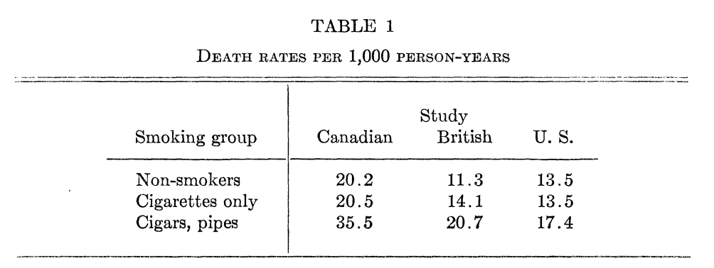
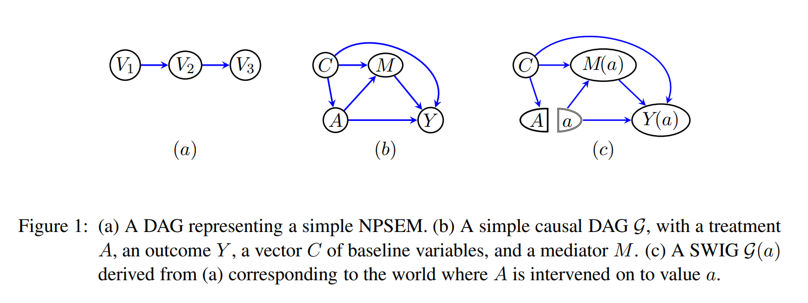

# Last two weeks

  - Identification under **ignorability**
    - Treatment assignment is independent of the potential outcomes
  - Randomized experiments guarantee ignorability
    - Randomization ensures that treatment is independent of **observed** and **unobserved** confounders.
  - How to use covariates in experiments
    - Improve precision for estimating the ATE
    - Subgroup effects

---

# This week

  - What happens when **ignorability** does not hold?
    - Treatment is not randomly assigned - we have an *observational* design.
    - Treatment assignment may be driven by 
  - Selection-on-observables assumptions
    - Treatment is ignorable **conditional** on observed covariates
  - Estimation under selection-on-observables
    - Stratification
    - Inverse Propensity of Treatment Weighting
    - Regression adjustment
    - Matching

---

class: title-slide

# Selection-on-observables
$$
  \require{cancel}
$$

---

# Why experiments worked
```{r, echo=F, warning=F, message=F}
library(tidyverse)
library(haven)
library(estimatr)
```
  - A good causal observational study should try to mimic the features of an experiment
  - So what were the nice properties of a **randomized experiment**?
    - **Positivity**: Assignment not deterministic $0 < P(D_i = 1) < 1$
    - **Ignorability/Unconfoundedness**: $P(D_i = 1 | Y_i(1), Y_i(0) = P(D_i = 1)$
--
  - We liked experiments because we could ensure treatment was independent of the potential outcomes.
    - $\{Y_i(1), Y_i(0)\} {\perp \! \! \! \perp} D_i$
--
  - Even in a **conditionally** randomized experiment, we knew $P(D_i = 1 | \mathbf{X}_i)$
---

# Observational designs

  - Complete **unconfoundedness** is only one kind of design assumption, but there are many settings where it won't hold.
  - Suppose we didn't randomize an intervention but simply observe its occurrence
    - $P(D_i = 1)$ is not known.
    - Treatment and control groups might not be comparable. Why? -- confounders!
--
  - Alternative design: **selection-on-observables**
    - Treatment assignment is ignorable **conditional** on a set of **observed** covariates $\mathbf{X}_i$
--
  - Assumptions:
    - **Positivity**/**Overlap**: $0 < P(D_i = 1 | \mathbf{X}_i) < 1$
    - **Conditional ignorability**: $\{Y_i(1), Y_i(0)\} {\perp \! \! \! \perp} D_i | \mathbf{X}_i$
      - Other names: "No unmeasured confounders", "selection on observables", "no omitted variables",
      "conditional exogeneity", "condtiional exchangeability", etc...
    
---

# Approximating experiments

  - A well-designed observational study will try to approximate some hypothetical "target" experiment (Rubin, 2008; Hernán and Robins, 2016).
    - Well-defined intervention
    - Clear distinction between treatment and pre-treatment covariates
--
  - You should try to answer the following questions: 
    - What's the intervention of interest?
    - What is the assignment process for the intervention?
    - How well does our adjustment model this assignment process?
--
  - What kind of experiment are we mimicking with a **selection-on-observables** identification strategy
    - *Conditional* randomization (given $\mathbf{X}_i$).
    - Treatment probability is not constant across levels of $\mathbf{X}_i$.
  - **Problem**: In an experiment we're guaranteed balance on the unobservables (by randomization). In a selection-on-observables design we are
  assuming these unobservables away!
  
---

# Identification of the ATE

  - Recall that under conditional ignorability, $\{Y_i(1), Y_i(0)\} \cancel{{\perp \! \! \! \perp}} D_i$
  - Therefore: 
  
$$E[Y_i(1) | D_i = 1] \neq E[Y_i(1)]$$

--
  - So the difference in means alone will not identify the ATE -- we need to **condition** on the covariates $\mathbf{X}_i$
  
---

# Identification of the ATE

- Iterated expectations

$$E_X\bigg[E[Y_i | D_i = 1, \mathbf{X}_i = x]\bigg] - E_X\bigg[E[Y_i | D_i = 0, \mathbf{X}_i = x]\bigg]$$

--

- Consistency: 

$$E_X\bigg[E[Y_i(1) | D_i = 1, \mathbf{X}_i = x]\bigg] - E_X\bigg[E[Y_i(0) | D_i = 0, \mathbf{X}_i = x]\bigg]$$

--

- Conditional ignorability:

$$E_X\bigg[E[Y_i(1) | \mathbf{X}_i = x]\bigg] - E_X\bigg[E[Y_i(0) | \mathbf{X}_i = x]\bigg]$$

--

- Law of iterated expectations

$$E[Y_i(1)] - E[Y_i(0)] = \tau$$

---

# Identification vs Estimation

- With infinite data, it would be possible to simply plug in sample analogues for $E[Y_i | D_i = 1, X_i = x]$ for each unique value of $x$ (as long as positivity holds).
--

- But as the dimensionality of $\mathbf{X}_i$ grows large, within our sample this might be impossible (few to no observations for any given $\mathbf{X}_i$ )
--

  - We'll make **additional** assumptions to address this problem as part of *estimating* these conditional expectations and consider different estimation strategies with different assumptions
  - But it's important not to confuse these assumptions (e.g. linearity in a regression model) with the *identification* assumptions needed to even get a causal quantity from the observed data.
--

- **Identification** assumptions
  - What do we need to assume is true about the world in order to get **any** causal quantity from the observed data?
  - In selection-on-observables designs: Treatment is independent of the potential outcomes conditional on observed covariates.
--

- **Estimation** assumptions
  - What do we need to assume in order to get a decent estimator of the treatment effect?
  - If these assumptions are wrong, might introduce additional bias **even if** ignorability holds
  - This is where fancy stats can help us!

---

# Adjustment via stratification

- If our $\mathbf{X}_i$ are sufficiently low-dimensional, we don't really need any strong modeling assumptions to estimate the ATE. We can use our usual stratification/sub-classification estimator:

$$\hat{\tau} = \sum_{x \in \mathcal{X}} \hat{\tau(x)} \widehat{P}(\mathbf{X}_i = x)$$

where

$$\hat{\tau(x)} = \widehat{E}[Y_i | D_i = 1, X_i = x] - \widehat{E}[Y_i | D_i = 0, X_i = x]$$

--

- What happens if $\mathbf{X}_i$ is high-dimensional? **Coarsen** into bins: 
  - Fewer bins = more (potential) bias.

---

# Example: Washington (2008)

  - Washington (2008; AER) examines whether having daughters affects a legislator's voting behavior on feminist/pro-women issues (measured by AAUW voting scores)
--

  - Let's use the data to estimate the effect of having any daughters vs. having $0$ daughters
--

  - What's the unadjusted estimate?

```{r}
washington <- read_dta("assets/washington.dta")
lm_robust(aauw ~ I(ngirls > 0), data=washington)
```

---

# Example: Washington (2008)

  - What's the confounder?
--

  - Number of children!
```{r}
# Number of girls by total number of children
table(washington$ngirls, washington$totchi)

# Association between total number of children and AAUW score
lm_robust(aauw ~ totchi, data=washington)
```


---

# Example: Washington (2008)

  - Identification strategy: **selection-on-observables**
    - Conditional on the **total number of children**, the number of girls is assigned *as-if-random*
--
  - For which strata can we not identify a treatment effect?
    - Legislators with $0$ children! Positivity/overlap violation. By definition a legislator w/ $0$ children can't have more than $0$ girls
--
  - Other strata are just very sparse (4+ children).
    - Let's estimate the "any child" effect for legislators with 1 to 3 children, stratifying on the total amount.
    - Note that we've changed the target population here as well as introduced a confounder.
    
---

# Example: Washington (2008)

```{r}
# Unadjusted
washington_unadjusted <- lm_robust(aauw ~ I(ngirls > 0), data=washington %>% filter(totchi>0&totchi<4))
tidy(washington_unadjusted) %>% filter(term == "I(ngirls > 0)TRUE") %>% select(term, estimate, std.error, p.value)

# Adjusted
washington_strat <- lm_lin(aauw ~ I(ngirls > 0), covariates = ~ as.factor(totchi), data=washington %>% filter(totchi>0&totchi<4))
tidy(washington_strat) %>% filter(term == "I(ngirls > 0)TRUE") %>% select(term, estimate, std.error, p.value)

```

---

# Example: Washington (2008)

- We might still include other covariates to improve precision even if we don't think that they're part of the confounding story.
  - E.g. We might think that controlling for total number of children is enough to break the relationship between party and number of girls, but party is still really predictive of AAUW voting score.

--

```{r}
# Adjusted + Party
washington_strat <- lm_lin(aauw ~ I(ngirls > 0), covariates = ~ as.factor(totchi)*as.factor(repub), data=washington %>% filter(totchi>0&totchi<4))
tidy(washington_strat) %>% filter(term == "I(ngirls > 0)TRUE") %>% select(term, estimate, std.error, p.value)

```

---

# Confounding and the direction of the bias

.center[]
.center[]

---

# Omitted Variable Bias

- Suppose there exists an omitted confounder $U_i$ and ignorability holds conditional on it. Suppose we ignore it and just use a simple difference-in-means estimator.
- What's the bias for the ATT? Recall our selection-into-treatment bias formula!

$$\underbrace{E[Y_i | D_i = 1] - E[Y_i | D_i = 0]}_{\text{Difference-in-means}} = \underbrace{E[Y_i(1) - Y_i(0) | D_i = 1]}_{\text{ATT}} + \bigg(\underbrace{E[Y_i(0) | D_i = 1] - E[Y_i(0) | D_i = 0]}_{\text{Selection-into-treatment bias}}\bigg)$$

---

# Omitted Variable Bias

- Let's write the selection bias conditioning on $U_i$

$$\text{Selection Bias} = \sum_{u \in \mathcal{U}} E[Y_i(0) | D_i = 1, U_i = u] Pr(U_i = u | D_i = 1) - \sum_{u \in \mathcal{U}} E[Y_i(0) | D_i = 0, U_i = u] Pr(U_i = u | D_i = 0)$$

--

- Ignorability conditional on $U_i$

$$\text{Selection Bias} = \sum_{u \in \mathcal{U}} E[Y_i(0) |  U_i = u] Pr(U_i = u | D_i = 1) - \sum_{u \in \mathcal{U}} E[Y_i(0) | U_i = u] Pr(U_i = u | D_i = 0)$$

--

- Combining terms

$$\text{Selection Bias} = \sum_{u \in \mathcal{U}} E[Y_i(0) |  U_i = u] \times \bigg(Pr(U_i = u | D_i = 1) -  Pr(U_i = u | D_i = 0)\bigg)$$

---

# Omitted Variable Bias

- Two elements to selection bias. First, if treatment assignment is independent of the confounder, then the bias is 0

$$\text{Selection Bias} = \sum_{u \in \mathcal{U}} E[Y_i(0) |  U_i = u] \times \bigg(Pr(U_i = u | D_i = 1) -  Pr(U_i = u | D_i = 0)\bigg)$$

--

- Second, if $Y_i(0)$ is independent of $U_i$, we have:

$$\text{Selection Bias} = \sum_{u \in \mathcal{U}} E[Y_i(0)] \times \bigg(Pr(U_i = u | D_i = 1) -  Pr(U_i = u | D_i = 0)\bigg)\\
\text{Selection Bias} = E[Y_i(0)] \times \bigg(\sum_{u \in \mathcal{U}}Pr(U_i = u | D_i = 1) -  \sum_{u \in \mathcal{U}} Pr(U_i = u | D_i = 0)\bigg)\\
\text{Selection Bias} = E[Y_i(0)] \times \bigg(1 -  1\bigg) = 0$$

--

- We get OVB/confounding when:
  1. $U_i$ is not independent of treatment
  2. $U_i$ is not independent of the potential outcomes

---

# Signing the bias

- Additionally, the bias is multiplicative. 
- Under some constant effects assumptions, we can get the direction of the bias of the difference-in-means relative to the ATT
  1. .blue[**Positive**] association between the confounder on outcome. .blue[**Positive**] association between confounder and treatment. .blue[**Positive**] bias.
  2. .blue[**Positive**] association between the confounder on outcome. .red[**Negative**] association between confounder and treatment. .red[**Negative**] bias.
  3. .red[**Negative**] association between the confounder on outcome. .blue[**Positive**] association between confounder and treatment. .red[**Negative**] bias.
  4. .red[**Negative**] association between the confounder on outcome. .red[**Negative**] association between confounder and treatment. .blue[**Positive**] bias.
    
---


# Example: Smoking and Cancer

- Back when the link between smoking and cancer was being debated, some researchers suggested that cigarettes might be a "healthy" alternative to pipe smoking
- Cochran (1968) uses this to illustrate adjustment by stratification

.center[]

1. What's the omitted confounder?
2. What's the direction of the bias due to the omitted confounder?

---

class: title-slide

# Propensity scores


---
# Propensity scores

- With low dimensional $\mathbf{X}$ we can use a stratified difference-in-means estimator. But with high-dimensional $\mathbf{X}$ we run into problems
  - The **curse of dimensionality**!
--

- Can we adjust for a single scalar quantity regardless of how high-dimensional $\mathbf{X}$ is?
  - Yes: The **propensity score**
  
$$e(X_i) = P(D_i = 1 | X_i)$$

--
- Rosenbaum and Rubin (1983) show that conditional on the propensity score, the treatment is independent of the covariates.

$$D_i {\perp \! \! \! \perp} X_i | e(X_i)$$

--

- Therefore, conditioning on the propensity score suffices to adjust for confounding due to $X$

$$\{Y_i(1), Y_i(0)\} {\perp \! \! \! \perp} D_i | e(X_i)$$

- The propensity score is a type of **balancing score** in that conditioning on it breaks the relationship between the covariates and treatment.
  
  
---


# Weighting estimators

- One way of adjusting for the propensity score is to use it as a **weight** on each observation.
- We weight each unit by the **inverse** propensity of it receiving its particular treatment
  - Treated units receive a weight $\frac{1}{e(X_i)}$
  - Control units receive a weight $\frac{1}{1 - e(X_i)}$
--

- This yields the Horvitz-Thompson estimator for the ATE (with known weights)

$$\hat{\tau} = \frac{1}{n}\sum_{i=1}^n\ \frac{D_i Y_i}{e(X_i)}  - \frac{(1-D_i)Y_i}{1 - e(X_i)}$$
--

- **Intuition**: Weighting constructs a "pseudo-population" where the link between treatment and the observed covariates is broken
  - Which treated units get more weight? Those whose treatment status is counter to what we would predict from the propensity score.
  - Downweight the "overrepresented" and upweight the "underrepresented" 

---

# Why weighting works

- By iterated expectations

$$E\left[\frac{D_i Y_i}{e(X_i)}\right] = E\bigg[E\left[\frac{D_i Y_i}{e(X_i)} \bigg| X_i \right]\bigg]$$
--

- Consistency

$$E\left[\frac{D_i Y_i}{e(X_i)}\right] = E\bigg[\frac{E[D_i Y_i(1) | X_i]}{e(X_i)} \bigg]$$
--

- Conditional ignorability

$$E\left[\frac{D_i Y_i}{e(X_i)}\right] = E\bigg[\frac{E[D_i |X_i] E[Y_i(1) | X_i]}{e(X_i)} \bigg]$$

---

# Why weighting works

- Definition of the propensity score

$$E\left[\frac{D_i Y_i}{e(X_i)}\right] = E\bigg[\frac{e(X_i) E[Y_i(1) | X_i]}{e(X_i)} \bigg]$$
--

- Iterated expectations

$$E\left[\frac{D_i Y_i}{e(X_i)}\right] = E[Y_i(1)]$$


---


# Estimating the propensity score

- Outside of an experiment, we don't actually know the propensity score
  - Even if we knew the propensity score, we get more efficient estimators by adjusting for the estimated propensity score (Hirano, Imbens and Ridder, 2003)
- How do we estimate it? 
--

- When we can't just stratify, we'll often assume a parametric *model* for $P(D_i = 1 | X)$.    
  - We could potentially just use OLS, but we need a model to make *predictions* of the propensity score. OLS w/ a binary outcome may give predictions above $1$ or below $0$ (especially when the model is not fully saturated)
--

- One common generalized linear model is the **logit**, which assumes that the log-odds of the propensity score is a linear function of the parameters 

$$\text{log}\bigg(\frac{e(x)}{1-e(x)}\bigg) = \beta_0 + \beta_1x_1 + \beta_2x_2 + \beta_3x_3 + \dotsc$$

- Estimate the parameters ( $\hat{\beta}$ ) via maximum likelihood and obtain a predicted probability for each observation $\widehat{e(X_i)}$

--
- **Warning**: Model misspecification for the propensity score can really ruin the performance of propensity score estimators (Kang and Schafer, 2007)
  - But how do we know if we got the model right?
  - More "robust" methods for estimating a balancing score aim at getting **exact** balance on the covariates (CBPS: Imai and Ratkovic, 2013)

---

# Normalizing the propensity score

- Horvitz-Thompson behaves especially poorly when propensity scores are close to $0$ and $1$ 

$$\hat{\tau} = \frac{1}{n}\sum_{i=1}^n\ \frac{D_i Y_i}{\widehat{e(X_i)}}  - \frac{(1-D_i)Y_i}{1 - \widehat{e(X_i)}}$$

--

- Common practice is to normalize the weights within the treated and control groups to sum to $1$, which gives us the Hajek estimator

$$\hat{\tau} = \frac{1}{\sum_{i=1}^n \frac{D_i}{\widehat{e(X_i)}}} \sum_{i=1}^n\ \frac{D_i Y_i}{\widehat{e(X_i)}} - \frac{1}{\sum_{i=1}^n \frac{1-D_i}{\widehat{1-e(X_i)}}} \sum_{i=1}^n\ \frac{(1-D_i) Y_i}{1-\widehat{e(X_i)}}$$

- Weighted least squares will do this if we regress outcome on a binary indicator for treatment and supply the inverse propensity weights.

---

# Inference

- We want to estimate the sampling variance $\text{Var}(\hat{\tau})$ in order to do inference
  - Can't just use the regression standard error -- need to take into account uncertainty when estimating the propensity scores.
- Two options
  1. Closed form "sandwich" variance estimator $\widehat{\text{Var}(\hat{\tau})}$ using M-estimation theory given the moment conditions from the propensity score model and the weighting estimator.
  2. Nonparametric bootstrap to estimate $\widehat{\text{Var}(\hat{\tau})}$ via re-sampling.

---

# Bootstrapping

- Bootstrapping is a useful tool for learning about the sampling distribution of a parameter when we don't want to use theory to figure out $\widehat{\text{Var}(\hat{\tau})}$
  - Doesn't *always* work -- need a relatively well-behaved estimator that is smooth w.r.t. the data.
--

- **Intuition**: What drives uncertainty in $\hat{\tau}$? If we took another sample, we would calculate a different value.
  - We can't go and re-draw a sample from the population again (that's just a hypothetical).
  - But our sample is a pretty good approximation for the population...and we can resample from that. 
  - So we can approximate the distribution of $\hat{\tau}$ under repeated draws from the population by taking repeated draws from the empirical distribution of the data in the sample.
--

- Under i.i.d. observations, we'll often use the "nonparametric" bootstrap in which we resample observations **with** replacement

---

# The bootstrap

- The bootstrap procedure for IPTW:
  1. Draw a sample of the data  by resampling observations (the rows of the data $\{Y_i, D_i, X_i\}$) **with replacement**
  2. Using the bootstrapped sample, estimate the propensity scores $\hat{e(X_i)}$.
  3. Using those propensity scores and the bootstrapped sample, compute an estimate of the average treatment effect $\hat{\tau}$. Store that estimate
  4. Repeat for many iterations.
--

- At the end, we have a bunch of draws that allow us to approximate the sampling distribution of $\hat{\tau}$. We can compute the standard deviation to get our estimate of the standard error of $\hat{\tau}$ and create confidence intervals under large-sample theory (normality). Alternatively, we can use percentiles of the bootstrap distribution to construct our confidence intervals.


---

# Illustration: Washington (2008)

- Let's suppose we want to adjust for total number of children and party in the Washington (2008) study using IPTW.

```{r}
# Subset to totchi > 0 and totchi < 4
wash_subset <- washington %>% filter(totchi>0&totchi<4)

# Fit a propensity score model
pscore_model <- glm(anygirls ~ as.factor(totchi) + as.factor(party) + 
                as.factor(totchi)*as.factor(party), data=wash_subset,
              family=binomial(link="logit"))

# Predict the propensity score
wash_subset$e <- predict(pscore_model, type="response")

# Generate the weights
wash_subset$iptw_weight <-1/wash_subset$e
wash_subset$iptw_weight[wash_subset$anygirls == 0] <- 1/(1-wash_subset$e[wash_subset$anygirls == 0])


```


---

# Illustration: Washington (2008)

- Histogram of the weights

```{r, echo=F, fig.align="center", fig.width=8, fig.height=6}
wash_subset %>% ggplot(aes(x=iptw_weight)) + geom_histogram(bins=30) + facet_wrap(~anygirls)
```


---


# Illustration: Washington (2008)

- Calculate IPTW estimate of the ATE

```{r}

# Weighted regression
iptw_model <- lm_robust(aauw ~ anygirls, data=wash_subset, weights=iptw_weight)
coef(iptw_model)[2] # Ignore the SE

# Weighted regression gives the Hajek (normalized weights) estimator
iptw_est <- weighted.mean(wash_subset$aauw[wash_subset$anygirls == 1], wash_subset$iptw_weight[wash_subset$anygirls == 1]) -
  weighted.mean(wash_subset$aauw[wash_subset$anygirls == 0], wash_subset$iptw_weight[wash_subset$anygirls == 0])
iptw_est
```


---

# Illustration: Washington (2008)

- Bootstrap

```{r}
set.seed(60638)
nIter <- 1000
boot_iptw <- rep(NA,nIter)
for (i in 1:nIter){
  wash_subset_boot <- wash_subset[sample(1:nrow(wash_subset), size = nrow(wash_subset), replace=T),]
   # Fit a propensity score model
  pscore_model_boot <- glm(anygirls ~ as.factor(totchi) + as.factor(party) + 
                  as.factor(totchi)*as.factor(party), data=wash_subset_boot,
                family=binomial(link="logit"))
  
  # Predict the propensity score
  wash_subset_boot$e_boot <- predict(pscore_model_boot, type="response")
  
  # Generate the weights
  wash_subset_boot$iptw_weight_boot <-1/wash_subset_boot$e_boot
  wash_subset_boot$iptw_weight_boot[wash_subset_boot$anygirls == 0] <- 1/(1-wash_subset_boot$e_boot[wash_subset_boot$anygirls == 0])
  
  # Fit a model
  iptw_model_boot <- lm_robust(aauw ~ anygirls, data=wash_subset_boot, weights=iptw_weight_boot)
  boot_iptw[i] <- coef(iptw_model_boot)[2]
}
```


---

# Illustration: Washington (2008)

- Bootstrap SE and percentile intervals

```{r}
# Estimated standard error
boot_se <- sd(boot_iptw)
boot_se

# Asymptotic CI
c(iptw_est - qnorm(.975)*boot_se, iptw_est + qnorm(.975)*boot_se)

# Percentile interval
quantile(boot_iptw, c(.025, .975))

```


---

class: title-slide

# Directed Acyclic Graphs
$$
  \require{cancel}
$$

---

# What to condition on?

- The main challenge in designing an observational study is figuring out what $\mathbf{X}$ is.
  - What do you need to control for in order to make $\{Y_i(1), Y_i(0)\} {\perp \! \! \! \perp} D_i | \mathbf{X}_i$ plausible?
--

- One useful tool: **graphical models**
  - Represent causal relations in terms of vertices/nodes ( $V$ ) and edges ( $E$ ) on a graph $G$.
  - **Vertices** represent variables
  - Directed **edges** denote non-zero causal effects.
--

- We will use DAGs to reason about (conditional) dependencies between variables 
  - Slight conceptual/terminology differences from potential outcomes, but fundamentals of graphical approaches are the same
  - See: Imbens (2020; JEL) for comments on the differences. Richardson and Robins (2013) for a unification.


---

# Directed Acyclic Graphs

```{tikz, dag, echo=F, fig.align='center'}
\usetikzlibrary{arrows}
\begin{tikzpicture}
\node (d) at (0,0) {$D$};
\node (x) at (1, 1) {$X$};
\node (u) at (1, -1) {$U$};
\node (y) at (2,0) {$Y$};
\draw[->, >=stealth, thick] (d) -- (y);
\draw[->, >=stealth, thick] (x) -- (y);
\draw[->, >=stealth, thick] (x) -- (d);
\draw[->, >=stealth, dotted, thick] (u) -- (y);
\draw[->, >=stealth, dotted, thick] (u) -- (d);
\end{tikzpicture}
```

1. **Directed**: Edges have arrows
2. **Acyclic**: A node can't be its own descendant
3. **Graph**: Comprised of nodes and edges

- DAGs encode causal assumptions
  - Absence of an edge - assume **no** causal effect
  - Direction of the arrow - direction of effect

---

# Directed Acyclic Graphs


.pull-left[
```{tikz, dag2, echo=F, fig.align='center'}
\usetikzlibrary{arrows}
\begin{tikzpicture}
\node (d) at (0,0) {$D$};
\node (x) at (0.5, 1) {$X$};
\node (y) at (1,0) {$Y$};
\draw[->, >=stealth, thick] (d) -- (y);
\draw[->, >=stealth, thick] (x) -- (y);
\draw[->, >=stealth, thick] (x) -- (d);
\end{tikzpicture}
```
]

.pull-right[ 
- Chain: $X \rightarrow D \rightarrow Y$
- Fork: $D \leftarrow X \rightarrow Y$
- .maroon[Collider]: $X \rightarrow Y \leftarrow D$

]

- A **parent** node is a direct cause of a **child** node.
- An **ancestor** node is a direct or indirect cause of a **descendent** node.

- **Path**: A sequence of nodes connected by edges (either direction!)
  - Causal path: All arrows are pointed in the same direction
  - Non-causal path: Some arrows go in the opposite direction


---


# Directed Acyclic Graphs

.pull-left[
```{tikz, dag3, echo=F, fig.align='center'}
\usetikzlibrary{arrows}
\begin{tikzpicture}
\node (d) at (0,0) {$D$};
\node (x) at (0.5, 1) {$X$};
\node (y) at (1,0) {$Y$};
\draw[->, >=stealth, thick] (d) -- (y);
\draw[->, >=stealth, thick] (x) -- (y);
\draw[->, >=stealth, thick] (x) -- (d);
\end{tikzpicture}
```
]

.pull-right[ 
$$Y = f_Y(D, X, \epsilon_Y)\\
D = f_D(X, \epsilon_D)$$
]

- DAGs are a way of representing a particular **nonparametric** structural equation model 
- The DAG also represents a factorization of the joint distribution if it's compatible with the DAG.

$$P(X_1, X_2, \dotsc, X_K) = \prod_{k=1}^K P(X_K | \text{parents}(X_K))$$
- This lets us read (conditional) independence relationships directly from the DAG.

---

# D-separation

- How do we know if two nodes $A$ and $B$ are conditionally dependent or independent conditional on a third set of nodes $C$? 
- We can read this right off of the DAG using the "*d*-separation" criterion.
  - If $A$ and $B$ are *d*-separated given $C$, then $A {\perp \! \! \! \perp} B | C$
  - Otherwise they are *d*-connected
--

- When are two nodes $d$-separated?
  - When there are no **unblocked** paths between them given $C$.
--

- When are paths unblocked?
  - When there is a chain or fork that is *not* conditioned on in $C$.
  - When there is a collider (or descendent of a collider) that *is* conditioned on in $C$.
--

- Conditioning on causal chains or common causes (forks) blocks a path. 
- Conditioning on common effects (colliders) unblocks a path.

---

# D-separation

```{tikz, d-separation, echo=F, fig.align='center'}
\usetikzlibrary{arrows}
\begin{tikzpicture}
\node (x1) at (0,0) {$X_1$};
\node (x2) at (1, 0) {$X_2$};
\node (d) at (0,1) {$D$};
\node (m) at (1,1) {$M$};
\node (y) at (2,0) {$Y$};
\draw[->, >=stealth, thick] (x1) -- (d);
\draw[->, >=stealth, thick] (x1) -- (x2);
\draw[->, >=stealth, thick] (x2) -- (y);
\draw[->, >=stealth, thick] (x2) -- (m);
\draw[->, >=stealth, thick] (d) -- (m);
\draw[->, >=stealth, thick] (m) -- (y);
\end{tikzpicture}
```

- Are $X_2$ and $D$ $d$-separated?
--

- What are the paths?
  - $D \rightarrow M \rightarrow Y \leftarrow X_2$ (Blocked by collider at $Y$)
  - $D \rightarrow M \leftarrow X_2$ (Blocked by collider at $M$)
  - $D \leftarrow X_1 \rightarrow X_2$ (Unblocked)

---


# D-separation

```{tikz, d-separation2, echo=F, fig.align='center'}
\usetikzlibrary{arrows}
\begin{tikzpicture}
\node[circle, draw] (x1) at (0,0) {$X_1$};
\node (x2) at (1, 0) {$X_2$};
\node (d) at (0,1) {$D$};
\node (m) at (1,1) {$M$};
\node (y) at (2,0) {$Y$};
\draw[->, >=stealth, thick] (x1) -- (d);
\draw[->, >=stealth, thick] (x1) -- (x2);
\draw[->, >=stealth, thick] (x2) -- (y);
\draw[->, >=stealth, thick] (x2) -- (m);
\draw[->, >=stealth, thick] (d) -- (m);
\draw[->, >=stealth, thick] (m) -- (y);
\end{tikzpicture}
```

- Are $X_2$ and $D$ $d$-separated conditional on $X_1$?
--

- Three paths
  - $D \rightarrow M \rightarrow Y \leftarrow X_2$ (Blocked by collider at $Y$)
  - $D \rightarrow M \leftarrow X_2$ (Blocked by collider at $M$)
  - $D \leftarrow X_1 \rightarrow X_2$ (Blocked by conditioning on $X_1$)

---


# D-separation

```{tikz, d-separation3, echo=F, fig.align='center'}
\usetikzlibrary{arrows}
\begin{tikzpicture}
\node[circle, draw]  (x1) at (0,0) {$X_1$};
\node (x2) at (1, 0) {$X_2$};
\node (d) at (0,1) {$D$};
\node[circle, draw]  (m) at (1,1) {$M$};
\node (y) at (2,0) {$Y$};
\draw[->, >=stealth, thick] (x1) -- (d);
\draw[->, >=stealth, thick] (x1) -- (x2);
\draw[->, >=stealth, thick] (x2) -- (y);
\draw[->, >=stealth, thick] (x2) -- (m);
\draw[->, >=stealth, thick] (d) -- (m);
\draw[->, >=stealth, thick] (m) -- (y);
\end{tikzpicture}
```

- Are $X_2$ and $D$ $d$-separated conditional on $X_1$ and $M$?
--

- Three paths
  - $D \rightarrow M \rightarrow Y \leftarrow X_2$ (Blocked by collider at $Y$)
  - $D \rightarrow M \leftarrow X_2$ (Unblocked by a conditioned collider at $M$)
  - $D \leftarrow X_1 \rightarrow X_2$ (Blocked by conditioning on $X_1$)

---


# Defining causal effects

- The graph lets us read conditional probabilities on the observed quantities $P(Y | D, X)$.
- However, we don't just want $P(Y |D)$, we want a *counterfactual*. Within Pearl's graph framework, an intervention is represented by the "do" operator applied to a node.
  - $\text{do}(X = x)$ denotes an intervention that sets $X$ to a particular level $x$
--

- We want to learn about the post-intervention distribution $P(Y | \text{do}(X = x))$, but we only have the observed distribution/DAG.
  - We want to **identify** the counterfactual distribution (or a functional thereof) from the observed distribution.
  - How do we do this: Pearl's "do-calculus"
--

- Similar idea to our identification problem when defining effects in terms of potential outcomes.
  - We observe $Y | D, X$ and want to identify $Y(d)$ 
  - In fact, $Y_i(d)$ and $Y|do(D=d)$ are essentially representing the same counterfactual concept.
  
---

# Backdoor adjustment

- If we condition on covariates $X$ can we non-parametrically identify the effect of $D$ on $Y$?
  - Yes, if we block all **backdoor paths** from $Y$ to $D$.
--

- Backdoor paths are all paths between $Y$ and $D$ that contain an arrow into $D$
  - By definition these are **non-causal** paths (somewhere there is a fork or collider)
  - **Intuition** - we want to keep any *causal* sources of dependency between $D$ and $Y$ and get rid of any non-causal dependencies (while avoiding *creating* new dependencies).
--

- **Backdoor criterion**
  1. No nodes in $X$ are descendents of $D$
  2. $D$ and $Y$ are $d$-separated by $X$ in the graph with all arrows out of $D$ removed (i.e. the graph w/ only backdoor paths between $D$ and $Y$)
--

- The second criterion is analogous to our key selection-on-observables identifying assumption: $\{Y_i(1), Y_i(0)\} {\perp \! \! \! \perp} D | X$ 
  - Richardson and Robins (2013) make this connection explicit with SWIGs.
--

- Estimation via standard selection-on-observables techniques (sub-classification, weighting, matching, regression) conditional on $X$.
  - What the DAG helps clarify is *which* variables belong in $X$

---

# Good controls


```{tikz, goodcontrol, echo=F, fig.align='center'}
\usetikzlibrary{arrows}
\begin{tikzpicture}
\node (d) at (0,0) {$D$};
\node[circle, draw] (x) at (1, 2) {$X$};
\node (y) at (2,0) {$Y$};
\draw[->, >=stealth, thick] (d) -- (y);
\draw[->, >=stealth, thick] (x) -- (y);
\draw[->, >=stealth, thick] (x) -- (d);
\end{tikzpicture}
```

- One backdoor path from $D$ to $Y$: $D \leftarrow X \rightarrow Y$.
- Conditioning on $X$ blocks that path

---

# Bad controls


```{tikz, badcontrol, echo=F, fig.align='center'}
\usetikzlibrary{arrows}
\begin{tikzpicture}
\node (d) at (0,0) {$D$};
\node[circle, draw] (m) at (1, -1) {$M$};
\node (y) at (2,0) {$Y$};
\node (u) at (2,-1) {$U$};
\draw[->, >=stealth, thick] (d) -- (y);
\draw[->, >=stealth, thick] (d) -- (m);
\draw[->, >=stealth, dotted,  thick] (u) -- (m);
\draw[->, >=stealth, dotted, thick] (u) -- (y);
\end{tikzpicture}
```

- No backdoor paths between $D$ and $Y$ w/o conditioning
- But conditioning on $M$ opens up a non-causal path between $D$ and $Y$
  - $D \rightarrow Z \leftarrow U \rightarrow Y$

---

# Bad controls


```{tikz, mbias, echo=F, fig.align='center'}
\usetikzlibrary{arrows}
\begin{tikzpicture}
\node (d) at (0,0) {$D$};
\node[circle, draw] (x) at (2, 1) {$X$};
\node (y) at (4,0) {$Y$};
\node (u1) at (0,2) {$U_1$};
\node (u2) at (4,2) {$U_2$};
\draw[->, >=stealth, thick] (d) -- (y);
\draw[->, >=stealth, dotted, thick] (u2) -- (y);
\draw[->, >=stealth, dotted, thick] (u2) -- (x);
\draw[->, >=stealth, dotted, thick] (u1) -- (d);
\draw[->, >=stealth, dotted, thick] (u1) -- (x);
\end{tikzpicture}
```

- Even though $X$ is not causally related to $D$ or $Y$ ("irrelevant control"), conditioning on it still induces bias if there are common causes of $X$ and treatment and $X$ and outcome
- "M-bias"
---

# Neutral Controls


```{tikz, neutralcontrol, echo=F, fig.align='center'}
\usetikzlibrary{arrows}
\begin{tikzpicture}
\node (d) at (0,0) {$D$};
\node[circle, draw] (x) at (1,2) {$X$};
\node (y) at (2,0) {$Y$};
\draw[->, >=stealth, thick] (d) -- (y);
\draw[->, >=stealth, thick] (x) -- (y);
\end{tikzpicture}
```

- $X$ is not a confounder but is predictive of $Y$
- Might improve precision!

---

# Are graphs and P.O. incompatible?

> So, what is it about epidemiologists that drives them to seek the light of new tools, while economists (at least those in Imbens’s camp) seek comfort in partial blindness, while missing out on the causal revolution? Can economists do in their heads what epidemiologists observe in their graphs? Can they, for instance, identify the testable implications of their own assumptions? Can they decide whether the IV assumptions (i.e., exogeneity and exclusion) are satisfied in their own models of reality? Of course they can’t; such decisions are intractable to the graph-less mind. (I have challenged them repeatedly to these tasks, to the sound of a pin-drop silence)

Pearl (2014) (http://causality.cs.ucla.edu/blog/index.php/2014/10/27/are-economists-smarter-than-epidemiologists-comments-on-imbenss-recent-paper/)

---

# SWIGs - a Unification

.center[]

Shpitser, Richardson and Robins (2021)

---

# DAG Practice

```{tikz, practicedag, echo=F, fig.align='center'}
\usetikzlibrary{arrows}
\begin{tikzpicture}
\node (U) at (0,4) {$U$};
\node (X) at (1,3) {$X$};
\node (D) at (2,3) {$D$};
\node (C) at (3,3) {$C$};
\node (Y) at (4,3) {$Y$};
\node (A) at (3,2) {$A$};
\node (B) at (2,1) {$B$};
\draw[->, >=stealth, thick] (D) -- (C);
\draw[->, >=stealth, thick] (C) -- (Y);
\draw[->, >=stealth, thick] (X) -- (D);
\draw[->, >=stealth, thick] (D) -- (A);
\draw[->, >=stealth, thick] (U) -- (X);
\draw[->, >=stealth, thick] (U) to [bend left] (Y);
\draw[->, >=stealth, thick] (B) -- (A);
\draw[->, >=stealth, thick] (B) to [bend right] (Y);
\end{tikzpicture}
```
