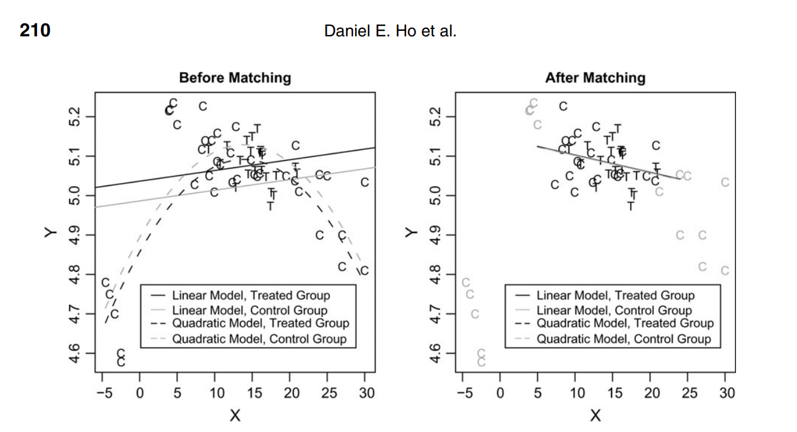
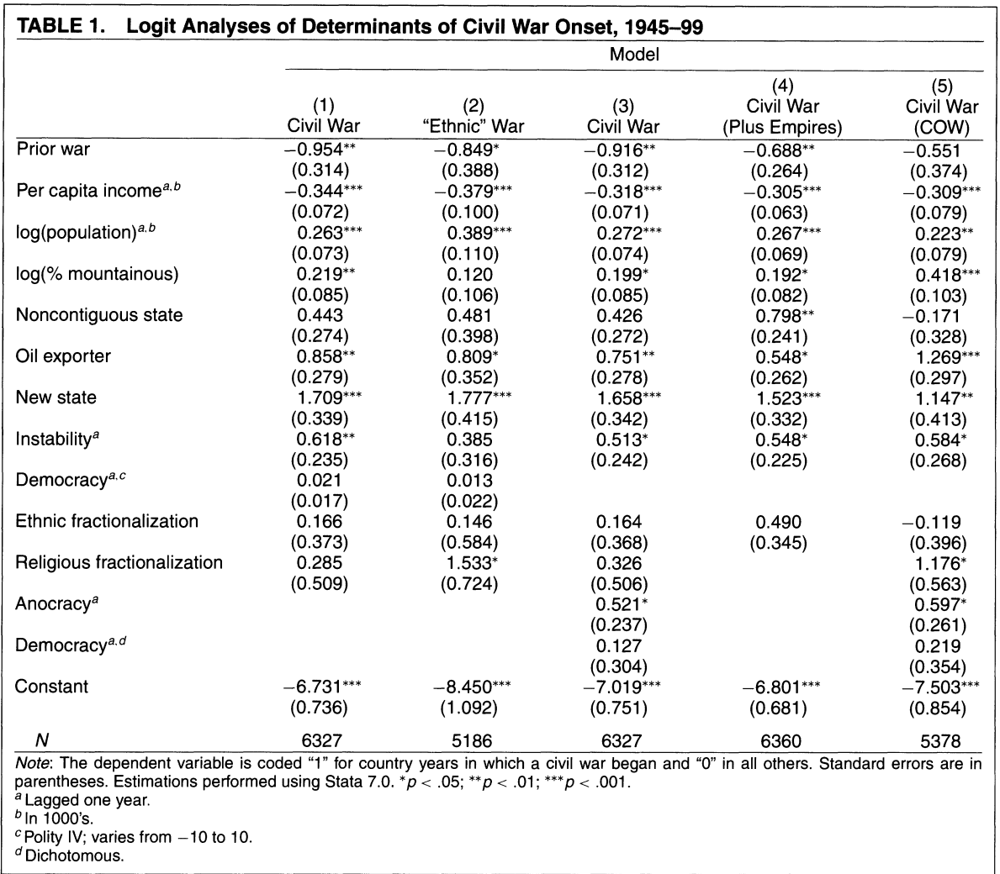

# Previously

  - Identification under **conditional ignorability**
    - Treatment assignment is independent of the potential outcomes *conditional* on observed covariates
    - "Selection-on-observables"
  - With discrete and low-dimensional covariates, simple nonparametric estimator:
    - Weighted average of CATEs across strata
    - With continuous/higher-dimensional covariates, often need *some* parametric assumptions.
  - Can we adjust for a single scalar?
    - Yes: the propensity score: $e(x) = P(D_i = 1 | X_i = x)$
    - IPTW: Weight each unit by the inverse probability of receiving the treatment it received.
---

# This week

  - Can we construct a "weighting" estimator that doesn't rely on a parametric model for the outcome?
    - Yes: Matching!
    - Problem: (inexact) matching is biased (though typically less biased than *failing* to adjust for confounding).
  - What if we modelled the outcome instead?
    - Regression estimators!: $\hat{E}[Y_i(0) | X]$ and $\hat{E}[Y_i(1) | X]$
  - Combining estimators
    - Regresssion to correct for bias in matching
    - Regression + IPTW: "doubly-robust" augmented IPTW
    
---

class: title-slide

# Matching
$$
  \require{cancel}
$$
```{r, echo=F}
options(digits=3)
```
---

# Imputation estimators

- We want to estimate the sample average treatment effect

$$\tau = \frac{1}{N}\sum_{i=1}^N Y_i(1) - Y_i(0)$$

- If we could directly observe $Y_i(1)$ and $Y_i(0)$, we could just plug them into the expression above.
  - We can't...but what if we could construct an *estimator* for each $Y_i(1)$ and $Y_i(0)$ and then plug *those* in.
--

- Consider $Y_i(1)$.
  - If $D_i = 1$, we can just plug in $Y_i$
  - If $D_i = 0$, we'll have to come up with some way of *imputing* $Y_i(1)$ from the rest of the data.
--

- If treatment is completely ignorable, a good (unbiased) estimate is just the average of $Y_i$ in the control group
- If treatment is not completely ignorable, we'll need to somehow use the $X_i$ 

---

# Imputation estimators

- In general, a lot of estimators that we use can be written as imputations of the individual potential outcomes

$$\hat{\tau} = \frac{1}{N}\sum_{i=1}^N \widehat{Y_i(1)} - \widehat{Y_i(0)}$$

- One intuitive imputation approach to adjust for $X_i$ is to simply impute, for each treated unit, the opposite potential outcome using the control units with the most "similar" values of $X_i$
  - Do the same among control units (imputing using the "most similar" treated observations).
- These are **matching** estimators

---

# Matching estimators

- How do we define what "close" or "similar" means?
--

- One approach: choose a *distance metric*
  - Let $Q_{ij}$ denote the distance between the covariates $X_i$ and $X_j$ between units $i$ and $j$
--

- Common metrics:
  - *Exact*: $Q_{ij} = 0$ if $X_i = X_j$ and $Q_{ij} = \infty$ if $X_i \neq X_j$
  - *Standardized Euclidean*: 
  
  $$Q_{ij} = \sqrt{\sum_{k=1}^K \frac{(X_{ik} - X_{jk})^2}{s_k}}$$
  - *Mahalanobis*:
  
  $$Q_{ij} = \sqrt{(X_i - X_j)^{\prime}S^{-1}(X_i - X_j)}$$
where $S$ is the sample covariance matrix.
  
---

# Matching with or without replacement

- Should we let units matched to one observation be allowed to be matched again?
--

- Advantages
  - Bias reduction - we always pick the closest matches.
  - Order of matching doesn't matter
--

- Challenges:
  - Inference is (slightly) more complicated
  - Possibly greater variance (e.g. only one treated unit is "close" to many controls)
--

- For the most part, we'll do matching **with** replacement.

---

# Nearest-neighbor matching

- For a treated unit with $D_i = 1$, we impute the potential outcomes as:

  $$\widehat{Y_i(1)} = Y_i$$
  $$\widehat{Y_i(0)} = \frac{1}{M} \sum_{j \in \mathcal{J}_M(i)} Y_j$$
  
  where $\mathcal{J}_M(i)$ is the set of $M$ closest matches to $i$ among the control observations.
- Do the same for the controls (but impute $\hat{Y_i(1)}$ using matched treated units)
--

- We can think of matching as a kind of weighting estimator that assigns a weight of $1 + \frac{K_M(i)}{M}$ to each unit.

$$\hat{\tau^m_M} = \frac{1}{N}\sum_{i=1}^N (2D_i -1) \bigg(1 + \frac{K_M(i)}{M}\bigg) Y_i$$

---

## ATE or ATT?

- In many settings where we might want to use matching, we have a handful of treated units and many controls.
  - Easy to find a good match for each treated unit
  - *Hard* to find a good match for each control.
--

- So instead of trying to estimate the ATE, we could try to estimate the ATT instead -- using the controls *only* to impute.

$$\hat{\tau^m_{\text{ATT}}} = \frac{1}{N_t}\sum_{i: D_i = 1} Y_i - \widehat{Y_i(0)}$$

--

- **Intuition**: Matching as a form of "pruning" -- many controls will have $K_M(i) = 0$
  - We're throwing away observations! But with good reason.
--

- ATT in an observational study is often the more policy-relevant quantity
  - e.g.: How were the incomes of people who *actually* received a particular social service improved? 

---

## Properties of the simple matching estimator

- Unless matching is exact, Abadie and Imbens (2006) show that matching exhibits a bias.
$$B_M = \frac{1}{N}\sum_{i=1}^N (2D_i - 1) \bigg[\frac{1}{M} \sum_{m=1}^M (\mu_{1-D_i}(X_i) - \mu_{1-D_i}(X_{\mathcal{J}_m(i)})\bigg]$$

where $\mu_1(X_i) = E[Y_i(1) | X_i]$ and $\mu_0(X_i) = E[Y_i(0) | X_i]$ are the conditional expectations.
--

- **Intuitively** - the bias term captures the differences in the conditional expectation function between observation $i$'s covariates and the covariates of the $M$ matches in $\mathcal{J}_m(i)$.
  - When matching is exact, $X_i$ and all of the $X_j$s of the matched units are identical
  - When matching is inexact, we have this **matching discrepancy**
--

- But does this bias go away in large samples?
  - With many continuous covariates, not fast enough - the rate of convergence of the bias term is slower than that of the sampling variance (the simple matching estimator is not $\sqrt{n}$-consistent).
  - This means our asymptotic approximations for the variance will be poor even in large samples.


---

# Simulation to show the bias

- Let's construct a simulation with confounding. Start with $K=8$ i.i.d. covariates $X_1, X_2, \dotsc X_K$ each distributed $\mathcal{N}(0,1)$.
--

- Treatment probability is modeled as a logit

$$\text{log}\bigg(\frac{e(X_i)}{1-e(X_i)}\bigg) =  \beta_1X_1 + \beta_2X_2 + \beta_3X_3 + \dotsc + \beta_k X_k$$

with assumed coefficients $\beta_k = \frac{1}{k}$
--

- Outcome is linear w/ same coefficients $\beta_k$ and a constant treatment effect of $2$

$$Y_i = 2D_i + \mathbf{X}\beta + \epsilon_i$$

---

# Simulation

- First, our unadjusted simple difference-in-means estimator

```{r, echo=F, message=F, warning=F}
library(tidyverse)
library(estimatr)
library(MASS)
inv.logit = function(x) 1/(1 + exp(-x))

```

```{r, echo=F, message=F, warning=F, fig.align="center"}
set.seed(60637)
nIter <- 1000
ate_est <- rep(NA, nIter)
for (iter in 1:nIter){
  N = 100
  K = 8
  X = mvrnorm(N, rep(0, K), Sigma=diag(rep(1,K)))
  colnames(X) <- paste("X",1:K, sep="")
  coef = 1/c(1:K) 
  prD = inv.logit(X%*%coef)
  D = rbinom(N, 1, prD)
  Y = 2*D + X%*%coef + rnorm(N)
  colnames(Y) <- "Y"
  dat <- data.frame(cbind(Y, D, X))
  ate_est[iter] <- coef(lm(Y ~ D, data=dat))[2]
}
hist(ate_est, main="Unadjusted", xlab="Estimate", xlim=c(1, 5))
abline(v=2, col="red", lty=2)
abline(v=mean(ate_est), col="blue", lty=2)

```

---

# Simulation

- Now, the 1-to-1 matching estimator

```{r, echo=F, message=F, warning=F}
library(Matching)

```

```{r, echo=F, message=F, warning=F, fig.align="center"}
set.seed(60637)
nIter <- 1000
ate_est <- rep(NA, nIter)
for (iter in 1:nIter){
  N = 100
  K = 8
  X = mvrnorm(N, rep(0, K), Sigma=diag(rep(1,K)))
  colnames(X) <- paste("X",1:K, sep="")
  coef = 1/c(1:K) 
  prD = inv.logit(X%*%coef)
  D = rbinom(N, 1, prD)
  Y = 2*D + X%*%coef + rnorm(N)
  colnames(Y) <- "Y"
  dat <- data.frame(cbind(Y, D, X))
  ate_est[iter] <- Match(Y = Y, Tr = D, X = X, estimand="ATE", Weight = 2)$est
}
hist(ate_est, main="1-to-1 Matching", xlab="Estimate", xlim=c(1, 5))
abline(v=2, col="red", lty=2)
abline(v=mean(ate_est), col="blue", lty=2)

```

---

# Simulation

- How about 1-to-3 matching?

```{r, echo=F, message=F, warning=F, fig.align="center"}
set.seed(60637)
nIter <- 1000
ate_est <- rep(NA, nIter)
for (iter in 1:nIter){
  N = 100
  K = 8
  X = mvrnorm(N, rep(0, K), Sigma=diag(rep(1,K)))
  colnames(X) <- paste("X",1:K, sep="")
  coef = 1/c(1:K) 
  prD = inv.logit(X%*%coef)
  D = rbinom(N, 1, prD)
  Y = 2*D + X%*%coef + rnorm(N)
  colnames(Y) <- "Y"
  dat <- data.frame(cbind(Y, D, X))
  ate_est[iter] <- Match(Y = Y, Tr = D, X = X, estimand="ATE", M = 3, Weight = 2)$est
}
hist(ate_est, main="1-to-3 Matching", xlab="Estimate", xlim=c(1, 5))
abline(v=2, col="red", lty=2)
abline(v=mean(ate_est), col="blue", lty=2)
```

---

# Simulation

- Now, what if we estimate the bias correction (using a regression estimator)

```{r, echo=F, message=F, warning=F, fig.align="center"}
set.seed(60637)
nIter <- 1000
ate_est <- rep(NA, nIter)
for (iter in 1:nIter){
  N = 100
  K = 8
  X = mvrnorm(N, rep(0, K), Sigma=diag(rep(1,K)))
  colnames(X) <- paste("X",1:K, sep="")
  coef = 1/c(1:K) 
  prD = inv.logit(X%*%coef)
  D = rbinom(N, 1, prD)
  Y = 2*D + X%*%coef + rnorm(N)
  colnames(Y) <- "Y"
  dat <- data.frame(cbind(Y, D, X))
  ate_est[iter] <- Match(Y = Y, Tr = D, X = X, estimand="ATE", M = 3, BiasAdjust=T, Weight = 2)$est
}
hist(ate_est, main="1-to-3 Matching w/ bias correction", xlab="Estimate", xlim=c(1, 5))
abline(v=2, col="red", lty=2)
abline(v=mean(ate_est), col="blue", lty=2)
```
---

# Bias-corrected matching

- Instead of substituting in just the average in the matches, Abadie and Imbens (2006) propose a "bias-corrected" imputation 
- For $D_i = 1$
  $$\widehat{Y_i(1)} = Y_i$$
  $$\widehat{Y_i(0)} = \frac{1}{M}\sum_{j \in \mathcal{J}_M(i)} (Y_j + \hat{\mu_0}(X_i) - \hat{\mu_0}(X_j))$$
- For $D_i = 0$
  $$\widehat{Y_i(0)} = Y_i$$
  $$\widehat{Y_i(1)} = \frac{1}{M}\sum_{j \in \mathcal{J}_M(i)} (Y_j + \hat{\mu_1}(X_i) - \hat{\mu_1}(X_j))$$
  
- **Intuition** -- We combine regression and matching! Regression models adjust for the residual imbalance that matching doesn't solve while matching helps limit the consequences of regression model misspecification.


---

# Matching as pre-processing

.center[]

---


# Variance estimation

- Unfortunately the standard pairs bootstrap doesn't work for variance estimation (even in the case with zero asymptotic bias) (Abadie and Imbens, 2008)
  - **Intuition**: The regular bootstrap does not preserve the distribution of match counts (the weights) $K_M(i)$.
--

- Otsu and Rai (2017) show that a *weighted* bootstrap based on the linearized form of the bias-corrected matching estimator *will* work since it conditions on the number of times a unit is matched
--

- Alternatively, Abadie and Imbens (2006) derive the asymptotic variance + provide an estimator.
  - `Matching` package implements this estimator.

---


# Recent matching methods


- *Optimal* (full) matching
  - Matching as a form of "sub-classification" - each unit is assigned to a sub-class with at least one treated and one control unit
  - Sub-classes chosen to minimize within-subclass distances.
--

- *Genetic* matching (Diamond and Sekhon, 2013)
  - Find the $S^{-1}$ matrix in the Mahalanobis distance that optimizes some criterion of balance between treated and control groups
  - Essentially trying to find optimal "weights" to put on covariates in the matching algorithm to achieve some global optimum of balance.
  - Use a "genetic" algorithm to search for this optimum (non-linear optimization problem)
--

- In general, *matching* is just another technique to try to achieve *balance* on the covariates between the treated and control groups
  - To some extent being superseded by other approaches to weighting that don't rely on distance metrics between observations.
  
---

# Example: Keriakes et. al. (2000)

- Let's see how matching compares to weighting using the dataset from section on percutaneous coronary interventions.
  - Our treatment: use of an anti-platelet drug (abciximab)
  - Our outcome: survival at 6 months
- Load the data and match on all the covariates w/o bias correction

```{r, warning=F, message=F}
library(Matching)
pci <- read_csv("assets/pci.csv")

match_results <- Matching::Match(Y = pci$sixMonthSurvive, Tr = pci$abcix,
                         X = pci %>% dplyr::select(stent, female, diabetic, height, acutemi, ejecfrac, ves1proc),
                         M=3 , Weight = 2, estimand = "ATE")# Weight = 2 = Mahalanobis distance

```

---

# Example: Keriakes et. al. (2000)

```{r}
summary(match_results)
```

- Results aren't too different from the unadjusted estimate - this might be because of left-over bias. Let's see how well matching improved the balance.

---


# Example: Keriakes et. al. (2000)

```{r, message=F}
library(cobalt)
cobalt::bal.tab(match_results, treat = pci$abcix, covs = pci %>% dplyr::select(stent, female, diabetic, height, acutemi, ejecfrac, ves1proc))
```

- Still have pretty bad imbalance on `ejecfrac` and `ves1proc`

---

# Example: Keriakes et. al. (2000)

```{r, fig.align = "center", fig.height=5.5, fig.width=8}
cobalt::love.plot(match_results, treat = pci$abcix, covs = pci %>% dplyr::select(stent, female, diabetic, height, acutemi, ejecfrac, ves1proc),
                  abs=T, binary="std", thresholds= c(m=.1))
```

---
# Example: Keriakes et. al. (2000)

```{r, fig.align="center", fig.height=5.5, fig.width=8}
match_weights <- table(c(match_results$index.treated, match_results$index.control))/3
hist(match_weights, main="Matching weights", xlab="Weight")
```

---

# Example: Keriakes et. al. (2000)

- Let's add on the bias correction

```{r}
match_biasadj <- Matching::Match(Y = pci$sixMonthSurvive, Tr = pci$abcix,
                         X = pci %>% dplyr::select(stent, female, diabetic, height, acutemi, ejecfrac, ves1proc),
                         M=3 , Weight = 2, estimand = "ATE", BiasAdjust = T)# Weight = 2 = Mahalanobis distance

summary(match_biasadj)

```


---

# Summary

  - Matching is a useful tool for reducing covariate imbalance between treated and control groups in a selection-on-observables design
    - **Intuition**: Group together treated and control units with "similar" covariate values
    - Does not depend on any model for the treatment or the outcome
--
  - However, matching is not a universal panacea even if we buy selection-on-observables
    - Still have residual imbalance due to imperfect matches.
--
  - **Combining** matching and regression
    - Matching is commonly framed as a "pre-processing" step prior to regression to avoid regression imputations that are far from the data.
    
---

class: title-slide

# Regression
---

# Agnostic Regression

- Classical approaches to the linear regression model focus on justifying inference under a particular parametric model

$$Y_i | X_i \sim \mathcal{N}(X_i^{\prime}\beta, \sigma^2)$$

- OLS is BLUE under the Gauss-Markov assumptions. It's the MLE under a normal outcome model.
--

- But we rarely believe these
  - Homoskedasticity is almost never true
  - Outcomes are binary, count, etc...
--

- Alternative: Linear regression is the Best Linear Predictor (BLP) of the conditional expectation function (CEF)

---

# Linear Regression

- The regression population parameter $\beta$ is the solution to the following optimization problem

$$\beta = \underset{b}{\text{arg min }} E[(Y_i - X_i^{\prime}b)^2]$$
--

- We'll estimate it from our sample using OLS:

$$\hat{\beta} = \left[\sum_{i=1}^N\left[X_i X_i^{\prime} \right]\right]^{-1} \sum_{i=1}^N[X_iY_i] =  (X^{\prime}X)^{-1}X^{\prime}Y$$

---

# Justifying linear regression

- One justification for linear regression is when the true population CEF $E[Y_i | X_i]$ is actually linear. In that case,

$$E[Y_i | X_i] = X_i^{\prime}\beta$$
- In this setting, our OLS estimator is unbiased and consistent for the true CEF
--

- When is the CEF linear?
  - Guaranteed when the model is **saturated**.
--

- A saturated regression model is one where the number of parameters ( $\beta_1, \beta_2, \dotsc$ ) equals the number of unique levels of $X_i$

---

# Fully saturated model

- Consider a model with two binary covariates $X_{i1}$ and $X_{i2}$.
- Four possible unique values:
  - $E[Y_i | X_{1i} = 0, X_{2i} = 0] = \alpha$
  - $E[Y_i | X_{1i} = 1, X_{2i} = 0] = \alpha + \beta$
  - $E[Y_i | X_{1i} = 0, X_{2i} = 1] = \alpha + \gamma$
  - $E[Y_i | X_{1i} = 1, X_{2i} = 1] = \alpha + \beta + \gamma + \delta$
--

- The CEF can be written as:

$$E[Y_i | X_{i1}, X_{i2}] = \alpha + \beta X_{i1} + \gamma X_{2i} + \delta X_{1i} X_{2i}$$

--

- The CEF is linear by construction! Each level of $E[Y_i | X_{1i}, X_{2i}]$ is estimated separately by taking the mean.
  - Note that the *outcome distribution doesn't matter*! Binary outcome? Still a linear **CEF**! Count outcome? Still a linear **CEF**!
---

# Justifying linear regression

- The second justification is that even if the true CEF is not linear, linear regression provides a "best" linear approximation. Why? Recall that the regression parameters solve the optimization problem:

$$\beta = \underset{b}{\text{arg min }} E[(Y_i - X_i^{\prime}b)^2]$$
--

- Among linear approximations to the CEF (ones that have the form $X_i^{\prime}\beta$), linear regression gives us the approximation that minimizes the mean squared error to the true CEF. In other words

$$\beta = \underset{b}{\text{arg min }} E[(E[Y_i|X_i] - X_i^{\prime}b)^2]$$

- So we don't have to *believe* linearity is true to use linear regression - we're still getting some sort of approximation
  - But the approximation *might* be bad, especially when the true CEF is very non-linear.
  
---

# Regression imputation

- We've typically worked with linear regression as a *prediction* problem: estimating $E[Y_i | X_i]$.
- But how do we use it to estimate $E[Y_i(1) | X_i]$ and $E[Y_i(0) | X_i]$?
  - We need our **identification** assumptions to hold!
--

- Recall that under selection-on-observables

$$E[Y_i(1)] = E_{X}\bigg[E[Y_i(1)| X_i]\bigg] = E_{X}\bigg[E[Y_i| X_i, D_i = 1]\bigg]$$
$$E[Y_i(0)] = E_{X}\bigg[E[Y_i(0)| X_i]\bigg] = E_{X}\bigg[E[Y_i| X_i, D_i = 0]\bigg]$$

--

- So what we need to do to estimate the ATE is:
  1. Fit a regression model in the treated group to estimate $E[Y_i(1) | X_i]$
  2. Fit a regression model in the control group to estimate $E[Y_i(0) | X_i]$
  3. Average the estimates from that model over the sample distribution of $X_i$

---

# Regression imputation

- Regression can be thought of as an **imputation** estimator:

$$\hat{\tau}_{\text{reg}} = \frac{1}{N} \sum_{i=1}^N \hat{\mu}_1(X_i) - \hat{\mu}_0(X_i)$$
- $\hat{\mu}_d(X_i) = \hat{E}[Y_i(d) | X_i]$ is our prediction from a regression of $Y_i$ on $X_i$ in either treated or control group

--

- Note that we have made **no** restrictions on individual treatment effect heterogeneity!
- Unbiased and consistent for the ATE if we've specified the true regression model for $E[Y_i(d) | X_i]$ correctly 

---

# Regression imputation in practice

- Let's take a look again at our Keriakes et. al. data. Let's consider first adjusting for a single covariate: `ejecfrac` - a measure of how much blood is pumped out of the left ventricle each time the heart pumps
  - Low values represent a patient with a poorly-working heart. These patients were more likely to receive the treatment.
- Before running any regression, it's very useful to plot the data using a **binned scatterplot**

```{r echo=F}
StatBinscatter <- ggplot2::ggproto(
  "StatBinscatter", 
  Stat,
  compute_group = function(data, scales, scalefactor = 1e-4, scalepoints = F, bins = 10) {
    bins     <- min(floor(nrow(data)/10), bins)
    x_bin    <- ggplot2::cut_number(data$x + 1e-12*runif(nrow(data)), bins)
    x_means  <- stats::ave(data$x, x_bin, FUN = mean)
    y_means  <- stats::ave(data$y, x_bin, FUN = mean)
    y_se     <- stats::ave(data$y, x_bin, FUN = sd)
    y_obs    <- stats::ave(data$y, x_bin, FUN = length)
    if (scalepoints == T){
      result   <- data.frame(x    = x_means, 
                             y    = y_means, 
                             ymax = y_means + 1.96*y_se/sqrt(y_obs),
                             ymin = y_means - 1.96*y_se/sqrt(y_obs),
                             size = scalefactor*y_obs)
    }else{
      result   <- data.frame(x    = x_means, 
                             y    = y_means, 
                             ymax = y_means + 1.96*y_se/sqrt(y_obs),
                             ymin = y_means - 1.96*y_se/sqrt(y_obs))
    }
    result   <- unique(result)
    return(result)
  },
  required_aes = c("x", "y")
)

#' Binscatter
#' 
#' Group variable on the horizontal axis into equal-sized bins and calculate group means
#' for each bin
#' @param bins Number of bins (defaults to 10)
#' @param geom Which geom to plot (defaults to "point", other options include "pointrange" or 
#' "line")
#' @examples 
#' 
#' ggplot(mpg, aes(x = displ, y = hwy)) + 
#' geom_point(alpha = .1) + 
#' stat_binscatter(color = "red")
#' 
#' ggplot(mpg, aes(x = displ, y = hwy)) + 
#' geom_point(alpha = .1) + 
#' stat_binscatter(color = "red", geom = "pointrange")
#' 
#' ggplot(diamonds, aes(x = carat, y = price, color = cut)) + 
#' stat_binscatter(bins = 20, geom = "pointrange") +
#' stat_binscatter(bins = 20, geom = "line")
#' 
stat_binscatter <- function(mapping = NULL, data = NULL, geom = "point",
                            position = "identity", na.rm = FALSE, show.legend = NA, 
                            inherit.aes = TRUE, ...) {
  ggplot2::layer(
    stat = StatBinscatter, data = data, mapping = mapping, geom = geom, 
    position = position, show.legend = show.legend, inherit.aes = inherit.aes,
    params = list(na.rm = na.rm, ...)
    )
}
```

```{r, echo=F, fig.align="center", fig.height=5}
pci %>% ggplot(aes(x=ejecfrac, y=as.numeric(sixMonthSurvive), colour=as.factor(abcix))) + stat_binscatter(bins = 6, size = 3) + xlab("Ejection Fraction") + ylab("Pr(Survival at six months)") + scale_colour_manual("Abciximab", values=c("indianred", "dodgerblue")) + theme_bw()
```

---

# Regression imputation in practice

- Now let's fit a linear regression in each treatment condition

```{r, echo=F, fig.align="center", fig.height=5}
pci %>% ggplot(aes(x=ejecfrac, y=as.numeric(sixMonthSurvive), colour=as.factor(abcix))) + stat_binscatter(bins = 6, size = 3) + geom_smooth(method=lm_robust, formula=y ~ x) + xlab("Ejection Fraction") + ylab("Pr(Survival at six months)") + scale_colour_manual("Abciximab", values=c("indianred", "dodgerblue")) + theme_bw()
```

- Note the approximation works kinda well in the range where we have a *lot* of data, but for some $X_i$ we end up predicting impossible probabilities.
  - How concerned should we be? Let's see how good the overlap is between treated and control?
  
---

# Regression imputation in practice

- If we have **zero** overlap between treatment and control in the covariates, our counterfactual predictions will be based on extreme extrapolations -- lots of model sensitivity

```{r, echo=F, fig.align="center", fig.height=5}
pci %>% ggplot(aes(x=ejecfrac)) + geom_histogram(bins=20) + xlab("Ejection Fraction") + facet_wrap(~abcix, ) + theme_bw()
```

- Here it's not too bad

---

# Regression imputation in practice

- What happens if we use a quadratic fit?

```{r, echo=F, fig.align="center", fig.height=6}
pci %>% ggplot(aes(x=ejecfrac, y=as.numeric(sixMonthSurvive), colour=as.factor(abcix))) + stat_binscatter(bins = 6, size = 3) + geom_smooth(method=lm_robust, formula=y ~ x + I(x^2)) + xlab("Ejection Fraction") + ylab("Pr(Survival at six months)") + scale_colour_manual("Abciximab", values=c("indianred", "dodgerblue")) + theme_bw()
```

---

# Regression imputation in practice

- Local linear regression smoothers are also popular

```{r, echo=F, fig.align="center", fig.height=6}
pci %>% ggplot(aes(x=ejecfrac, y=as.numeric(sixMonthSurvive), colour=as.factor(abcix))) + stat_binscatter(bins = 6, size = 3) + geom_smooth(method=loess, formula=y~x) + xlab("Ejection Fraction") + ylab("Pr(Survival at six months)") + scale_colour_manual("Abciximab", values=c("indianred", "dodgerblue")) + theme_bw()
```

---

# Regression imputation in practice

- Now let's actually construct our imputation estimator for the ATE using all of the covariates

```{r}

# Fit regression models
mu_1 <- lm_robust(sixMonthSurvive ~ stent + female + diabetic + height + acutemi + ejecfrac + I(ejecfrac^2) + ves1proc + I(ves1proc^2), data = pci %>% filter(abcix == 1))
mu_0 <- lm_robust(sixMonthSurvive ~ stent + female + diabetic + height + acutemi + ejecfrac + I(ejecfrac^2) + ves1proc + I(ves1proc^2), data = pci %>% filter(abcix == 0))

# Predict onto the sample
pci$y1 <- predict(mu_1, newdata=pci)
pci$y0 <- predict(mu_0, newdata=pci)

# Point estimate
point <- mean(pci$y1) - mean(pci$y0)
point

```
--

- Inference?
  - Bootstrap...
  - ...or do this all in one regression!

---

# Regression imputation in practice

- Recall that the Lin (2013) estimator (with full interactions w/ treatment) is essentially fitting two regressions

```{r}
reg_ate <- lm_lin(sixMonthSurvive ~ abcix, 
                  covariates = ~ stent + female + diabetic + height + acutemi + ejecfrac  + I(ejecfrac^2) + ves1proc + I(ves1proc^2), 
                  data = pci)

tidy(reg_ate) %>% filter(term == "abcix")
```

- The coefficient on treatment captures the difference between these two regression functions averaged over the distribution of the data
  - In other words, the imputation estimator!

---

# Regression with constant effects

- Often you will see researchers estimate a single regression model with the form:

$$E[Y_i | D_i, X_i] = \tau D_i + X_i^{\prime}\beta$$

--

- Does $\tau$ identify the ATE?
  - We need to assume the model is correct (e.g. no treatment-covariate interactions)
  - **And** we need to assume constant treatment effects!
--

- Even if the model for the outcome is correct, under effect heterogeneity, the regression coefficient $\tau$ is not the ATE.
  - "Regression weighting problem" (Samii and Aronow, 2012)

---

# Regression weighting

- Suppose the potential outcomes can be written as

$$Y_i(d) = Y_i(0) + \tau_i \times d$$

- The ATE is $E[\tau_i] = \tau$

--

- Suppose we then fit our usual linear regression model

$$Y_i = \alpha + \tau_{\text{R}} D_i + X_i^{\prime}\beta + \epsilon_i$$

- Will our estimate of $\hat{\tau_{\text{R}}}$ equal $E[\tau_i]$?
  - No!

---

# Regression weighting

- Recall the Frisch-Waugh-Lovell theorem. In a multiple regression setting, we can write an expression for the treatment coefficient as

$$\tau_\text{R} = \frac{Cov(Y_i, \tilde{D_i})}{Var(\tilde{D_i})} $$
where $\tilde{D_i}$ is the residual from a regression of $D_i$ on all of the other covariates.

--

- In this case, that's just:

$$\tau_\text{R} = \frac{Cov(Y_i, D_i - E[D_i|X_i])}{Var(D_i - E[D_i|X_i])} $$

---

# Regression weighting

- We can re-arrange terms (see Samii and Aronow, 2016 for the math) to get an expression for the weights placed on individual $\tau_i$

$$\tau_\text{R} = \frac{E[w_i \tau_i]}{E[w_i]}$$
where $w_i = (D_i - E[D_i | X_i])^2$

--

- **Intuition** - Units whose treatment status is *poorly predicted* by the covariates get more weight.
  - Why? Because OLS is a **minimum-variance** estimator - estimates are more precise for strata where there is more residual variation in $D_i$ 
--

- The typical multiple regression estimator does not recover the ATE under effect heterogeneity.

---

# Regression weighting

```{r}
full_reg <- lm_robust(sixMonthSurvive ~ abcix + stent + female + diabetic + height + acutemi + ejecfrac + I(ejecfrac^2) + ves1proc + I(ves1proc^2), data=pci)
tidy(full_reg) %>% filter(term == "abcix")

# Get the weights
resid_reg <- lm_robust(abcix ~stent + female + diabetic + height + acutemi + ejecfrac + I(ejecfrac^2) + ves1proc + I(ves1proc^2), data=pci)
pci$abcix_resid <- pci$abcix - resid_reg$fitted.values
# Show FWL working
partial_reg <- lm_robust(sixMonthSurvive ~ abcix_resid, data=pci)
tidy(partial_reg) %>% filter(term == "abcix_resid")

# Weights on individual treatment effects
pci$abcix_w <- pci$abcix_resid^2

```

---

# Regression weighting

```{r, echo=F, fig.height=6, fig.align="center"}
# Summarize
hist(pci$abcix_w, main = "", xlab="Weight on treatment effect")
```

---

# Regression overview

- Regression adjusts for $X_i$ by directly modeling $E[Y_i(1) | X_i]$ and $E[Y_i(0) | X_i]$.
  - Linear regression is actually quite flexible -- don't need the full Gauss-Markov assumptions to justify it as a "best approximation" to the CEF.
--

- **Recommended**
  - Fit two separate models in treatment/control and use them to impute the P.O. for each unit $i$
  - Can bootstrap to get the sampling variance
  - Or fit a single regression model with all treatment-covariate interactions
--

- **Careful**
  - Regression estimators aren't great when overlap is poor
  - Regression doesn't necessarily assign a "representative" weight to each observation 

---

# Beware the Table 2 fallacy


.center[]

---

# Beware the Table 2 fallacy

- It is best to design a regression to estimate **one** effect.
- Don't read all the coefficients from a regression as causal!
--

- **Intuition**: We've selected $X_i$ that affect our treatment $D$.
  - So the coefficient on $X_i$ in our regression will - by construction - suffer from post-treatment bias since we're controlling for $D$ in that same regression!
  - We also justified our choices of $X_i$ based on what affects $D$, but the confounders for $D$ are not the same as the confounders for some other $X$
  - Effect heterogeneity also messes this up -- remember FWL!
--

- For more, see
> Westreich, Daniel, and Sander Greenland. "The table 2 fallacy: presenting and interpreting confounder and modifier coefficients." American journal of epidemiology 177.4 (2013): 292-298.
---

# Overview

- All of the methods we've discussed only work if our identification assumption is correct
- **Selection-on-observables**:
  - $\{Y_i(1), Y_i(0)\} {\perp \! \! \! \perp} D_i | X_i$
--

- How do we know if $X_i$ is the right set of covariates?
  - Theory! + (some) knowledge of the treatment assignment process.
  - DAGs as a tool for synthesizing theory about 
--

- Once we think selection-on-observables is a plausible **identification strategy**, then we have some choice in our **estimation** approach:
  - Discrete covariates: Just stratify!
  - Concerned about modelling assumptions? Maybe match first?
  - IPTW + Regression: More recent methods combine the two for "double-robustness"
  - Consider less parametric methods for the models (kernels, local linear regression, BART, GAMs)
--

- **Always look at your data!**
  
---