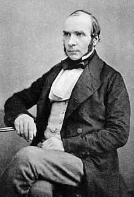
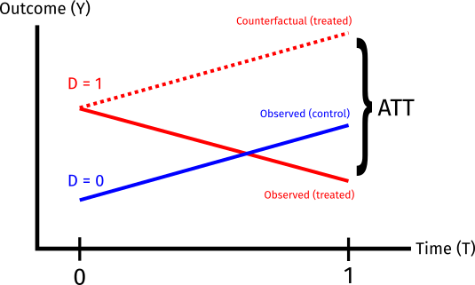

# Last week

- Identification under **unobserved confounding**
- Instrumental variables - we can identify the local average treatment effect (LATE) with an instrument that...
  - ...is ignorable/conditionally ignorable...
  - ...and affects the outcome only through the treatment (exclusion restriction)...
  - ...and has a monotonic effect on treatment.
- Our simple IV estimator (1 instrument, 1 treatment, no covariates) is a ratio of the reduced form effect of the instrument and the first-stage effect.
  - Ratios are poorly behaved! Lots of statistical issues with a weak first stage.
      
---

# This week

- More strategies for identification when **unobserved confounding**
--

- When we have repeated observations over time, can we use pre-treatment outcomes to help with inference?
  - Time 1: Some units treated, some units under control
  - Time 0: All units under control
--

- What if the confounding in time 1 were unobserved...
  - ... but the amount of confounding in time 1 is the same as in time 0?
--

- Then we can use the pre-treatment (time 0) difference in the treated and control arms to **de-bias** the time 1 difference.
  - **Difference-in-differences**
--

- Assumption: **parallel trends**
  - The *trend* in the average potential outcome in the treated group would have been the same as the *trend* in the control group absent treatment.
--

- Generalizes to any setting where we believe there is confounding but where the true effect of treatment is known to be 0
  - "Negative Outcome Control"


---

class: title-slide

# Difference-in-differences
$$
  \require{cancel}
$$
```{r, echo=F, warning=F, message=F}
library(tidyverse)
library(estimatr)
library(haven)
options(digits=3)
```

---

# John Snow and Cholera

.center[]

---

# John Snow and Cholera

- 1854: Large cholera outbreak near Broad Street in London.
  - Physician John Snow hypothesized that cholera was transmitted through the water
  - Contrary to popular belief that it was airborne ("miasma theory")
--

- Snow convinced the local authorities to remove the handle of the Broad Street pump
  - Cholera deaths declined
  - But was this causal?
--

- Even Snow didn't necessarily think so...

> There is no doubt that the mortality was much diminished, as I said before, by the flight of the population, which commenced soon after the outbreak; but the attacks had so far diminished before the use of the water was stopped, that it is impossible to decide whether the well still contained the cholera poison in an active state, or whether, from some cause, the water had become free from it. (Snow, "On the Mode of Communication of Cholera, 1855)

---

# John Snow and Cholera

- The more interesting John Snow story was not the Broad Street pump, but another 1856 paper titled "Cholera and the water supply in the south districts of London in 1854"
--

- **Key insight**: South London was served by two major water companies: .maroon[Lambeth Company] and .blue[Southwark and Vauxhall Company].
  - Lambeth switched to a less contaminated source between 1849 and 1853
  
--

> Between the epidemics of 1849 and that of 1853, one of the water companies supplying the south districts of London changed its source of supply from the middle of the town, near the foot of the Hungerford Suspension Bridge, to Thames Ditton, at a part of the river which is beyond the influence of the tide, and, therefore, out of reach of the sewage of the metropolis. (Snow, 1856)

---

# John Snow and Cholera

.center[]

---

# John Snow and Cholera

- Snow compared Lambeth (treated) districts with Southwark and Vauxhall (control) districts -- less mortality in Lambeth.

> ...Taking into account the population supplied respectively by each company, the mortality was, at this period of the epidemic, nearly eight times as great in that supplied by the Southwark and Vauxhall Company as in that supplied by the Lambeth Company. (Snow, 1856)

--

- But this isn't enough - what if Lambeth districts differed in unobserved ways from Southwark and Vauxhall districts?

--

- So Snow also compared the observed mortality in 1853 to mortality in 1849, when **both** districts used contaminated water.

> In the autumn of 1853 it was shown by Dr. Farr* that the districts partly supplied by this, the Lambeth Water Company, with improved water, suffered less than the districts supplied entirely by the Southwark and Vauxhall Company with the water from the river at Battersea Fields, although in 1849 they had suffered rather more than the latter districts (Snow, 1856).

---

# John Snow and Cholera

- This was one of the first "difference-in-differences" designs.
  - Not just a before-after comparison
  - Not just a cross-sectional comparison
--

- Implicit assumption: If there were something different about Lambeth (aside from the treatment) it would have the same effect on the outcome in the pre-treatment (1849) period as it would in 1853.
  - An assumption on the counterfactuals: Had treatment not changed in Lambeth, the average trend (from 1849 to 1853) in Lambeth would have been the same as the trend in Southwark and Vauxhall

---

# DiD with two periods

- Two groups (treated/control); two time periods (0, 1). 
  - $D_i = 1$: treated in time $1$, $D_i = 0$ control in time $1$
  - All units under control in time $0$
  - Can also think in terms of a treatment indicator in each time period: $D_{i1} = D_i$, $D_{i0} = 0$
--

- Two outcomes observed
  - $Y_{i1}$: outcome in period $1$, $Y_{i0}$ outcome in period $0$
--

- Potential outcomes

$$Y_{i1}(d) = Y_{i1} \text{ if } D_i = d$$

--

- Treatment in time $1$ has no effect on the outcome in time $0$ (no reverse-causality)

$$Y_{i0}(1) = Y_{i0}(0) = Y_{i0}$$

---

# Identifying assumptions

- Causal estimand: **Average Treatment Effect on the Treated** (ATT) in time $1$

$$\tau_{\text{ATT}} = E[Y_{i1}(1) | D_i = 1] - E[Y_{i1}(0) | D_i = 1]$$

--

- The first part we can get directly from the data (observed outcome among the treated group)

$$\tau_{\text{ATT}} = E[Y_{i1} | D_i = 1] - E[Y_{i1}(0) | D_i = 1]$$

--

- Second part we don't observe directly and need some additional assumptions.
  - But we won't assume ignorability of treatment: $Y_{i1}(0) \cancel{{\perp \! \! \! \perp}} D_i$

---

# Identifying assumptions

- Remember the selection bias formula for the ATT:

$$\tau_{\text{ATT}} = \underbrace{\left\{E[Y_{i1} | D_i = 1] - E[Y_{i1} | D_i = 0]\right\}}_{\text{Difference-in-means in time 1}} - \underbrace{\left\{E[Y_{i1}(0) | D_i = 1] - E[Y_{i1}(0)| D_i = 0]\right\}}_{\text{Selection bias}}$$

--

- We can observe $E[Y_{i1}(0)| D_i = 0]$, but can't observe $E[Y_{i1}(0)| D_i = 1]$
  - Can we estimate the **selection bias**?
--

- **Assumption**: The selection bias in time $1$ is the same as the selection bias in time $0$.

---

# Parallel trends

- Our parallel trends assumption:

$$\underbrace{\left\{E[Y_{i1}(0) | D_i = 1] - E[Y_{i1}(0)| D_i = 0]\right\}}_{\text{Selection bias at time 1}} = \underbrace{\left\{E[Y_{i0} | D_i = 1] - E[Y_{i0}| D_i = 0]\right\}}_{\text{Observed difference at time 0}}$$

--

- Alternatively, re-arranging the terms, we can write "parallel trends" as

$$\underbrace{\left\{E[Y_{i1}(0) | D_i = 1] - E[Y_{i0} | D_i = 1] \right\}}_{\text{Average counterfactual trend among treated}} = \underbrace{\left\{E[Y_{i1}(0)| D_i = 0] - E[Y_{i0}| D_i = 0]\right\}}_{\text{Average trend among controls}}$$

---

# Parallel trends

- Substituting our parallel trends assumption back into the ATT formula gives us an expression in terms of observables

$$\tau_{\text{ATT}} = \underbrace{\left\{E[Y_{i1} | D_i = 1] - E[Y_{i1} | D_i = 0]\right\}}_{\text{Difference-in-means in time 1}} - \underbrace{\left\{E[Y_{i0} | D_i = 1] - E[Y_{i0} | D_i = 0]\right\}}_{\text{Difference-in-means at time 0}}$$

--

- Or equivalently

$$\tau_{\text{ATT}} = \underbrace{\left\{E[Y_{i1} - Y_{i0} | D_i = 1]\right\}}_{\text{Average change in the treated group}} - \underbrace{\left\{E[Y_{i1} - Y_{i0} | D_i = 0]\right\}}_{\text{Average change in the control group}}$$

--

- We can estimate each of these four expectations non-parametrically with the sample means.

---

# Difference-in-differences

.center[]

---

# Estimation

- With repeated observations at the unit level, we can use a simple regression of the **differenced** outcomes on the treatment indicator

$$Y_{i1} - Y_{i0} = \alpha + \tau D_i + \epsilon_i$$

- Each row in the data is a single *unit* with outcomes in two time periods.
  - Straightforward asymptotic inference with Neyman-like SEs

---

# Fixed-effects estimators

- Suppose our dataset is organized where each row is a unit/time period - $it$.
- We can recover our DiD estimator using a "two-way" fixed effects regression
  - Unique parameter for each *unit*
  - Unique parameter for each *time period*

$$Y_{it} = \alpha_i + \delta_{t} + \tau D_{it} + \epsilon_{it}$$
--

- **Expectations**: 
  - $E[Y_{i0} | D_i = 0] = E[\alpha_i | D_i = 0] + \delta_0$
  - $E[Y_{i1} | D_i = 0] = E[\alpha_i | D_i = 0] + \delta_1$
  - $E[Y_{i0} | D_i = 1] = E[\alpha_i | D_i = 1] + \delta_0$
  - $E[Y_{i1} | D_i = 1] = E[\alpha_i | D_i = 1] + \delta_1 + \tau$
--

- **Differences**
  - $E[Y_{i1} | D_i = 1] - E[Y_{i0} | D_i = 1] = \delta_1 - \delta_0 + \tau$
  - $E[Y_{i1} | D_i = 0] - E[Y_{i0} | D_i = 0] = \delta_1 - \delta_0$
--

- **Difference-in-differences**
  - $\{E[Y_{i1} | D_i = 1] - E[Y_{i0} | D_i = 1]\} - \{E[Y_{i1} | D_i = 0] - E[Y_{i0} | D_i = 0]\} = \tau$
--

- Does **not** generalize neatly to many time periods w/ variation in treatment timing.
  - Need to believe the constant, instantaneous treatment effect $\tau$

---

# Fixed-effects as imputation

- We can think of our DiD estimator as an imputation estimator

$$\hat{\tau}_{\text{ATT}} = \frac{1}{N_t}\sum_{i: D_{i} = 1} Y_{i1} - \widehat{Y_{i1}(0)}$$
--

- Under parallel trends, 

$$\widehat{Y_{i1}(0)} = Y_{i0} - \left\{\frac{1}{N_c} \sum_{j:D_j = 0} Y_{j1} - Y_{j0}\right\}$$

--

- Can also imagine fitting a model among *only* the control periods ( $D_{it} = 0$ ) and using the model to predict on the treated units.

$$E[Y_{it} | D_{it} = 0] = \alpha_i + \delta_t$$

---

# Standard errors

- Recall the classic "sandwich" form for the variance-covariance matrix of the OLS coefficients

$$Var(\hat{\beta} | \mathbf{X}) = (\mathbf{X}^{\prime}\mathbf{X})^{-1}\mathbf{X^{\prime}}\Omega\mathbf{X}(\mathbf{X}^{\prime}\mathbf{X})^{-1}$$
- $\Omega$ is the outer product of the error terms $\epsilon\epsilon^{\prime}$

--

- We can't just plug in the outer product of the residuals as our estimator. $\hat{\Omega} = \hat{\epsilon}\hat{\epsilon}^{\prime}$ will not yield a consistent estimator of $Var(\hat{\beta})$.
  - Under independence across observations $Cov(\epsilon_i, \epsilon_j) = 0$ and homoskedasticity, $\Omega$ is the identity matrix multiplied by a constant $\sigma^2$ and we get our conventional OLS SE estimator.
  - Under independence but with heteroskedasticity, we can construct a plug-in estimator $\hat{\Omega}$ with $0$ on the off-diagonals and the squared residuals $\hat{\epsilon_i}^2$ on the diagonals. This yields a consistent estimator for $Var(\hat{\beta})$ (Huber-White SEs)

---

# Standard errors

- In the TWFE setting, we might believe that errors are independent across units: $Cov(\epsilon_{it}, \epsilon_{jt}) = 0$ but that there is within-unit correlation over time: $Cov(\epsilon_{it}, \epsilon_{it^{\prime}}) \neq 0$. Huber-White assumptions are incorrect.
- Alternative: **Cluster-robust Standard Errors.**
  - Assume $\Omega$ is block-diagonal (no error covariance across clusters, unrestricted error covariance within cluster)
  - $\hat{\Omega_c} = \hat{\epsilon_c}\hat{\epsilon_c}^{\prime}$

$$\widehat{Var(\hat{\beta} | \mathbf{X})} = (\mathbf{X}^{\prime}\mathbf{X})^{-1}\left[\sum_{c}\mathbf{X^{\prime}_{c}}\hat{\Omega}_c\mathbf{X_c}\right](\mathbf{X}^{\prime}\mathbf{X})^{-1}$$

--

- Consistent but biased w/ small numbers of clusters: typically augment with a small-sample correction (CR1, CR2, etc...)
  - Cluster bootstrap also performs somewhat better in smaller samples.

---

# Example: Card and Krueger (1994, AER)

- Does increasing the minimum wage reduce employment?
  - Classical theoretical models suggest yes...
  - But empirical evidence is hard to come by - no one has (yet) randomized the minimum wage.
--

- Card and Krueger use a policy change in New Jersey relative to Pennsylvania
- In 1992, NJ raised its minimum wage from 4.25 dollars per hour to 5.05 per hour
  - PA stayed at 4.25 dollars per hour
--

- Surveyed 410 fast food restaurants before and after the change was put into place
  - Compared change in employment before/after in NJ with change before/after in PA.
--

- **Key assumption** - Had NJ not implemented the minimum wage increase, the average trend in NJ fast food restaurant employment would have been the same as the average trend in PA fast food restaurant employment

---

# Example: Card and Krueger (1994, AER)

```{r, echo=T, warning=F, message=F}
# Load the data for Card and Krueger (1994)
minwage <- read_csv("assets/minwage.csv")
# Index of observations
minwage$unit <- 1:nrow(minwage)

# Change in full-time employment
minwage$CHG_EMPFT <- minwage$EMPFT2 - minwage$EMPFT

# Regress change on treatment (STATE = 1 for NJ)
diff <- lm_robust(CHG_EMPFT ~ STATE, data=minwage, se_type = "HC0")
tidy(diff)
```

---

# Example: Card and Krueger (1994, AER)

```{r, echo=T, warning=F, message=F}
# Equivalence of TWFE in 2x2 case
minwage_long <- minwage %>% pivot_longer(cols = starts_with("EMPFT"), 
                names_to = "time_str", names_prefix = "EMPFT", values_to = "EMPFT")

# Recode time variable
minwage_long$time <- NA
minwage_long$time[minwage_long$time_str == ""] <- 0
minwage_long$time[minwage_long$time_str == "2"] <- 1

# Make the treatment variable
minwage_long$treat <- as.integer(minwage_long$STATE == 1&minwage_long$time==1)

# TWFE
twfe_reg <- lm_robust(EMPFT ~ treat + as.factor(time) + as.factor(unit), 
                      data=minwage_long, cluster=unit, se_type = "CR0")
tidy(twfe_reg) %>% filter(term == "treat")
```

---

class: title-slide

# Difference-in-differences with many time periods
$$
  \require{cancel}
$$

---