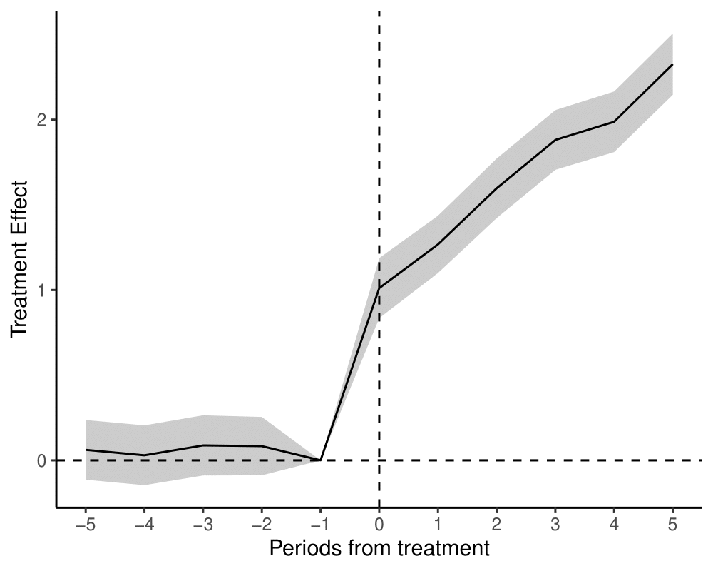
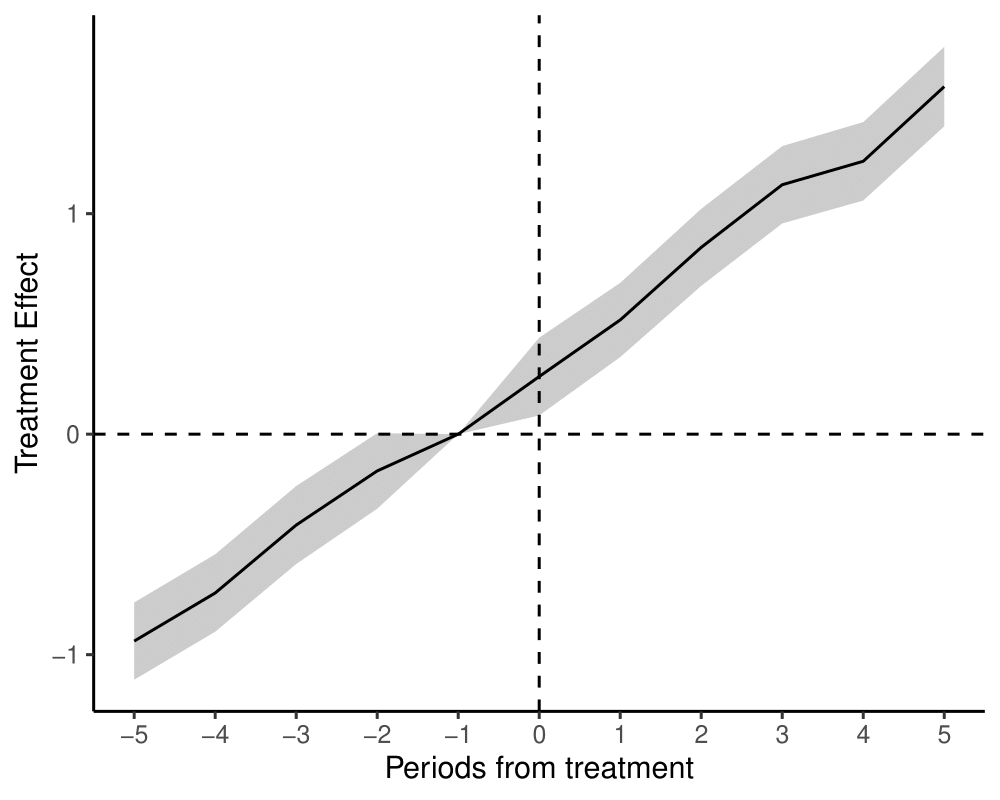

# Last week

- Identification under **unobserved confounding**
- Instrumental variables - we can identify the local average treatment effect (LATE) with an instrument that...
  - ...is ignorable/conditionally ignorable...
  - ...and affects the outcome only through the treatment (exclusion restriction)...
  - ...and has a monotonic effect on treatment.
- Our simple IV estimator (1 instrument, 1 treatment, no covariates) is a ratio of the reduced form effect of the instrument and the first-stage effect.
  - Ratios are poorly behaved! Lots of statistical issues with a weak first stage.
      
---

# This week

- More strategies for identification when **unobserved confounding**
--

- When we have repeated observations over time, can we use pre-treatment outcomes to help with inference?
  - Time 1: Some units treated, some units under control
  - Time 0: All units under control
--

- What if the confounding in time 1 were unobserved...
  - ... but the amount of confounding in time 1 is the same as in time 0?
--

- Then we can use the pre-treatment (time 0) difference in the treated and control arms to **de-bias** the time 1 difference.
  - **Difference-in-differences**
--

- Assumption: **parallel trends**
  - The *trend* in the average potential outcome in the treated group would have been the same as the *trend* in the control group absent treatment.
--

- Generalizes to any setting where we believe there is confounding but where the true effect of treatment is known to be 0
  - "Negative Outcome Control"


---

class: title-slide

# Difference-in-differences
$$
  \require{cancel}
$$

```{css, echo=F}
.center2 {
  margin: 0;
  position: absolute;
  top: 50%;
  left: 50%;
  -ms-transform: translate(-50%, -50%);
  transform: translate(-50%, -50%);
}
```

```{r, echo=F, warning=F, message=F}
library(tidyverse)
library(estimatr)
library(haven)
options(digits=3)
```

---

# John Snow and Cholera

.center[]

---

# John Snow and Cholera

- 1854: Large cholera outbreak near Broad Street in London.
  - Physician John Snow hypothesized that cholera was transmitted through the water
  - Contrary to popular belief that it was airborne ("miasma theory")
--

- Snow convinced the local authorities to remove the handle of the Broad Street pump
  - Cholera deaths declined
  - But was this causal?
--

- Even Snow didn't necessarily think so...

> There is no doubt that the mortality was much diminished, as I said before, by the flight of the population, which commenced soon after the outbreak; but the attacks had so far diminished before the use of the water was stopped, that it is impossible to decide whether the well still contained the cholera poison in an active state, or whether, from some cause, the water had become free from it. (Snow, "On the Mode of Communication of Cholera, 1855)

---

# John Snow and Cholera

- The more interesting John Snow story was not the Broad Street pump, but another 1856 paper titled "Cholera and the water supply in the south districts of London in 1854"
--

- **Key insight**: South London was served by two major water companies: .maroon[Lambeth Company] and .blue[Southwark and Vauxhall Company].
  - Lambeth switched to a less contaminated source between 1849 and 1853
  
--

> Between the epidemics of 1849 and that of 1853, one of the water companies supplying the south districts of London changed its source of supply from the middle of the town, near the foot of the Hungerford Suspension Bridge, to Thames Ditton, at a part of the river which is beyond the influence of the tide, and, therefore, out of reach of the sewage of the metropolis. (Snow, 1856)

---

# John Snow and Cholera

.center[]

---

# John Snow and Cholera

- Snow compared Lambeth (treated) districts with Southwark and Vauxhall (control) districts -- less mortality in Lambeth.

> ...Taking into account the population supplied respectively by each company, the mortality was, at this period of the epidemic, nearly eight times as great in that supplied by the Southwark and Vauxhall Company as in that supplied by the Lambeth Company. (Snow, 1856)

--

- But this isn't enough - what if Lambeth districts differed in unobserved ways from Southwark and Vauxhall districts?

--

- So Snow also compared the observed mortality in 1853 to mortality in 1849, when **both** districts used contaminated water.

> In the autumn of 1853 it was shown by Dr. Farr* that the districts partly supplied by this, the Lambeth Water Company, with improved water, suffered less than the districts supplied entirely by the Southwark and Vauxhall Company with the water from the river at Battersea Fields, although in 1849 they had suffered rather more than the latter districts (Snow, 1856).

---

# John Snow and Cholera

- This was one of the first "difference-in-differences" designs.
  - Not just a before-after comparison
  - Not just a cross-sectional comparison
--

- Implicit assumption: If there were something different about Lambeth (aside from the treatment) it would have the same effect on the outcome in the pre-treatment (1849) period as it would in 1853.
  - An assumption on the counterfactuals: Had treatment not changed in Lambeth, the average trend (from 1849 to 1853) in Lambeth would have been the same as the trend in Southwark and Vauxhall

---

# DiD with two periods

- Two groups (treated/control); two time periods (0, 1). 
  - $D_i = 1$: treated in time $1$, $D_i = 0$ control in time $1$
  - All units under control in time $0$
  - Can also think in terms of a treatment indicator in each time period: $D_{i1} = D_i$, $D_{i0} = 0$
--

- Two outcomes observed
  - $Y_{i1}$: outcome in period $1$, $Y_{i0}$ outcome in period $0$
--

- Potential outcomes

$$Y_{i1}(d) = Y_{i1} \text{ if } D_i = d$$

--

- Treatment in time $1$ has no effect on the outcome in time $0$ (no reverse-causality)

$$Y_{i0}(1) = Y_{i0}(0) = Y_{i0}$$

---

# Identifying assumptions

- Causal estimand: **Average Treatment Effect on the Treated** (ATT) in time $1$

$$\tau_{\text{ATT}} = E[Y_{i1}(1) | D_i = 1] - E[Y_{i1}(0) | D_i = 1]$$

--

- The first part we can get directly from the data (observed outcome among the treated group)

$$\tau_{\text{ATT}} = E[Y_{i1} | D_i = 1] - E[Y_{i1}(0) | D_i = 1]$$

--

- Second part we don't observe directly and need some additional assumptions.
  - But we won't assume ignorability of treatment: $Y_{i1}(0) \cancel{{\perp \! \! \! \perp}} D_i$

---

# Identifying assumptions

- Remember the selection bias formula for the ATT:

$$\tau_{\text{ATT}} = \underbrace{\left\{E[Y_{i1} | D_i = 1] - E[Y_{i1} | D_i = 0]\right\}}_{\text{Difference-in-means in time 1}} - \underbrace{\left\{E[Y_{i1}(0) | D_i = 1] - E[Y_{i1}(0)| D_i = 0]\right\}}_{\text{Selection bias}}$$

--

- We can observe $E[Y_{i1}(0)| D_i = 0]$, but can't observe $E[Y_{i1}(0)| D_i = 1]$
  - Can we estimate the **selection bias**?
--

- **Assumption**: The selection bias in time $1$ is the same as the selection bias in time $0$.

---

# Parallel trends

- Our parallel trends assumption:

$$\underbrace{\left\{E[Y_{i1}(0) | D_i = 1] - E[Y_{i1}(0)| D_i = 0]\right\}}_{\text{Selection bias at time 1}} = \underbrace{\left\{E[Y_{i0} | D_i = 1] - E[Y_{i0}| D_i = 0]\right\}}_{\text{Observed difference at time 0}}$$

--

- Alternatively, re-arranging the terms, we can write "parallel trends" as

$$\underbrace{\left\{E[Y_{i1}(0) | D_i = 1] - E[Y_{i0} | D_i = 1] \right\}}_{\text{Average counterfactual trend among treated}} = \underbrace{\left\{E[Y_{i1}(0)| D_i = 0] - E[Y_{i0}| D_i = 0]\right\}}_{\text{Average trend among controls}}$$

---

# Parallel trends

- Substituting our parallel trends assumption back into the ATT formula gives us an expression in terms of observables

$$\tau_{\text{ATT}} = \underbrace{\left\{E[Y_{i1} | D_i = 1] - E[Y_{i1} | D_i = 0]\right\}}_{\text{Difference-in-means in time 1}} - \underbrace{\left\{E[Y_{i0} | D_i = 1] - E[Y_{i0} | D_i = 0]\right\}}_{\text{Difference-in-means at time 0}}$$

--

- Or equivalently

$$\tau_{\text{ATT}} = \underbrace{\left\{E[Y_{i1} - Y_{i0} | D_i = 1]\right\}}_{\text{Average change in the treated group}} - \underbrace{\left\{E[Y_{i1} - Y_{i0} | D_i = 0]\right\}}_{\text{Average change in the control group}}$$

--

- We can estimate each of these four expectations non-parametrically with the sample means.

---

# Difference-in-differences

.center[]

---

# Estimation

- With repeated observations at the unit level, we can use a simple regression of the **differenced** outcomes on the treatment indicator

$$Y_{i1} - Y_{i0} = \alpha + \tau D_i + \epsilon_i$$

- Each row in the data is a single *unit* with outcomes in two time periods.
  - Straightforward asymptotic inference with Neyman-like SEs

---

# Fixed-effects estimators

- Suppose our dataset is organized where each row is a unit/time period - $it$.
- We can recover our DiD estimator using a "two-way" fixed effects regression
  - Unique parameter for each *unit*
  - Unique parameter for each *time period*

$$Y_{it} = \alpha_i + \delta_{t} + \tau D_{it} + \epsilon_{it}$$
---

# Fixed-effects estimators

- **Expectations**: 
  - $E[Y_{i0} | D_i = 0] = E[\alpha_i | D_i = 0] + \delta_0$
  - $E[Y_{i1} | D_i = 0] = E[\alpha_i | D_i = 0] + \delta_1$
  - $E[Y_{i0} | D_i = 1] = E[\alpha_i | D_i = 1] + \delta_0$
  - $E[Y_{i1} | D_i = 1] = E[\alpha_i | D_i = 1] + \delta_1 + \tau$
--

- **Differences**
  - $E[Y_{i1} | D_i = 1] - E[Y_{i0} | D_i = 1] = \delta_1 - \delta_0 + \tau$
  - $E[Y_{i1} | D_i = 0] - E[Y_{i0} | D_i = 0] = \delta_1 - \delta_0$
--

- **Difference-in-differences**
  - $\{E[Y_{i1} | D_i = 1] - E[Y_{i0} | D_i = 1]\} - \{E[Y_{i1} | D_i = 0] - E[Y_{i0} | D_i = 0]\} = \tau$
--

- Does **not** generalize neatly to many time periods w/ variation in treatment timing.
  - Need to believe the constant, instantaneous treatment effect $\tau$
--

- Need to account for dependence in observations between time periods w/in same unit
  - "Cluster-robust" SEs or block bootstrap

---

# Fixed-effects as imputation

- We can think of our DiD estimator as an imputation estimator

$$\hat{\tau}_{\text{ATT}} = \frac{1}{N_t}\sum_{i: D_{i} = 1} Y_{i1} - \widehat{Y_{i1}(0)}$$
--

- Under parallel trends, 

$$\widehat{Y_{i1}(0)} = Y_{i0} - \left\{\frac{1}{N_c} \sum_{j:D_j = 0} Y_{j1} - Y_{j0}\right\}$$

--

- Can also imagine fitting a model among *only* the control periods ( $D_{it} = 0$ ) and using the model to predict on the treated units.

$$E[Y_{it} | D_{it} = 0] = \alpha_i + \delta_t$$

---

# Example: Card and Krueger (1994, AER)

- Does increasing the minimum wage reduce employment?
  - Classical theoretical models suggest yes...
  - But empirical evidence is hard to come by - no one has (yet) randomized the minimum wage.
--

- Card and Krueger use a policy change in New Jersey relative to Pennsylvania
- In 1992, NJ raised its minimum wage from 4.25 dollars per hour to 5.05 per hour
  - PA stayed at 4.25 dollars per hour
--

- Surveyed 410 fast food restaurants before and after the change was put into place
  - Compared change in employment before/after in NJ with change before/after in PA.
--

- **Key assumption** - Had NJ not implemented the minimum wage increase, the average trend in NJ fast food restaurant employment would have been the same as the average trend in PA fast food restaurant employment

---

# Example: Card and Krueger (1994, AER)

```{r, echo=T, warning=F, message=F}
# Load the data for Card and Krueger (1994)
minwage <- read_csv("assets/minwage.csv")
# Index of observations
minwage$unit <- 1:nrow(minwage)

# Change in full-time employment
minwage$CHG_EMPFT <- minwage$EMPFT2 - minwage$EMPFT

# Regress change on treatment (STATE = 1 for NJ)
diff <- lm_robust(CHG_EMPFT ~ STATE, data=minwage, se_type = "HC0")
tidy(diff)
```

---

# Example: Card and Krueger (1994, AER)

```{r, echo=T, warning=F, message=F}
# Equivalence of TWFE in 2x2 case
minwage_long <- minwage %>% pivot_longer(cols = starts_with("EMPFT"), 
                names_to = "time_str", names_prefix = "EMPFT", values_to = "EMPFT")

# Recode time variable
minwage_long$time <- NA
minwage_long$time[minwage_long$time_str == ""] <- 0
minwage_long$time[minwage_long$time_str == "2"] <- 1

# Make the treatment variable
minwage_long$treat <- as.integer(minwage_long$STATE == 1&minwage_long$time==1)

# TWFE
twfe_reg <- lm_robust(EMPFT ~ treat + as.factor(time) + as.factor(unit), 
                      data=minwage_long, cluster=unit, se_type = "CR0")
tidy(twfe_reg) %>% filter(term == "treat")
```

---

# DiD with Covariates

- What if parallel trends holds only conditional on a set of pre-treatment covariates

$$\underbrace{\left\{E[Y_{i1}(0) - Y_{i0} | D_i = 1, X_i = x] \right\}}_{\text{Average counterfactual trend among treated}} = \underbrace{\left\{E[Y_{i1} - Y_{i0}| D_i = 0, X_i = x]\right\}}_{\text{Average trend among controls}}$$

--

- We can include the covariates in the regression or TWFE
  - But beware of unit-constant covariates in TWFE - they get soaked up by the unit fixed effects
--

- Can we adjust without strong assumptions on the outcome model? Abadie (2005) shows that an IPTW estimator can identify the ATT under conditional parallel trends:

$$E[Y_{i1}(1) - Y_{i1}(0)| D_i = 1] = E\left[\frac{(Y_{i1} - Y_{i0})}{P(D_i = 1)} \times \frac{D_i - P(D_i = 1 | X_i)}{1 - P(D_i = 1 | X_i)}\right]$$
- **Intuiution**: Treated units get a constant weight. Control units are reweighted to match the covariate distribution among the treateds.

---

# Example: Card and Krueger (1994, AER)

- Suppose we thought that parallel trends in Card and Krueger (1994) only held conditional on the type of fast food restaurant

```{r, echo=T, warning=F, message=F}
# 1=Burger King; 2=KFC; 3=Roy Rogers; 4=Wendy's
minwage %>% group_by(STATE) %>% summarize(mean(CHAIN == 1), mean(CHAIN==2), mean(CHAIN == 3), mean(CHAIN ==4))

# Fit a propensity score model
weight_model <- glm(STATE ~ as.factor(CHAIN), data=minwage, family=binomial(link="logit"))

# Predict weights
minwage$e <- predict(weight_model, type="response")
minwage$did_wt <- (1/mean(minwage$STATE)) * ((minwage$STATE -minwage$e)/(1-minwage$e))

```


---

# Example: Card and Krueger (1994, AER)


```{r, echo=T, warning=F, message=F}
# Point estimate
mean(minwage$CHG_EMPFT*minwage$did_wt)

# Slight fix of the weights -> Hajek estimator
minwage$did_wt_reg <- minwage$did_wt*minwage$STATE - minwage$did_wt*(1-minwage$STATE)
lm_robust(CHG_EMPFT ~ STATE, data=minwage, weight=did_wt_reg)

```


---

# Example: Card and Krueger (1994, AER)


```{r, echo=T, warning=F, message=F}
# Bootstrap
set.seed(60637)
niter <- 1000
boot_est <- rep(NA, niter)
for(i in 1:niter){
  boot_minwage <- minwage[sample(1:nrow(minwage), nrow(minwage), replace=T),]
  # Fit a propensity score model
  weight_model_boot <- glm(STATE ~ as.factor(CHAIN), data=boot_minwage, family=binomial(link="logit"))
  
  # Predict weights
  boot_minwage$e <- predict(weight_model_boot, type="response")
  boot_minwage$did_wt <- (1/mean(boot_minwage$STATE)) * ((boot_minwage$STATE - boot_minwage$e)/(1-boot_minwage$e))
  
  # Point est
  boot_est[i] <- mean(boot_minwage$CHG_EMPFT*boot_minwage$did_wt)
}
#Bootstrap 95\% CI
quantile(boot_est, c(.025, .975))
```


---

class: title-slide

# Difference-in-differences with many time periods

---

# Classic 2x2 DiD

- DiD estimators can be understood in terms of averages over 2x2 comparisons between units $i$ and $i^\prime$ and time periods $t$ and $t^\prime$

$$\underbrace{\bigg[Y_{it} - Y_{i^\prime t} \bigg]}_{\text{cross-sectional difference at time } t} - \underbrace{\bigg[Y_{it^\prime} - Y_{i^\prime t^\prime} \bigg]}_{\text{cross-sectional difference at time } t^\prime}$$

--

- In the classic 2x2 case, we have time period $t$ as the period where treatment is assigned to some units and $t^\prime$ as the "pre-treatment" period.
  - Compare units $i$ in treatment with units $i^\prime$ in the control: $D_{i} = 1, D_{i^\prime} = 0$

---

# Classic 2x2 DiD

.center2[
```{tikz, echo=F, fig.align="center", dpi=144, fig.cap="DiD with 2 periods, 2 groups"}
\usetikzlibrary{shapes}
\usetikzlibrary{positioning}
\usetikzlibrary{arrows}
\usetikzlibrary{shapes.misc}
\usetikzlibrary{shapes.symbols}
\usetikzlibrary{shadows}
\usetikzlibrary{fit}
\begin{tikzpicture}[scale=.4]
\draw (-6, 6) node (l0) {Unit};
\draw (-6, 4) node (l1) {$1$};
\draw (-6, 2) node (l2) {$2$};

\draw (-3, 7.5) node (t0) {Time};
\draw (-4, 6) node (t1) {$1$};
\draw (-2, 6) node (t2) {$2$};

\draw (-5, 7) -- (-5, 1);
\draw (-7, 5) -- (-1, 5);

\draw (-4, 4) node (a1t1) {$0$};
\draw (-2, 4) node (a1t2) {$1$};

\draw (-4, 2) node (a2t1) {$0$};
\draw (-2, 2) node (a2t2) {$0$};

\node[draw=black, fit=(a1t1)  (a1t2), inner sep=.2ex, line width = 1.5, dashed] (cohort1) {};

\end{tikzpicture}
 
```
]

---

# DiD with no staggered adoption

- Suppose that instead of having two time periods, we have $T-1$ post-treatment periods and $Q$ pre-treatment periods
  - Normalize $t$ so that treatment starts at $t=0$ for the treated units and the control units never initiate treatment.
  - Still assume two treatment groups $D_i = 1$ and $D_i = 0$.
--

- **Static** TWFE

$$Y_{it} = \alpha_i + \delta_{t} + \tau D_{it} + \epsilon_{it}$$
--

- **Dynamic** TWFE

$$Y_{it} = \alpha_i + \delta_{t} + \sum_{l=-Q}^{-2} \gamma_l D^{(l)}_{it} + \sum_{l=0}^{T-1} \tau_l D^{(l)}_{it} + \epsilon_{it}$$

where $D_{it}^{(l)}$ is a dummy indicator for observation $i$ being $l$ periods from treatment initiation at time $t$

---

# DiD with no staggered adoption

.center2[
```{tikz, echo=F, fig.align="center", dpi=144, fig.cap="DiD with 4 periods, 2 groups"}
\usetikzlibrary{shapes}
\usetikzlibrary{positioning}
\usetikzlibrary{arrows}
\usetikzlibrary{shapes.misc}
\usetikzlibrary{shapes.symbols}
\usetikzlibrary{shadows}
\usetikzlibrary{fit}
\begin{tikzpicture}[scale=.4]
\draw (-6, 6) node (l0) {Unit};
\draw (-6, 4) node (l1) {$1$};
\draw (-6, 2) node (l2) {$2$};

\draw (-1, 7.5) node (t0) {Time};
\draw (-4, 6) node (t1) {$1$};
\draw (-2, 6) node (t2) {$2$};
\draw (0, 6) node (t3) {$3$};
\draw (2, 6) node (t4) {$4$};

\draw (-5, 7) -- (-5, 1);
\draw (-7, 5) -- (3, 5);

\draw (-4, 4) node (a1t1) {$0$};
\draw (-2, 4) node (a1t2) {$0$};
\draw (0, 4) node (a1t3) {$1$};
\draw (2, 4) node (a1t4) {$1$};

\draw (-4, 2) node (a2t1) {$0$};
\draw (-2, 2) node (a2t2) {$0$};
\draw (0, 2) node (a2t3) {$0$};
\draw (2, 2) node (a2t4) {$0$};

\node[draw=black, fit=(a1t1)  (a1t2) (a1t3) (a1t4), inner sep=.2ex, line width = 1.5, dashed] (cohort1) {};

\end{tikzpicture}
 
```
]

---

# DiD with no staggered adoption

.center2[
```{tikz, echo=F, fig.align="center", dpi=144, fig.cap="DiD with 4 periods, 2 groups - relative treatment time"}
\usetikzlibrary{shapes}
\usetikzlibrary{positioning}
\usetikzlibrary{arrows}
\usetikzlibrary{shapes.misc}
\usetikzlibrary{shapes.symbols}
\usetikzlibrary{shadows}
\usetikzlibrary{fit}
\begin{tikzpicture}[scale=.4]
\draw (-6, 6) node (l0) {Unit};
\draw (-6, 4) node (l1) {$1$};
\draw (-6, 2) node (l2) {$2$};

\draw (-1, 7.5) node (t0) {Relative Time};
\draw (-4, 6) node (t1) {$-2$};
\draw (-2, 6) node (t2) {$-1$};
\draw (0, 6) node (t3) {$0$};
\draw (2, 6) node (t4) {$1$};

\draw (-5, 7) -- (-5, 1);
\draw (-7, 5) -- (3, 5);

\draw (-4, 4) node (a1t1) {$0$};
\draw (-2, 4) node (a1t2) {$0$};
\draw (0, 4) node (a1t3) {$1$};
\draw (2, 4) node (a1t4) {$1$};

\draw (-4, 2) node (a2t1) {$0$};
\draw (-2, 2) node (a2t2) {$0$};
\draw (0, 2) node (a2t3) {$0$};
\draw (2, 2) node (a2t4) {$0$};

\node[draw=black, fit=(a1t1)  (a1t2) (a1t3) (a1t4), inner sep=.2ex, line width = 1.5, dashed] (cohort1) {};

\end{tikzpicture}
 
```
]

---

# DiD with no staggered adoption

- Do these regressions still identify an ATT under **no staggered adoption**
--

- **Dynamic** TWFE: Yes! 
  - $\hat{\tau_l}$ is the 2x2 DiD between period $l$ and the held-out "baseline" period (period $-1$)
  - Under parallel trends, this identifies the ATT in period $l$
--

- **Static** TWFE: Also Yes!
  - $\hat{\tau}$ is an average over the 2x2 diff-in-diffs between each post-treatment and each pre-treatment period.
  - Equivalent to collapsing the data into a 2x2 DiD by averaging overall pre- and post- outcomes for treated/control

---

# DiD with no staggered adoption

.center2[
```{tikz, echo=F, fig.align="center", dpi=144, fig.cap="Static TWFE 2x2s"}
\usetikzlibrary{shapes}
\usetikzlibrary{positioning}
\usetikzlibrary{arrows}
\usetikzlibrary{shapes.misc}
\usetikzlibrary{shapes.symbols}
\usetikzlibrary{shadows}
\usetikzlibrary{fit}
\definecolor{diff1}{RGB}{230,159,0}
\definecolor{diff2}{RGB}{86,180,233}
\definecolor{diff3}{RGB}{0,158,115}
\definecolor{diff4}{RGB}{240,228,66}
\begin{tikzpicture}[scale=.4]
\draw (-6, 6) node (l0) {Unit};
\draw (-6, 4) node (l1) {$1$};
\draw (-6, 2) node (l2) {$2$};

\draw (-1, 7.5) node (t0) {Time};
\draw (-4, 6) node (t1) {$1$};
\draw (-2, 6) node (t2) {$2$};
\draw (0, 6) node (t3) {$3$};
\draw (2, 6) node (t4) {$4$};

\draw (-5, 7) -- (-5, 1);
\draw (-7, 5) -- (3, 5);

\draw (-4, 4) node (a1t1) {$0$};
\draw (-2, 4) node (a1t2) {$0$};
\draw (0, 4) node (a1t3) {$1$};
\draw (2, 4) node (a1t4) {$1$};

\draw (-4, 2) node (a2t1) {$0$};
\draw (-2, 2) node (a2t2) {$0$};
\draw (0, 2) node (a2t3) {$0$};
\draw (2, 2) node (a2t4) {$0$};

% Draw matched sets
\node[draw=diff1, fit= (a1t4) (a1t3), inner sep = .5ex, line width=1.5, dashed] (treat) {};
\node[draw=diff2, fit= (a2t4) (a2t3), inner sep = .5ex, line width=1.5, dashed] (firstdiff) {};
\node[draw=diff4, fit= (a1t1) (a1t2), inner sep = .5ex, line width=1.5, dashed] (seconddiff) {};
\node[draw=diff3, fit= (a2t1) (a2t2), inner sep = .5ex, line width=1.5, dashed] (thirddiff) {};

\end{tikzpicture}
 
```
]

---

# DiD with no staggered adoption

.center2[
```{tikz, echo=F, fig.align="center", dpi=144, fig.cap="Dynamic TWFE - relative time 1"}
\usetikzlibrary{shapes}
\usetikzlibrary{positioning}
\usetikzlibrary{arrows}
\usetikzlibrary{shapes.misc}
\usetikzlibrary{shapes.symbols}
\usetikzlibrary{shadows}
\usetikzlibrary{fit}
\definecolor{diff1}{RGB}{230,159,0}
\definecolor{diff2}{RGB}{86,180,233}
\definecolor{diff3}{RGB}{0,158,115}
\definecolor{diff4}{RGB}{240,228,66}
\begin{tikzpicture}[scale=.4]
\draw (-6, 6) node (l0) {Unit};
\draw (-6, 4) node (l1) {$1$};
\draw (-6, 2) node (l2) {$2$};

\draw (-1, 7.5) node (t0) {Relative Time};
\draw (-4, 6) node (t1) {$-2$};
\draw (-2, 6) node (t2) {$-1$};
\draw (0, 6) node (t3) {$0$};
\draw (2, 6) node (t4) {$1$};

\draw (-5, 7) -- (-5, 1);
\draw (-7, 5) -- (3, 5);

\draw (-4, 4) node (a1t1) {$0$};
\draw (-2, 4) node (a1t2) {$0$};
\draw (0, 4) node (a1t3) {$1$};
\draw (2, 4) node (a1t4) {$1$};

\draw (-4, 2) node (a2t1) {$0$};
\draw (-2, 2) node (a2t2) {$0$};
\draw (0, 2) node (a2t3) {$0$};
\draw (2, 2) node (a2t4) {$0$};

% Draw matched sets
\node[draw=diff1, fit= (a1t4), inner sep = .5ex, line width=1.5, dashed] (treat) {};
\node[draw=diff2, fit= (a2t4), inner sep = .5ex, line width=1.5, dashed] (firstdiff) {};
\node[draw=diff4, fit=  (a1t2), inner sep = .5ex, line width=1.5, dashed] (seconddiff) {};
\node[draw=diff3, fit=  (a2t2), inner sep = .5ex, line width=1.5, dashed] (thirddiff) {};

\end{tikzpicture}
 
```
]

---

# Pre-trends

- We might be concerned that our parallel trends assumption is violated. We can't *test* the parallel trends assumption directly, but we might be able to use the pre-treatment periods to provide evidence against the parallel trends assumption.
- Suppose parallel trends holds generally from any period $t^{\prime}$ to $t$ -- what are the implications of this?

$$E[Y_{it}(0) - Y_{it^{\prime}}(0)| D_i = 1] = E[Y_{it}(0) - Y_{it^{\prime}}(0) | D_i = 0]$$
  
--

- **Placebo/Pre-trends test**

$$\hat{\tau} = \underbrace{\left\{\hat{\mathbb{E}}[Y_{i-1} | D_i = 1] - \hat{\mathbb{E}}[Y_{i-1} | D_i = 0]\right\}}_{\text{Difference-in-means in time -1}} -  \underbrace{\left\{\hat{\mathbb{E}}[Y_{i-2} | D_i = 1] - \hat{\mathbb{E}}[Y_{i-2} | D_i = 0]\right\}}_{\text{Difference-in-means in time -2}}$$

- If the "general" form of parallel trends holds then this "placebo" difference-in-differences should be zero.
  - In both time $-1$ and $-2$, all units are under control.
  - Generally true for any periods where treatment has not been initiated (lots of possible placebo tests w/ different baselines)


---

# "Event study" plots

- Some placebo tests are part of our "dynamic" specification

$$Y_{it} = \alpha_i + \delta_{t} + \sum_{l=-Q}^{-2} \gamma_l D^{(l)}_{it} + \sum_{l=0}^{T-1} \tau_l D^{(l)}_{it} + \epsilon_{it}$$
--

- When there is no staggered adoption, the $\gamma$ coefficients are equivalent to the "placebo" DiD between period $l$ and the baseline held-out period $-1$.

---

# Placebo tests

.center2[
```{tikz, echo=F, fig.align="center", dpi=144, fig.cap="Dynamic TWFE - placebo -2"}
\usetikzlibrary{shapes}
\usetikzlibrary{positioning}
\usetikzlibrary{arrows}
\usetikzlibrary{shapes.misc}
\usetikzlibrary{shapes.symbols}
\usetikzlibrary{shadows}
\usetikzlibrary{fit}
\definecolor{diff1}{RGB}{230,159,0}
\definecolor{diff2}{RGB}{86,180,233}
\definecolor{diff3}{RGB}{0,158,115}
\definecolor{diff4}{RGB}{240,228,66}
\begin{tikzpicture}[scale=.4]
\draw (-6, 6) node (l0) {Unit};
\draw (-6, 4) node (l1) {$1$};
\draw (-6, 2) node (l2) {$2$};

\draw (-1, 7.5) node (t0) {Relative Time};
\draw (-4, 6) node (t1) {$-2$};
\draw (-2, 6) node (t2) {$-1$};
\draw (0, 6) node (t3) {$0$};
\draw (2, 6) node (t4) {$1$};

\draw (-5, 7) -- (-5, 1);
\draw (-7, 5) -- (3, 5);

\draw (-4, 4) node (a1t1) {$0$};
\draw (-2, 4) node (a1t2) {$0$};
\draw (0, 4) node (a1t3) {$1$};
\draw (2, 4) node (a1t4) {$1$};

\draw (-4, 2) node (a2t1) {$0$};
\draw (-2, 2) node (a2t2) {$0$};
\draw (0, 2) node (a2t3) {$0$};
\draw (2, 2) node (a2t4) {$0$};

% Draw matched sets
\node[draw=diff1, fit= (a1t1), inner sep = .5ex, line width=1.5, dashed] (treat) {};
\node[draw=diff2, fit= (a2t1), inner sep = .5ex, line width=1.5, dashed] (firstdiff) {};
\node[draw=diff4, fit=  (a1t2), inner sep = .5ex, line width=1.5, dashed] (seconddiff) {};
\node[draw=diff3, fit=  (a2t2), inner sep = .5ex, line width=1.5, dashed] (thirddiff) {};

\end{tikzpicture}
 
```
]

---

# "Event study" plots

- What we want!

.center[]


---

# "Event study" plots

- What is likely very concerning!

.center[]


---

# Example: Paglayan (2019, AJPS)

- Paglayan (2019) examines whether the implementation of mandatory collective barganing in some states affects state expenditures on education
  - Cross-sectionally, states with collective bargaining laws spend more on education
  - But is this just selection-on-unobservables?
--

- **Design**: Look at the roll-out of collective bargaining laws over time in U.S. states
  - Eliminate the baseline differences in spending across states using a DiD approach.

--
```{r, message=F, warning=F}
library(panelView)
union <- read_dta("assets/Paglayan Dataset.dta")
union <- union %>% filter(!is.na(studteachratio)&State !="DC"&State != "WI"&year>1959&year<1997)
table(union$YearCBrequired)
```

---


# Staggered adoption

- Collective bargaining laws were rolled out in a *staggered* fashion
--
```{r, message=F, warning=F, echo=F, fig.align="center", fig.height=7, fig.width=9}
library(panelView)
panelview(data=union, D="CBrequired_SY", index=c("State", "year"), axis.adjust=T, axis.lab = "time", by.timing=T)
```

---

# Example: Paglayan (2019, AJPS)

- Let's focus on just the group that implemented the law in 1970 versus the never-treated group to illustrate the case without staggering.
  - Two treatment "histories" (start in 1970 vs. never start)
  - Outcome: Student-teacher ratios

```{r, message=F, warning=F}
union_1970 <- union %>% filter(is.na(YearCBrequired)|YearCBrequired == 1970)
union_1970$treated <- as.numeric(!is.na(union_1970$YearCBrequired))

# First, the static specification
lm_robust(studteachratio ~ CBrequired_SY, fixed_effects = ~ as.factor(year) + as.factor(State), data=union_1970, cluster=State)
```

---

# Example: Paglayan (2019, AJPS)

- Now the "event study" plot 

```{r, message=F, warning=F}
union_1970$year_relevel <- relevel(as.factor(union_1970$year), ref="1969")

# Now let's do the "event study" regression
event_study <- tidy(lm_robust(studteachratio ~ treated*as.factor(year_relevel), fixed_effects = ~ as.factor(year) + as.factor(State), data=union_1970, cluster=State))
event_study <- event_study %>% filter(!is.na(estimate))
event_study$yearEst <- as.numeric(str_remove(event_study$term, fixed("treated:as.factor(year_relevel)")))
event_study <- event_study %>% select(yearEst, estimate, conf.low, conf.high)
event_study <- rbind(event_study, data.frame(yearEst = 1969, estimate = 0, conf.low=0, conf.high=0))

```

---

# Example: Paglayan (2019, AJPS)

```{r, echo=F, message=F, warning=F, fig.align="center", fig.width=10}
event_study %>% ggplot(aes(x=as.numeric(yearEst), y = estimate, ymin=conf.low, ymax=conf.high)) + geom_point() + geom_pointrange() +
  xlab("Year") + ylab("Estimated effect on student-teacher ratio") + geom_vline(xintercept = 1969.5, lty=2) + geom_hline(yintercept = 0, lty=2) +
  theme_bw()
```


---

# DiD with staggered adoption

- What happens when units take treatment at different times
  - Policies are rolled out by states over time (early vs. late adopters)
  - Countries sign on to treaties at different periods
- We need a new definition of the "Average Treatment Effect on the Treated"
--

- Notation
  - Assume $T$ total periods indexed by $t = 1, 2, \dotsc, T$
  - Each unit initiates treatment at some time $G_i$, $D_{it}$ denotes whether a unit is treated at time $t$
  - In the staggered design, we assume units don't leave treatment once initiated.
  - Never treated units have $G_i = \infty$
--

- Define the potential outcomes in terms of "group" or "cohort" membership

$$Y_{it}(g) = Y_{it} \text{ if } G_i = g$$


---

# DiD with staggered adoption

.center2[
```{tikz, echo=F, fig.align="center", dpi=144, fig.cap="DiD with 4 periods, 3 timing groups"}
\usetikzlibrary{shapes}
\usetikzlibrary{positioning}
\usetikzlibrary{arrows}
\usetikzlibrary{shapes.misc}
\usetikzlibrary{shapes.symbols}
\usetikzlibrary{shadows}
\usetikzlibrary{fit}
\definecolor{diff1}{RGB}{230,159,0}
\definecolor{diff2}{RGB}{86,180,233}
\definecolor{diff3}{RGB}{0,158,115}
\definecolor{diff4}{RGB}{240,228,66}
\begin{tikzpicture}[scale=.4]
\draw (-6, 6) node (l0) {Unit};
\draw (-6, 4) node (l1) {$1$};
\draw (-6, 2) node (l2) {$2$};
\draw (-6, 0) node (l2) {$3$};

\draw (-1, 7.5) node (t0) {Time};
\draw (-4, 6) node (t1) {$1$};
\draw (-2, 6) node (t2) {$2$};
\draw (0, 6) node (t3) {$3$};
\draw (2, 6) node (t4) {$4$};

\draw (-5, 7) -- (-5, -1);
\draw (-7, 5) -- (3, 5);

\draw (-4, 4) node (a1t1) {$0$};
\draw (-2, 4) node (a1t2) {$0$};
\draw (0, 4) node (a1t3) {$1$};
\draw (2, 4) node (a1t4) {$1$};

\draw (-4, 2) node (a2t1) {$0$};
\draw (-2, 2) node (a2t2) {$0$};
\draw (0, 2) node (a2t3) {$0$};
\draw (2, 2) node (a2t4) {$1$};

\draw (-4, 0) node (a3t1) {$0$};
\draw (-2, 0) node (a3t2) {$0$};
\draw (0, 0) node (a3t3) {$0$};
\draw (2, 0) node (a3t4) {$0$};

\node[draw=black, fit=(a1t1)  (a1t2) (a1t3) (a1t4), inner sep=.2ex, line width = 1.5, dashed] (cohort1) {};
\node[draw=red, fit=(a2t1)  (a2t2) (a2t3) (a2t4), inner sep=.2ex, line width = 1.5, dashed] (cohort2) {};

\end{tikzpicture}
 
```
]

---

# DiD with staggered adoption

- Building block: **"Group-Time" ATT** (Callaway and Sant'anna)

$$\tau_{gt} = E[Y_{it}(g) - Y_{it}(\infty) | G_i = g]$$

--
- What would have happened to group $g$ at time $t$ had it never received treatment

--

- **Assumption**: No reverse causality/anticipation

$$Y_{it}(g) = Y_{it}(\infty) \forall t < g$$

- The potential outcomes among the "not-yet-treated" at time $t$ are the same as the "never-treated" at time $t$
--

- **Assumption**: "General" parallel trends. For all $t \neq t^{\prime}$ and $g \neq g^{\prime}$

$$E[Y_{it}(\infty) - Y_{it^{\prime}}(\infty)| G_i = g] - E[Y_{it}(\infty) - Y_{it^{\prime}}(\infty)| G_i = g^{\prime}]$$

- Somewhat weaker version allowed in Callaway and Sant'anna that only assumes parallel trends with respect to the the never-treateds $G_i = \infty$


---

# DiD with staggered adoption

- Can easily estimate any group-time ATT via a 2x2 diff-in-diff

$$\hat{\tau_{gt}} = \underbrace{\frac{1}{N_g} \sum_{i: G_i = g} Y_{it} - \frac{1}{N_{g>t}} \sum_{i: G_i > t} Y_{it}}_{\text{Mean difference between group g and not-yet-treated at t}} - \underbrace{\frac{1}{N_g} \sum_{i: G_i = g} Y_{i,g-1} - \frac{1}{N_{g>t}} \sum_{i: G_i > t} Y_{i, g-1}}_{\text{Mean difference between group g and not-yet-treated at g-1}}$$
--

- This is implemented in the Callaway and Sant'anna (2021) estimator
  - R package: `did`

---

# Visualizing group effects

.center2[
```{tikz, echo=F, fig.align="center", dpi=144, fig.cap="DiD for group 1, time 3"}
\usetikzlibrary{shapes}
\usetikzlibrary{positioning}
\usetikzlibrary{arrows}
\usetikzlibrary{shapes.misc}
\usetikzlibrary{shapes.symbols}
\usetikzlibrary{shadows}
\usetikzlibrary{fit}
\definecolor{diff1}{RGB}{230,159,0}
\definecolor{diff2}{RGB}{86,180,233}
\definecolor{diff3}{RGB}{0,158,115}
\definecolor{diff4}{RGB}{240,228,66}
\begin{tikzpicture}[scale=.4]
\draw (-6, 6) node (l0) {Unit};
\draw (-6, 4) node (l1) {$1$};
\draw (-6, 2) node (l2) {$2$};
\draw (-6, 0) node (l2) {$3$};

\draw (-1, 7.5) node (t0) {Time};
\draw (-4, 6) node (t1) {$1$};
\draw (-2, 6) node (t2) {$2$};
\draw (0, 6) node (t3) {$3$};
\draw (2, 6) node (t4) {$4$};

\draw (-5, 7) -- (-5, -1);
\draw (-7, 5) -- (3, 5);

\draw (-4, 4) node (a1t1) {$0$};
\draw (-2, 4) node (a1t2) {$0$};
\draw (0, 4) node (a1t3) {$1$};
\draw (2, 4) node (a1t4) {$1$};

\draw (-4, 2) node (a2t1) {$0$};
\draw (-2, 2) node (a2t2) {$0$};
\draw (0, 2) node (a2t3) {$0$};
\draw (2, 2) node (a2t4) {$1$};

\draw (-4, 0) node (a3t1) {$0$};
\draw (-2, 0) node (a3t2) {$0$};
\draw (0, 0) node (a3t3) {$0$};
\draw (2, 0) node (a3t4) {$0$};

\node[draw=diff1, fit= (a1t3), inner sep = .5ex, line width=1.5, dashed] (treat) {};
\node[draw=diff2, fit= (a2t3) (a3t3), inner sep = .5ex, line width=1.5, dashed] (firstdiff) {};
\node[draw=diff4, fit=  (a1t2), inner sep = .5ex, line width=1.5, dashed] (seconddiff) {};
\node[draw=diff3, fit=  (a2t2) (a3t2), inner sep = .5ex, line width=1.5, dashed] (thirddiff) {};

\end{tikzpicture}
 
```
]

---

# Visualizing group effects

.center2[
```{tikz, echo=F, fig.align="center", dpi=144, fig.cap="DiD for group 1, time 4"}
\usetikzlibrary{shapes}
\usetikzlibrary{positioning}
\usetikzlibrary{arrows}
\usetikzlibrary{shapes.misc}
\usetikzlibrary{shapes.symbols}
\usetikzlibrary{shadows}
\usetikzlibrary{fit}
\definecolor{diff1}{RGB}{230,159,0}
\definecolor{diff2}{RGB}{86,180,233}
\definecolor{diff3}{RGB}{0,158,115}
\definecolor{diff4}{RGB}{240,228,66}
\begin{tikzpicture}[scale=.4]
\draw (-6, 6) node (l0) {Unit};
\draw (-6, 4) node (l1) {$1$};
\draw (-6, 2) node (l2) {$2$};
\draw (-6, 0) node (l2) {$3$};

\draw (-1, 7.5) node (t0) {Time};
\draw (-4, 6) node (t1) {$1$};
\draw (-2, 6) node (t2) {$2$};
\draw (0, 6) node (t3) {$3$};
\draw (2, 6) node (t4) {$4$};

\draw (-5, 7) -- (-5, -1);
\draw (-7, 5) -- (3, 5);

\draw (-4, 4) node (a1t1) {$0$};
\draw (-2, 4) node (a1t2) {$0$};
\draw (0, 4) node (a1t3) {$1$};
\draw (2, 4) node (a1t4) {$1$};

\draw (-4, 2) node (a2t1) {$0$};
\draw (-2, 2) node (a2t2) {$0$};
\draw (0, 2) node (a2t3) {$0$};
\draw (2, 2) node (a2t4) {$1$};

\draw (-4, 0) node (a3t1) {$0$};
\draw (-2, 0) node (a3t2) {$0$};
\draw (0, 0) node (a3t3) {$0$};
\draw (2, 0) node (a3t4) {$0$};

\node[draw=diff1, fit= (a1t4), inner sep = .5ex, line width=1.5, dashed] (treat) {};
\node[draw=diff2, fit=  (a3t4), inner sep = .5ex, line width=1.5, dashed] (firstdiff) {};
\node[draw=diff4, fit=  (a1t2), inner sep = .5ex, line width=1.5, dashed] (seconddiff) {};
\node[draw=diff3, fit=  (a3t2), inner sep = .5ex, line width=1.5, dashed] (thirddiff) {};

\end{tikzpicture}
 
```
]

---

# Visualizing group effects

.center2[
```{tikz, echo=F, fig.align="center", dpi=144, fig.cap="DiD for group 2, time 4"}
\usetikzlibrary{shapes}
\usetikzlibrary{positioning}
\usetikzlibrary{arrows}
\usetikzlibrary{shapes.misc}
\usetikzlibrary{shapes.symbols}
\usetikzlibrary{shadows}
\usetikzlibrary{fit}
\definecolor{diff1}{RGB}{230,159,0}
\definecolor{diff2}{RGB}{86,180,233}
\definecolor{diff3}{RGB}{0,158,115}
\definecolor{diff4}{RGB}{240,228,66}
\begin{tikzpicture}[scale=.4]
\draw (-6, 6) node (l0) {Unit};
\draw (-6, 4) node (l1) {$1$};
\draw (-6, 2) node (l2) {$2$};
\draw (-6, 0) node (l2) {$3$};

\draw (-1, 7.5) node (t0) {Time};
\draw (-4, 6) node (t1) {$1$};
\draw (-2, 6) node (t2) {$2$};
\draw (0, 6) node (t3) {$3$};
\draw (2, 6) node (t4) {$4$};

\draw (-5, 7) -- (-5, -1);
\draw (-7, 5) -- (3, 5);

\draw (-4, 4) node (a1t1) {$0$};
\draw (-2, 4) node (a1t2) {$0$};
\draw (0, 4) node (a1t3) {$1$};
\draw (2, 4) node (a1t4) {$1$};

\draw (-4, 2) node (a2t1) {$0$};
\draw (-2, 2) node (a2t2) {$0$};
\draw (0, 2) node (a2t3) {$0$};
\draw (2, 2) node (a2t4) {$1$};

\draw (-4, 0) node (a3t1) {$0$};
\draw (-2, 0) node (a3t2) {$0$};
\draw (0, 0) node (a3t3) {$0$};
\draw (2, 0) node (a3t4) {$0$};

\node[draw=diff1, fit= (a2t4), inner sep = .5ex, line width=1.5, dashed] (treat) {};
\node[draw=diff2, fit=  (a3t4), inner sep = .5ex, line width=1.5, dashed] (firstdiff) {};
\node[draw=diff4, fit=  (a2t2), inner sep = .5ex, line width=1.5, dashed] (seconddiff) {};
\node[draw=diff3, fit=  (a3t2), inner sep = .5ex, line width=1.5, dashed] (thirddiff) {};

\end{tikzpicture}
 
```
]

---

# Visualizing group effects


```{r, message=F, warning=F, echo=F, fig.align="center", fig.height=7, fig.width=9}
library(panelView)
panelview(data=union, D="CBrequired_SY", index=c("State", "year"), axis.adjust=T, axis.lab = "time", by.timing=T)
```

---

# Aggregating group-time ATTs

- Any given group-time ATT is going to probably be high-variance.
  - We're probably more interested in some *overall* effect of treatment or an *average* of group-time ATTs.
--

- But how should we aggregate?
  - Average across $t \ge g$ in each group, then average across $g$? - Non-uniform weights on time
  - Average across each time period uniformly? - Non-uniform weights on group
  - Average all group-time effects where $g = t$ or $g = t-1$, (one-period out, two-periods out, etc...)
--

- Lots of substantively different estimands: the choice is up to you!
  - See Callaway and Sant'anna (2021) for more on this.

---

# Two-way FE w/ staggered adoption

- Does the **static** specification identify an average of group-time ATTs?

$$Y_{it} = \alpha_i + \delta_{t} + \tau D_{it} + \epsilon_{it}$$
--

- No! (Goodman-Bacon, 2021)
  - $\hat{\tau}$ is a weighted average over 2x2 differences-in-differences.
  - Only **some** of those are valid under our identification assumptions
  - Others require an additional **constant effects** assumption in order to identify an ATT.
--

- Intuition:
  - The TWFE estimator under staggered adoption incorporates 2x2 DiD terms where the "baseline" period is in the **future** (where both units are under treatment)
  - These comparisons are only valid if we believe effects are constant over time

---

# Two-way FE w/ staggered adoption

.center2[
```{tikz, echo=F, fig.align="center", dpi=144, fig.cap="Good 2x2"}
\usetikzlibrary{shapes}
\usetikzlibrary{positioning}
\usetikzlibrary{arrows}
\usetikzlibrary{shapes.misc}
\usetikzlibrary{shapes.symbols}
\usetikzlibrary{shadows}
\usetikzlibrary{fit}
\definecolor{diff1}{RGB}{230,159,0}
\definecolor{diff2}{RGB}{86,180,233}
\definecolor{diff3}{RGB}{0,158,115}
\definecolor{diff4}{RGB}{240,228,66}
\begin{tikzpicture}[scale=.4]
\draw (-6, 6) node (l0) {Unit};
\draw (-6, 4) node (l1) {$1$};
\draw (-6, 2) node (l2) {$2$};
\draw (-6, 0) node (l2) {$3$};

\draw (-1, 7.5) node (t0) {Time};
\draw (-4, 6) node (t1) {$1$};
\draw (-2, 6) node (t2) {$2$};
\draw (0, 6) node (t3) {$3$};
\draw (2, 6) node (t4) {$4$};

\draw (-5, 7) -- (-5, -1);
\draw (-7, 5) -- (3, 5);

\draw (-4, 4) node (a1t1) {$0$};
\draw (-2, 4) node (a1t2) {$0$};
\draw (0, 4) node (a1t3) {$1$};
\draw (2, 4) node (a1t4) {$1$};

\draw (-4, 2) node (a2t1) {$0$};
\draw (-2, 2) node (a2t2) {$0$};
\draw (0, 2) node (a2t3) {$0$};
\draw (2, 2) node (a2t4) {$1$};

\draw (-4, 0) node (a3t1) {$0$};
\draw (-2, 0) node (a3t2) {$0$};
\draw (0, 0) node (a3t3) {$0$};
\draw (2, 0) node (a3t4) {$0$};

\node[draw=diff1, fit= (a1t3), inner sep = .5ex, line width=1.5, dashed] (treat) {};
\node[draw=diff2, fit= (a2t3), inner sep = .5ex, line width=1.5, dashed] (firstdiff) {};
\node[draw=diff4, fit=  (a1t2), inner sep = .5ex, line width=1.5, dashed] (seconddiff) {};
\node[draw=diff3, fit=  (a2t2), inner sep = .5ex, line width=1.5, dashed] (thirddiff) {};

\end{tikzpicture}
 
```
]

---

# Two-way FE w/ staggered adoption

.center2[
```{tikz, echo=F, fig.align="center", dpi=144, fig.cap="Bad 2x2"}
\usetikzlibrary{shapes}
\usetikzlibrary{positioning}
\usetikzlibrary{arrows}
\usetikzlibrary{shapes.misc}
\usetikzlibrary{shapes.symbols}
\usetikzlibrary{shadows}
\usetikzlibrary{fit}
\definecolor{diff1}{RGB}{230,159,0}
\definecolor{diff2}{RGB}{86,180,233}
\definecolor{diff3}{RGB}{0,158,115}
\definecolor{diff4}{RGB}{240,228,66}
\begin{tikzpicture}[scale=.4]
\draw (-6, 6) node (l0) {Unit};
\draw (-6, 4) node (l1) {$1$};
\draw (-6, 2) node (l2) {$2$};
\draw (-6, 0) node (l2) {$3$};

\draw (-1, 7.5) node (t0) {Time};
\draw (-4, 6) node (t1) {$1$};
\draw (-2, 6) node (t2) {$2$};
\draw (0, 6) node (t3) {$3$};
\draw (2, 6) node (t4) {$4$};

\draw (-5, 7) -- (-5, -1);
\draw (-7, 5) -- (3, 5);

\draw (-4, 4) node (a1t1) {$0$};
\draw (-2, 4) node (a1t2) {$0$};
\draw (0, 4) node (a1t3) {$1$};
\draw (2, 4) node (a1t4) {$1$};

\draw (-4, 2) node (a2t1) {$0$};
\draw (-2, 2) node (a2t2) {$0$};
\draw (0, 2) node (a2t3) {$0$};
\draw (2, 2) node (a2t4) {$1$};

\draw (-4, 0) node (a3t1) {$0$};
\draw (-2, 0) node (a3t2) {$0$};
\draw (0, 0) node (a3t3) {$0$};
\draw (2, 0) node (a3t4) {$0$};

\node[draw=diff1, fit= (a1t3), inner sep = .5ex, line width=1.5, dashed] (treat) {};
\node[draw=diff2, fit= (a2t3), inner sep = .5ex, line width=1.5, dashed] (firstdiff) {};
\node[draw=diff4, fit=  (a1t4), inner sep = .5ex, line width=1.5, dashed] (seconddiff) {};
\node[draw=diff3, fit=  (a2t4), inner sep = .5ex, line width=1.5, dashed] (thirddiff) {};

\end{tikzpicture}
 
```
]

---

# Two-way FE w/ staggered adoption

- What about the **dynamic** specification?

$$Y_{it} = \alpha_i + \delta_{t} + \sum_{l=-Q}^{-2} \gamma_l D^{(l)}_{it} + \sum_{l=0}^{T-1} \tau_l D^{(l)}_{it} + \epsilon_{it}$$

- Also no! (Sun and Abraham, 2021)
  - Both $\tau_l$ and $\gamma_l$ incorporate ATTs from *other* relative-times $\neq l$
  - The **dynamic** specification is only valid if we believe each relative-time treatment effect is constant across timing groups.
--

- Li and Strezhnev (2024) develop some more of the intuition
  - Each $\hat{\tau_l}$ incorporates 2x2 DiDs with units that are also **already treated** but at different times
  - The bias due to the "contaminating" treatment effects gets differenced out by estimating those relative time effects with **different units**

---

# Dynamic TWFE


.center2[
```{tikz, echo=F, fig.align="center", dpi=144, fig.cap="Dynamic specification - good 2x2s"}
\usetikzlibrary{shapes}
\usetikzlibrary{positioning}
\usetikzlibrary{arrows}
\usetikzlibrary{shapes.misc}
\usetikzlibrary{shapes.symbols}
\usetikzlibrary{shadows}
\usetikzlibrary{fit}
\definecolor{diff1}{RGB}{230,159,0}
\definecolor{diff2}{RGB}{86,180,233}
\definecolor{diff3}{RGB}{0,158,115}
\definecolor{diff4}{RGB}{240,228,66}
\begin{tikzpicture}[scale=.4]
\draw (-6, 6) node (l0) {Unit};
\draw (-6, 4) node (l1) {$1$};
\draw (-6, 2) node (l2) {$2$};
\draw (-6, 0) node (l2) {$3$};

\draw (-1, 7.5) node (t0) {Relative Times};
\draw (-4, 6) node (t1) {$1$};
\draw (-2, 6) node (t2) {$2$};
\draw (0, 6) node (t3) {$3$};
\draw (2, 6) node (t4) {$4$};

\draw (-5, 7) -- (-5, -1);
\draw (-7, 5) -- (3, 5);

\draw (-4, 4) node (a1t1) {$-2$};
\draw (-2, 4) node (a1t2) {$-1$};
\draw (0, 4) node (a1t3) {$0$};
\draw (2, 4) node (a1t4) {$1$};

\draw (-4, 2) node (a2t1) {$-3$};
\draw (-2, 2) node (a2t2) {$-2$};
\draw (0, 2) node (a2t3) {$-1$};
\draw (2, 2) node (a2t4) {$0$};

\draw (-4, 0) node (a3t1) {$\infty$};
\draw (-2, 0) node (a3t2) {$\infty$};
\draw (0, 0) node (a3t3) {$\infty$};
\draw (2, 0) node (a3t4) {$\infty$};

\node[draw=diff1, fit= (a1t4), inner sep = .5ex, line width=1.5, dashed] (treat) {};
\node[draw=diff2, fit= (a3t4), inner sep = .5ex, line width=1.5, dashed] (firstdiff) {};
\node[draw=diff4, fit=  (a1t2), inner sep = .5ex, line width=1.5, dashed] (seconddiff) {};
\node[draw=diff3, fit=  (a3t2), inner sep = .5ex, line width=1.5, dashed] (thirddiff) {};

\end{tikzpicture}
 
```
]


---

# Dynamic TWFE

.center2[
```{tikz, echo=F, fig.align="center", dpi=144, fig.cap="Dynamic specification - contaminated 2x2s"}
\usetikzlibrary{shapes}
\usetikzlibrary{positioning}
\usetikzlibrary{arrows}
\usetikzlibrary{shapes.misc}
\usetikzlibrary{shapes.symbols}
\usetikzlibrary{shadows}
\usetikzlibrary{fit}
\definecolor{diff1}{RGB}{230,159,0}
\definecolor{diff2}{RGB}{86,180,233}
\definecolor{diff3}{RGB}{0,158,115}
\definecolor{diff4}{RGB}{240,228,66}
\begin{tikzpicture}[scale=.4]
\draw (-6, 6) node (l0) {Unit};
\draw (-6, 4) node (l1) {$1$};
\draw (-6, 2) node (l2) {$2$};
\draw (-6, 0) node (l2) {$3$};

\draw (-1, 7.5) node (t0) {Relative Times};
\draw (-4, 6) node (t1) {$1$};
\draw (-2, 6) node (t2) {$2$};
\draw (0, 6) node (t3) {$3$};
\draw (2, 6) node (t4) {$4$};

\draw (-5, 7) -- (-5, -1);
\draw (-7, 5) -- (3, 5);

\draw (-4, 4) node (a1t1) {$-2$};
\draw (-2, 4) node (a1t2) {$-1$};
\draw (0, 4) node (a1t3) {$0$};
\draw (2, 4) node (a1t4) {$1$};

\draw (-4, 2) node (a2t1) {$-3$};
\draw (-2, 2) node (a2t2) {$-2$};
\draw (0, 2) node (a2t3) {$-1$};
\draw (2, 2) node (a2t4) {$0$};

\draw (-4, 0) node (a3t1) {$\infty$};
\draw (-2, 0) node (a3t2) {$\infty$};
\draw (0, 0) node (a3t3) {$\infty$};
\draw (2, 0) node (a3t4) {$\infty$};

\node[draw=diff1, fit= (a1t4), inner sep = .5ex, line width=1.5, dashed] (treat) {};
\node[draw=diff2, fit= (a2t4), inner sep = .5ex, line width=1.5, dashed] (firstdiff) {};
\node[draw=diff4, fit=  (a1t2), inner sep = .5ex, line width=1.5, dashed] (seconddiff) {};
\node[draw=diff3, fit=  (a2t2), inner sep = .5ex, line width=1.5, dashed] (thirddiff) {};

\end{tikzpicture}
 
```
]

---

# Dynamic TWFE

.center2[
```{tikz, echo=F, fig.align="center", dpi=144, fig.cap="Dynamic specification - (some) de-contamination"}
\usetikzlibrary{shapes}
\usetikzlibrary{positioning}
\usetikzlibrary{arrows}
\usetikzlibrary{shapes.misc}
\usetikzlibrary{shapes.symbols}
\usetikzlibrary{shadows}
\usetikzlibrary{fit}
\definecolor{diff1}{RGB}{230,159,0}
\definecolor{diff2}{RGB}{86,180,233}
\definecolor{diff3}{RGB}{0,158,115}
\definecolor{diff4}{RGB}{240,228,66}
\begin{tikzpicture}[scale=.4]
\draw (-6, 6) node (l0) {Unit};
\draw (-6, 4) node (l1) {$1$};
\draw (-6, 2) node (l2) {$2$};
\draw (-6, 0) node (l2) {$3$};

\draw (-1, 7.5) node (t0) {Relative Times};
\draw (-4, 6) node (t1) {$1$};
\draw (-2, 6) node (t2) {$2$};
\draw (0, 6) node (t3) {$3$};
\draw (2, 6) node (t4) {$4$};

\draw (-5, 7) -- (-5, -1);
\draw (-7, 5) -- (3, 5);

\draw (-4, 4) node (a1t1) {$-2$};
\draw (-2, 4) node (a1t2) {$-1$};
\draw (0, 4) node (a1t3) {$0$};
\draw (2, 4) node (a1t4) {$1$};

\draw (-4, 2) node (a2t1) {$-3$};
\draw (-2, 2) node (a2t2) {$-2$};
\draw (0, 2) node (a2t3) {$-1$};
\draw (2, 2) node (a2t4) {$0$};

\draw (-4, 0) node (a3t1) {$\infty$};
\draw (-2, 0) node (a3t2) {$\infty$};
\draw (0, 0) node (a3t3) {$\infty$};
\draw (2, 0) node (a3t4) {$\infty$};

\node[draw=diff1, fit= (a2t4), inner sep = .5ex, line width=1.5, dashed] (treat) {};
\node[draw=diff2, fit= (a3t4), inner sep = .5ex, line width=1.5, dashed] (firstdiff) {};
\node[draw=diff4, fit=  (a2t2), inner sep = .5ex, line width=1.5, dashed] (seconddiff) {};
\node[draw=diff3, fit=  (a3t2), inner sep = .5ex, line width=1.5, dashed] (thirddiff) {};

\end{tikzpicture}
 
```
]

---

# Example: Paglayan (2019, AJPS)

- Let's fit the **dynamic** specification on the Paglyan (2019) dataset.
```{r}
# Keep all
union_rep2 <- union
union_rep2 <- union_rep2 %>% mutate(yearFromCB = year - YearCBrequired)

# Make the never-treateds "infinity" (ensure that their dummy will be dropped as well)
union_rep2$yearFromCB[is.na(union_rep2$YearCBrequired)] <- Inf

# Make the dummy variables using the factor syntax - make -1 the reference period
union_rep2$yearFromCBFactor <- relevel(as.factor(union_rep2$yearFromCB), ref="-1")
```

---

# Example: Paglayan (2019, AJPS)

```{r, message=F, warning=F}

### Student-teacher ratio
dyn_reg_rep2_1 <- lm_robust(studteachratio ~ yearFromCBFactor, 
                            fixed_effects = ~ as.factor(year) + as.factor(State),  
                            data=union_rep2, cluster=State)

### Make this into a plot
dyn_plot_rep2_1 <- tidy(dyn_reg_rep2_1) %>% filter(!is.na(estimate)) %>% mutate(period = as.numeric(str_remove(term, fixed("yearFromCBFactor")))) %>% 
  select(period, estimate, conf.low, conf.high) %>% bind_rows(data.frame(period = -1, estimate = 0, conf.low=0, conf.high=0))

rep2_1 <- dyn_plot_rep2_1  %>% filter(period >= -6&period<=10) %>% ggplot(aes(x=as.numeric(period), y = estimate, ymin=conf.low, ymax=conf.high)) +  geom_vline(xintercept = -0, lty=2) + geom_hline(yintercept = 0, lty=2) + geom_errorbar(width=.2, col="darkgrey") + geom_point(size=2.5) +
  xlab("Years relative to mandatory collective bargaining law") + ylab("Difference (Treated - Control)")  + scale_x_continuous(breaks=seq(-6, 10, by=1)) + scale_y_continuous(limits=c(-1.5,1.5)) +
  theme_bw() + ggtitle("Student-teacher ratio")
```

---

# Example: Paglayan (2019, AJPS)

```{r, echo=F, message=F, warning=F, fig.align="center", fig.width=10}
rep2_1
```

---

# Example: Paglayan (2019, AJPS)

- Compare with Callaway/Sant'anna

```{r, warning=F, message=F}
library(did)
union_rep2$YearCBrequired[is.na(union_rep2$YearCBrequired)] <- 0
dyn_reg_cs_1 <- att_gt(yname = "studteachratio", tname="year", idname="Stateid", 
                       gname="YearCBrequired", xformla = ~1, 
                       base_period = "universal", control_group = "notyettreated",
                       cband = F,
                        allow_unbalanced_panel = T, data=union_rep2)

dyn_reg_cs_1_agg <- aggte(dyn_reg_cs_1, type="dynamic", na.rm = T)

dyn_plot_cs_1 <- tidy(dyn_reg_cs_1_agg) %>% 
    filter(!is.na(estimate)) %>% 
    mutate(term = str_remove_all(term, "`")) %>% 
    mutate(period = as.numeric(str_remove_all(term, ("ATT\\(|\\)")))) %>% 
    select(period, estimate, conf.low, conf.high)

dyn_plot_cs_1[dyn_plot_cs_1$period == -1,]$conf.low <- 0
dyn_plot_cs_1[dyn_plot_cs_1$period == -1,]$conf.high <- 0

cs_1 <- dyn_plot_cs_1  %>% filter(period >= -6&period<=10) %>% ggplot(aes(x=as.numeric(period), y = estimate, ymin=conf.low, ymax=conf.high)) +  geom_vline(xintercept = -0, lty=2) + geom_hline(yintercept = 0, lty=2) + geom_errorbar(width=.2, col="darkgrey") + geom_point(size=2.5) +
  xlab("Years relative to mandatory collective bargaining law") + ylab("Difference (Treated - Control)")  + scale_x_continuous(breaks=seq(-6, 10, by=1)) + scale_y_continuous(limits=c(-1.5,1.5)) +
  theme_bw() + ggtitle("Student-teacher ratio")
```

---

# Example: Paglayan (2019, AJPS)

```{r, message=F, warning=F, echo=F, fig.align="center", fig.width=10}
cs_1
```

---

# DiD with staggered adoption

.center2[
```{tikz, echo=F, fig.align="center", dpi=144, fig.cap="DiD with 4 periods, 3 timing groups"}
\usetikzlibrary{shapes}
\usetikzlibrary{positioning}
\usetikzlibrary{arrows}
\usetikzlibrary{shapes.misc}
\usetikzlibrary{shapes.symbols}
\usetikzlibrary{shadows}
\usetikzlibrary{fit}
\definecolor{diff1}{RGB}{230,159,0}
\definecolor{diff2}{RGB}{86,180,233}
\definecolor{diff3}{RGB}{0,158,115}
\definecolor{diff4}{RGB}{240,228,66}
\begin{tikzpicture}[scale=.4]
\draw (-6, 6) node (l0) {Unit};
\draw (-6, 4) node (l1) {$1$};
\draw (-6, 2) node (l2) {$2$};
\draw (-6, 0) node (l2) {$3$};

\draw (-1, 7.5) node (t0) {Time};
\draw (-4, 6) node (t1) {$1$};
\draw (-2, 6) node (t2) {$2$};
\draw (0, 6) node (t3) {$3$};
\draw (2, 6) node (t4) {$4$};

\draw (-5, 7) -- (-5, -1);
\draw (-7, 5) -- (3, 5);

\draw (-4, 4) node (a1t1) {$0$};
\draw (-2, 4) node (a1t2) {$0$};
\draw (0, 4) node (a1t3) {$1$};
\draw (2, 4) node (a1t4) {$1$};

\draw (-4, 2) node (a2t1) {$0$};
\draw (-2, 2) node (a2t2) {$0$};
\draw (0, 2) node (a2t3) {$0$};
\draw (2, 2) node (a2t4) {$1$};

\draw (-4, 0) node (a3t1) {$0$};
\draw (-2, 0) node (a3t2) {$0$};
\draw (0, 0) node (a3t3) {$0$};
\draw (2, 0) node (a3t4) {$0$};

\node[draw=black, fit=(a1t1)  (a1t2) (a1t3) (a1t4), inner sep=.2ex, line width = 1.5, dashed] (cohort1) {};
\node[draw=red, fit=(a2t1)  (a2t2) (a2t3) (a2t4), inner sep=.2ex, line width = 1.5, dashed] (cohort2) {};

\end{tikzpicture}
 
```
]

---

# Summary

- Diff-in-diff with two periods, two treatment groups
  - Parallel trends assumption - sensitive to transformations of the outcome (e.g. logs vs. levels)
  - Straightforward non-parametric estimator - can weight + use regression if parallel trends holds conditionally
--

- Diff-in-diff with multiple periods, two treatment groups
  - No changes! Everything is fine - TWFE still gives you a difference-in-difference under no effect homogeneity assumptions
  - Use pre-trends tests as a diagnostic, but be careful (w/ small samples, low power to violations)
--

- Diff-in-diff with staggered adoption
  - Can break down into a bunch of 2x2 DiDs for different treatment *groups* and *time* periods
  - But beware of naive 2-way fixed effects, both **static** and **dynamic** specifications - "bad" 2x2s if effects aren't constant
  - **Suggestion**: Imputation estimators - fit a model in the controls, predict to the treateds
--

- Diff-in-diff w/ arbitrary treatment histories
  - You're going to need some modeling assumptions!

---
