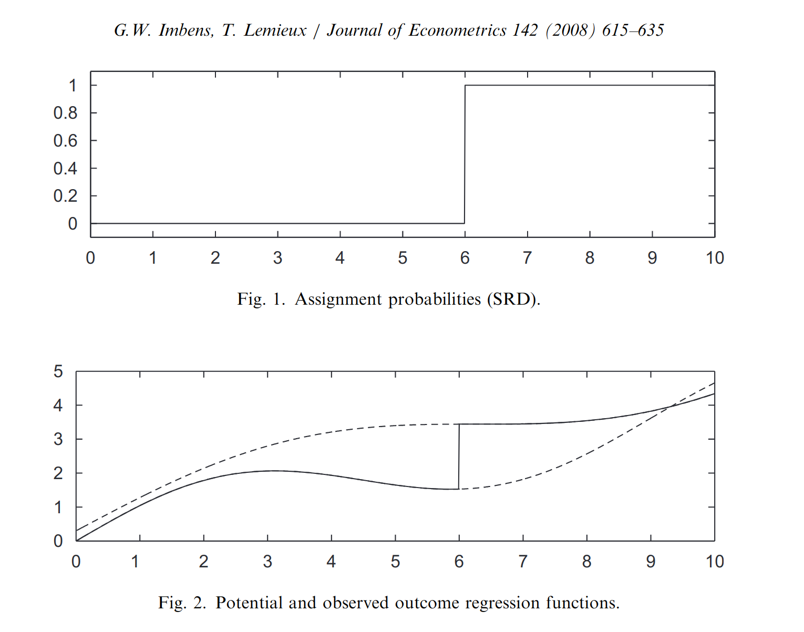
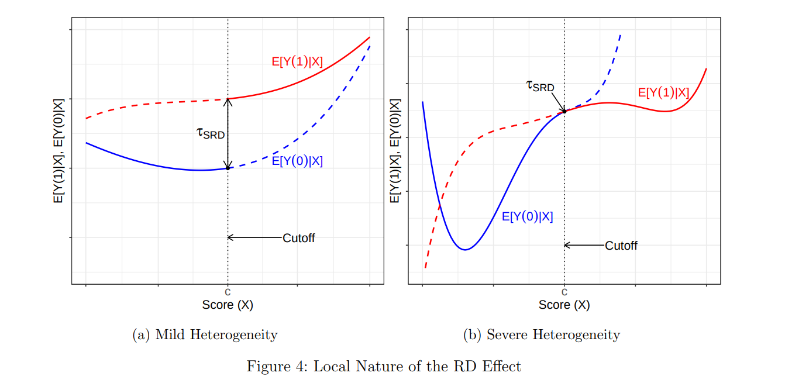
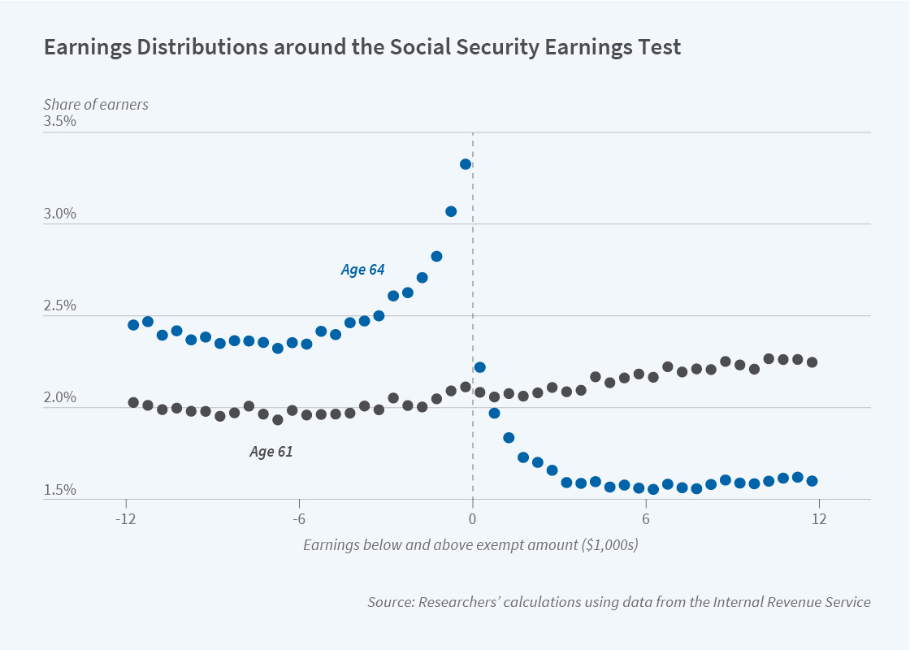

# Midterm 

- Overall, great work - not much curving needed:
  - 47-50: A
  - 45-47: A-
  - 44: B+
  - 40-43: B
  - 35-39: B-
  - Below 35: C

---

# Last two weeks

- Techniques for addressing **unobserved confounding**
--

- Instrumental variables
  - Find a randomized (natural) experiment that affects your treatment and doesn't affect the outcome any other way.
--

- Difference-in-differences
  - Find an outcome where we know treatment has no effect (e.g. *before* treatment starts)
  - Use the observed difference on that outcome to de-bias the comparison between treated and control.
      
---

# This week

- Another strategy for identification when there exists **unobserved confounding**
--

- **Regression Discontinuity Designs**: What if the treatment is assigned via a "cut-off" rule?
  - All units below the cut-off remain under control
  - All units above the cut-off get treated
--

- If there's an observed *discontinuity* in the outcome, that might be evidence of a causal effect if...
  - The conditional expectations of the potential outcomes are truly continuous at the cut-off
--

- Often described as "as-good-as-random" assignment near the cut-off.


---

class: title-slide

# Regression Discontinuity Designs
$$
  \require{cancel}
$$
```{r, echo=F, warning=F, message=F}
library(tidyverse)
library(estimatr)
library(haven)
options(digits=3)
```

---

# Randomization near a cut-off

.center[]

---

# Regression Discontinuity Designs

- Three components:
  - "Score"/"running"/"forcing" variable: $X_i$
  - Cut-off: $c$
  - Treatment is determined by $X_i$ and $c$
--

- $X_i$ is predictive of the potential outcomes - it's a confounder.
  - But all we'll need for identification is the *smoothness* of the CEFs of the potential outcomes around $c$
--

- Presence of an unexpected "jump" around $c$ is attributed to the causal effect of treatment.
--

- Examples from education:
  - Test score thresholds for allocating scholarships (Thistlewaite and Campbell, 1960)
  - Class size thresholds for splitting classes (Angrist and Lavy, 1999)
  - GPA thresholds for majors (Bleemer and Mehta, 2022)
--

- Examples from political science
  - Close elections! (Lee, 2008; Broockman, 2009; Gerber and Hopkins, 2011)

---

# Regression Discontinuity Designs

- Setup:
  - Treatment: $D_i \in \{0, 1\}$
  - Potential outcomes: $Y_i(1), Y_i(0)$
  - Observed outcomes (Consistency): $Y_i = Y_i(1)D_i + Y_i(0)(1- D_i)$
  - Score/running variable $X_i$
  - Threshold $c$

---

# Regression Discontinuity Designs

- **Sharp RD**: Treatment assignment is a deterministic function of the running variable $X_i$ and the cut-off $c$

$$D_i = \mathbb{1}(X_i \ge c) \text{  for all  } i$$
--

- Close (2 party) FPTP elections:
  - Candidates receiving above 50 percent (2-party) of the vote get elected
  - Candidates below 50 percent of the (2-party) vote do not.
--

- Sharp RD: Treatment is *deterministic*
  - Propensity score is a step function:
  
  $$P(D_i | X_i \ge c) = 1$$
  $$P(D_i | X_i < c) = 0$$

---

# Regression Discontinuity Designs

- **Assumption**: Continuity of the CEFs (around $c$):
  - We assume that $E[Y_i(0) | X_i = x]$ and $E[Y_i(1) | X_i = x]$ are continuous in $x$

--
- **Implications**:

  - The CEF of $Y_i(0)$ at $X_i = c$ is equal to the limit of the CEF from the bottom
  
  $$E[Y_i(0) | X_i = c] = \lim_{x \to c^{-}} E[Y_i(0) | X_i = x]$$

--

  - All units below the discontinuity take control. 

  $$E[Y_i(0) | X_i = c] = \lim_{x \to c^{-}} E[Y_i(0) | D_i = 0, X_i = x]$$
--

  - Then, by consistency

  $$E[Y_i(0) | X_i = c] = \lim_{x \to c^{-}} E[Y_i | X_i = x]$$
  
---

# Regression Discontinuity Designs

- The same holds for the CEF of $Y_i(1)$ but taking the limit from the top

$$E[Y_i(1) | X_i = c] = \lim_{x \to c^{+}} E[Y_i | X_i = x]$$

--

- We can therefore identify the treatment effect **at the threshold** using the difference in the one-sided limits

$$\begin{align*}\tau_{\text{SRD}} &= E[Y_i(1) - Y_i(0) | X_i = c]\\
&= E[Y_i(1) | X_i = c] - E[Y_i(0) | X_i = c]\\
&= \lim_{x \to c^{+}} E[Y_i | X_i = x] - \lim_{x \to c^{-}} E[Y_i | X_i = x]
\end{align*}$$
--

- **Intuition** - We use the data below and above the cut-off to *extrapolate* to the cut-off. The difference in extrapolations is our estimate of the ATE.
  - All we need is **continuity** in the CEFs
 
---

# Visualizing the sharp RD

.center[]

---

# Visualizing the sharp RD

.center[]

---

# Extrapolation

- How does RD compare to other identification strategies?
- Implicitly we have a selection-on-observables assumption: $D_i$ is perfectly determined by $X_i$ 
  - Conditional on $X_i$ it's independent of the potential outcomes
--

- But unlike selection-on-observables, we have **no overlap/positivity**
  - $P(D_i = 1 | X_i < c) = 0$
--

- RD relies on *extrapolation* from the observed treated/control observations to a common value of $X_i$ - the cut-off or threshold $c$.
  - Extrapolation can be very sensitive to model specification - works best when there are many observations near $c$

---

# Interpreting the RD Estimand

- Like IV, RD identifies a *local* average treatment effect
--

- What if we're not interested in the effect at the discontinuity but the effect for the sample as a whole?
  - **External validity** challenge - how much effect heterogeneity is there?
  
.center[]

---

# Violations of continuity

- What could cause the potential outcomes to be discontinuous around $c$?
--

- **Bunching/Sorting**
  - Suppose individuals knew the cut-off and could manipulate their $X_i$ to get (or avoid) treatment
  - Another selection-into-treatment problem.
  - Can diagnose by looking at the histogram of observations around the discontinuity.
--

- **Other "treatments"**
  - Sometimes other factors will be "assigned" by a discontinuity along with the treatment
  - Common with geographical RDs - a lot of things change across a border!

---

# Example of "bunching"

.center[]

Gelber et. al. (2021) "Misperceptions of the Social Security Earnings Test and the Actuarial Adjustment: Implications for Labor Force Participation and Earnings"

---

class: title-slide

# Estimation: Local Regression

---

# Estimation challenges

- With infinite data, we can get arbitrarily close to the true ATE at the discontinuity
  - More and more observations very close to $c$
--

- But with actual datasets, we might have very few observations *near* $c$.
  - Need to use observations that are further away and fit a *model* to extrapolate to the discontinuity.
--

- Bias-variance trade-off:
  - Using observations that are very far from the discontinuity might increase bias (especially if our assumptions on the CEF are wrong) but reduce variance.
  - Restricting us to only "close" observations might reduce bias but increase the variance.

---

# Binned scatterplots

- In a regression-discontinuity design, always plot your data!
  - Raw scatterplots are hard to interpret -- we want to start by trying to approximate the CEF without imposing any additional modeling assumptions
--

- **Binned scatterplots** - Plot the average of $Y_i$ within bins of $X_i$
  - Choice of binning method (equally spaced vs. quantile) and number of bins is a bias-variance trade-off
--

- Do we see the conditional expectation changing smoothly before and after the cut-point? Is there a visible gap at the cutpoint?

---

# Illustration: Incumbency Advantage

- Our running example will be the Lee (2008) "close elections" dataset.
- What is the size of the incumbency advantage in the U.S. House?
  - When Democrats barely win in time $t$ does it have an effect on their vote share in $t+1$?
--

- Variables
  - $X_i$ - Democratic margin of victory in time $t$
  - $Y_i$ - Democratic vote share in time $t+1$
  - $D_i$ - Victory in time $t$ (margin > $0$)


---

# Illustration: Incumbency Advantage

```{r, echo=T, message=F, fig.align="center", fig.height=5.5}
house = read_csv("assets/house.csv")
house$d <- as.integer(house$x >= 0)
house %>% ggplot(aes(x=x, y=y, colour=as.factor(d))) + geom_point() + geom_vline(xintercept=0, lty=2) + theme_bw() + theme(legend.position="none") + 
  xlab("Democratic margin of victory at time t") + ylab("Democratic vote share at time t+1")

```

---

# Illustration: Incumbency Advantage

```{r, echo=T, message=F, fig.align="center", fig.height=5.5}
house %>% ggplot(aes(x=x, y=y, colour=as.factor(d))) + 
  stat_summary_bin(fun='mean', bins=50, size=2, geom='point') +  geom_vline(xintercept=0, lty=2) + theme_bw() + theme(legend.position="none") + 
  xlab("Democratic margin of victory at time t") + ylab("Democratic vote share at time t+1")

```

---

# Illustration: Incumbency Advantage

```{r, echo=T, message=F, fig.align="center", fig.height=5.5}
house %>% filter(abs(x) < .2) %>% ggplot(aes(x=x, y=y, colour=as.factor(d))) + 
  stat_summary_bin(fun='mean', bins=20, size=2, geom='point') +  geom_vline(xintercept=0, lty=2) + theme_bw() + theme(legend.position="none") + 
  xlab("Democratic margin of victory at time t") + ylab("Democratic vote share at time t+1")

```

---

# Local polynomial regression

- **Goal**: Estimate $\lim_{x \to c^{+}} E[Y_i | X_i]$ and $\lim_{x \to c^{-}} E[Y_i | X_i]$
--

- Fit a *model* on the treated and control sides (respectively) and get the prediction at the cut-point.
- What *model*? A *local* polynomial regression
  - To reduce the approximation error from our choice of polynomial use only units with $X_i$ close to $c$ (within some bandwidth $h$)
  - Use the model to capture changes in $E[Y_i(d) | X_i = x]$ even near $c$
  
---

# Local polynomial regression

1. Choose a polynomial order $p$ and a kernel function $K(\cdot)$
  - Kernel captures how we should weight observations near the discontinuity vs. far
  - Lots of options: "triangular" is common (diminishing weight further from the discontinuity) but we'll just use a uniform kernel for this example.
--

2. Choose a bandwidth $h$
  - Observations outside of the bandwidth receive a weight of $0$. Observations inside the bandwidth get weight $K\left(\frac{X_i - c}{h}\right)$
  - With a uniform kernel, all observations get the same weight if they're inside the bandwidth
--

3. Fit a regression among observations $X_i \ge c$ of $Y_i$ on the polynomial of $(X_i - c), (X_i - c)^2, \dotsc, (X_i - c)^p$, weighting each observation by its kernel weight.

  $$\hat{E}[Y_i | X_i \ge x] = \hat{\mu}_{+} + \hat{\mu}_{+,1}(X_i - c) + \dotsc + \hat{\mu}_{+,p}(X_i - c)^p$$
--

4. Fit a regression among observations $X_i < c$ of $Y_i$ on the polynomial of $(X_i - c), (X_i - c)^2, \dotsc, (X_i - c)^p$,  weighting each observation by its kernel weight.

  $$\hat{E}[Y_i | X_i < x] = \hat{\mu}_{-} + \hat{\mu}_{-,1}(X_i - c) + \dotsc + \hat{\mu}_{-,p}(X_i - c)^p$$
--

5. Our RD estimate is the difference in intercepts from this regression: $\hat{\tau}_{\text{SRD}} = \hat{\mu}_+ - \hat{\mu}_-$

---

# Local polynomial regression

- We can do this all in a single regression with all polynomial terms interacted with the treatment variable
- Let's do a local *linear* fit with a bandwidth of $.1$ and a uniform kernel

```{r}
lm_robust(y ~ d + d*I(x-0), data=house %>% filter(abs(x) < .1))
```
- The coefficient on $d$ is the estimated gap at the discontinuity.

---

# Local polynomial regression

```{r, echo=T, message=F, fig.align="center", fig.height=5.5}
house %>% filter(abs(x) < .2) %>% ggplot(aes(x=x, y=y, colour=as.factor(d))) + 
  stat_summary_bin(fun='mean', bins=20, size=2, geom='point') + geom_smooth(method="lm_robust", formula = y ~ x, data=house %>% filter(abs(x) < .1)) +
  geom_vline(xintercept=0, lty=2) + geom_vline(xintercept=-.1, lty=3) + geom_vline(xintercept=.1, lty=3) + theme_bw() + theme(legend.position="none") + 
  xlab("Democratic margin of victory at time t") + ylab("Democratic vote share at time t+1")

```

---

# Local polynomial regression

```{r, echo=T, message=F, fig.align="center", fig.height=5.5}
house %>% filter(abs(x) < .2) %>% ggplot(aes(x=x, y=as.numeric(y>.5), colour=as.factor(d))) + 
  stat_summary_bin(fun='mean', bins=20, size=2, geom='point') + geom_smooth(method="lm_robust", formula = y ~ x, data=house %>% filter(abs(x) < .1)) +
  geom_vline(xintercept=0, lty=2) + geom_vline(xintercept=-.1, lty=3) + geom_vline(xintercept=.1, lty=3) + theme_bw() + theme(legend.position="none") + 
  xlab("Democratic margin of victory at time t") + ylab("Pr(Democratic victory at time t+1)")

```

---
