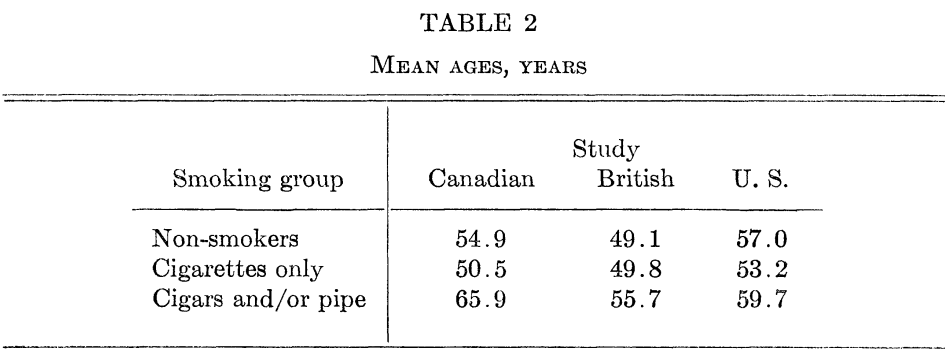
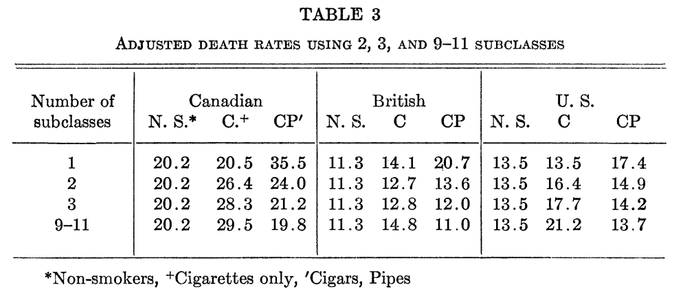

# Last three weeks

- Identification under *unobserved* confounding.
- **Solutions**: Make additional assumptions on the form of the confounding
--

- **Instrumental Variables**
  - Assume unobserved confounding doesn't affect the instrument.
--

- **Difference-in-differences**
  - Assume unobserved confounding affects "placebo" outcome the same way as the outcome of interest.
--

- **Regression discontinuity design**
  - No unobserved confounding in vicinity of a treatment assignment discontinuity

---

# Today

- Back to **selection on observables**!
--

- How can we diagnose our no unobserved confounders assumption?
  - What sorts of confounders would threaten our results (cause them to go to $0$).
--

- Omitted variable bias formula
  - Allows us to "sign the bias" of a proposed confounder based on the outcome-confounder and outcome-treatment relationships
--

- Sensitivity analysis
  - How bad of a hypothetical confounder would we need to break the result?
  - Provides a benchmark for any critiques of a selection-on-observables assumption.

---

class: title-slide

# Omitted variable bias
$$
  \require{cancel}
$$

```{r, echo=F, message=F, warning=F}
library(tidyverse)
library(estimatr)
options(digits=3)
```

---

# Omitted Variable Bias

- Let's return to our previous setting with treatment $D_i$ and outcome $Y_i$.
- Suppose there exists an omitted confounder $U_i$ and ignorability holds conditional on that omitted confounder. 
  - Suppose we ignore it and just use a simple difference-in-means estimator.
--

- What's the bias for the ATT? Recall our selection-into-treatment bias formula!

$$\underbrace{E[Y_i | D_i = 1] - E[Y_i | D_i = 0]}_{\text{Difference-in-means}} = \underbrace{E[Y_i(1) - Y_i(0) | D_i = 1]}_{\text{ATT}} + \bigg(\underbrace{E[Y_i(0) | D_i = 1] - E[Y_i(0) | D_i = 0]}_{\text{Selection-into-treatment bias}}\bigg)$$

---

# Omitted Variable Bias

- Let's write the selection bias conditioning on $U_i$

$$\text{Selection Bias} = \sum_{u \in \mathcal{U}} E[Y_i(0) | D_i = 1, U_i = u] Pr(U_i = u | D_i = 1) - \sum_{u \in \mathcal{U}} E[Y_i(0) | D_i = 0, U_i = u] Pr(U_i = u | D_i = 0)$$

--

- Ignorability conditional on $U_i$

$$\text{Selection Bias} = \sum_{u \in \mathcal{U}} E[Y_i(0) |  U_i = u] Pr(U_i = u | D_i = 1) - \sum_{u \in \mathcal{U}} E[Y_i(0) | U_i = u] Pr(U_i = u | D_i = 0)$$

--

- Combining terms

$$\text{Selection Bias} = \sum_{u \in \mathcal{U}} E[Y_i(0) |  U_i = u] \times \bigg(Pr(U_i = u | D_i = 1) -  Pr(U_i = u | D_i = 0)\bigg)$$

---

# Omitted Variable Bias

- Two elements to selection bias. First, if treatment assignment is independent of the confounder, then the bias is 0

$$\text{Selection Bias} = \sum_{u \in \mathcal{U}} E[Y_i(0) |  U_i = u] \times \bigg(Pr(U_i = u | D_i = 1) -  Pr(U_i = u | D_i = 0)\bigg)$$

--

- Second, if $Y_i(0)$ is independent of $U_i$, we have:

$$\text{Selection Bias} = \sum_{u \in \mathcal{U}} E[Y_i(0)] \times \bigg(Pr(U_i = u | D_i = 1) -  Pr(U_i = u | D_i = 0)\bigg)\\
\text{Selection Bias} = E[Y_i(0)] \times \bigg(\sum_{u \in \mathcal{U}}Pr(U_i = u | D_i = 1) -  \sum_{u \in \mathcal{U}} Pr(U_i = u | D_i = 0)\bigg)\\
\text{Selection Bias} = E[Y_i(0)] \times \bigg(1 -  1\bigg) = 0$$

--

- We get OVB/confounding when:
  1. $U_i$ is not independent of treatment
  2. $U_i$ is not independent of the potential outcomes

---

# Signing the bias

- Additionally, the bias is multiplicative. 
- Under some constant effects assumptions, we can get the direction of the bias of the difference-in-means relative to the ATT
  1. .blue[**Positive**] association between the confounder on outcome. .blue[**Positive**] association between confounder and treatment. .blue[**Positive**] bias.
  2. .blue[**Positive**] association between the confounder on outcome. .red[**Negative**] association between confounder and treatment. .red[**Negative**] bias.
  3. .red[**Negative**] association between the confounder on outcome. .blue[**Positive**] association between confounder and treatment. .red[**Negative**] bias.
  4. .red[**Negative**] association between the confounder on outcome. .red[**Negative**] association between confounder and treatment. .blue[**Positive**] bias.
    
---


# Example: Smoking and Cancer

- Back when the link between smoking and cancer was being debated, some researchers suggested that cigarettes might be a "healthy" alternative to pipe smoking
- Cochran (1968) uses this to illustrate adjustment by stratification

.center[]

1. What's the omitted confounder?
2. What's the direction of the bias due to the omitted confounder?

---

# Example: Smoking and Cancer

.center[]


---

# Example: Smoking and Cancer

.center[]

---

# OVB in linear models

- Suppose we want to identify the effect of $D$ on $Y$ conditional on pre-treatment covariates $\mathbf{X}$. Assume we're willing to assume a linear model for the outcome and that there exists one omitted covariate $Z$

$$Y = \hat{\tau} D + \mathbf{X}\hat{\beta} + \hat{\gamma} Z + \hat{\epsilon}$$
--

- What happens if we instead estimate the "restricted" model with $Z$ omitted?

$$Y = \hat{\tau}_{\text{res}} D + \mathbf{X}\hat{\beta}_{\text{res}} + \hat{\epsilon}_{\text{res}}$$

- What's the relationship between $\hat{\tau}_{\text{res}}$?

---

# OVB in linear models

- Let's define $D^{\perp \mathbf{X}}$ as the "partialled-out" value of $D$ (the residuals from a regression of $D$ on $X$).
  - Similarly define $Y^{\perp \mathbf{X}}$ as the "partialled-out" value of $Y$ given $X$
--

- By the Frisch-Waugh-Lovell theorem, we can write any regression coefficient in terms of the "partialled" bivariate regression

$$\hat{\tau}_{\text{res}} = \frac{\text{cov}(D^{\perp \mathbf{X}}, Y^{\perp \mathbf{X}})}{\text{var}(D^{\perp \mathbf{X}})}$$

--

- Using our definition of $Y$ (by the linear model)

$$\hat{\tau}_{\text{res}} = \frac{\text{cov}(D^{\perp \mathbf{X}}, \hat{\tau}D^{\perp \mathbf{X}} + \hat{\gamma}Z^{\perp \mathbf{X}})}{\text{var}(D^{\perp \mathbf{X}})}$$

--

- Properties of covariance

$$\hat{\tau}_{\text{res}} = \hat{\tau}\frac{\text{cov}(D^{\perp \mathbf{X}}, D^{\perp \mathbf{X}})}{{\text{var}(D^{\perp \mathbf{X}})}}  + \hat{\gamma}\frac{\text{cov}(D^{\perp \mathbf{X}}, Z^{\perp \mathbf{X}})}{\text{var}(D^{\perp \mathbf{X}})}$$


---


# OVB in linear models


- Simplifying

$$\hat{\tau}_{\text{res}} = \hat{\tau}  + \hat{\gamma}\frac{\text{cov}(D^{\perp \mathbf{X}}, Z^{\perp \mathbf{X}})}{\text{var}(D^{\perp \mathbf{X}})}$$

--

- We can recognize that the last term is the coefficient on $D$ from a regression of $Z$ on $D$ and $X$ (again using FWL) - let's call this $\hat{\delta}$

$$\hat{\tau}_{\text{res}} = \hat{\tau}  + \hat{\gamma}\hat{\delta}$$
--

- So the discrepancy between the "restricted"  and "unrestricted" models can be written as the product of two coefficients - the relationship between $Z$ and $Y$ (given $X$) and the relationship between $Z$ and $D$ (given $D$)

$$\widehat{\text{bias}} = \hat{\gamma}\hat{\delta}$$

---

# Signing the bias

- Gentzkow, Shapiro, Sinkinson (2011: AER) examine the effect of newspaper entry on political competitiveness in the US counties from 1869 to 1928.
  - Outcome: Presidential/congressional turnout
  - Treatment: Number of new newspapers 
  - Finding: More newspapers increase turnout.
--

- Consider some hypothetical confounders, in what direction would they bias the estimate?
  - **Population growth**: How would population growth affect newspaper entry? How would it affect turnout?
  - **Income growth** How would income growth affect newspaper entry and turnout?
--

- How would we expect either of these confounders to alter our estimate?

---

class: title-slide

# Sensitivity analyses

---

# Sensitivity analysis

- Sensitivity analyses ask the question "how bad of a violation of our identification assumptions would break our result?"
  - We use a parameter (or parameters) to represent the violation and re-do the analysis.
  - Vary the parameter over a (sensible) range - how often do our results appreciably change (e.g. become zero or flip sign)
--

- For a sensitivity analysis to **unobserved confounding**, we can specify the violation in terms of two parameters:
  - The partial regression coefficient between $Z$ and $Y$, $\hat{\gamma}$ 
  - The partial regression coefficient between $Z$ and $D$ $\hat{\delta}$
--

- Slightly annoying since each of these depends on the scale of $Z$ and $Y$ - can we re-write in terms of parameters with the same range irrespective of the outcome?
  - Cinelli and Hazlett (2020) provide a reparameterization in terms of the partial $R^2$ of two regressions involving $Z$ (which are always between $0$ and $1$)

---

# Rewriting the bias

- Start by defining the $R^2_{Z \sim D}$ as the $R^2$ from a regression of $Z$ on $D$.
  - For OLS: $R^2_{Z \sim D} = 1 - \frac{\text{Var}(Z^{\perp D})}{\text{Var}(Z)} = \text{cor}(Z, D)^2 = \left(\frac{\text{cov}(Z, D)}{\text{sd}(Z)\text{sd}(D)}\right)^2$
  - Same thing for the partial $R^2$: $R^2_{Z \sim D | \mathbf{X}} = \text{cor}(Z^{\perp \mathbf{X}}, D^{\perp \mathbf{X}})^2$
--

- Now write our bias term 

$$\widehat{\text{bias}} = \left(\frac{\text{cov}(D^{\perp \mathbf{X}}, Z^{\perp \mathbf{X}})}{\text{var}(D^{\perp \mathbf{X}})}\right) \left(\frac{\text{cov}(Y^{\perp \mathbf{X}, D}, Z^{\perp \mathbf{X}, D})}{\text{var}(Z^{\perp \mathbf{X}, D})}\right)$$

--

- Convert covariance to correlation

$$\widehat{\text{bias}} = \left(\frac{\text{cor}(D^{\perp \mathbf{X}}, Z^{\perp \mathbf{X}}) \text{sd}(Z^{\perp \mathbf{X}})}{\text{sd}(D^{\perp \mathbf{X}})}\right) \left(\frac{\text{cor}(Y^{\perp \mathbf{X}, D}, Z^{\perp \mathbf{X}, D})\text{sd}(Y^{\perp \mathbf{X}, D})}{\text{sd}(Z^{\perp \mathbf{X}, D})}\right)$$

---

# Rewriting the bias

- Rearrange terms

$$\widehat{\text{bias}} = \left(\frac{\text{cor}(D^{\perp \mathbf{X}}, Z^{\perp \mathbf{X}}) \text{cor}(Y^{\perp \mathbf{X}, D}, Z^{\perp \mathbf{X}, D})}{\frac{\text{sd}(Z^{\perp \mathbf{X},D})}{\text{sd}(Z^{\perp \mathbf{X}})}}\right) \left(\frac{\text{sd}(Y^{\perp \mathbf{X}, D})}{\text{sd}(D^{\perp \mathbf{X}})}\right)$$

--

- Square everything

$$\widehat{\text{bias}}^2 = \left(\frac{\text{cor}(D^{\perp \mathbf{X}}, Z^{\perp \mathbf{X}})^2 \text{cor}(Y^{\perp \mathbf{X}, D}, Z^{\perp \mathbf{X}, D})^2}{\frac{\text{var}(Z^{\perp \mathbf{X},D})}{\text{var}(Z^{\perp \mathbf{X}})}}\right) \left(\frac{\text{var}(Y^{\perp \mathbf{X}, D})}{\text{var}(D^{\perp \mathbf{X}})}\right)$$

--

- Substitute in the (partial) $R^2$ parameters

$$\widehat{\text{bias}}^2 = \left(\frac{R^2_{D \sim Z | \mathbf{X}} R^2_{Y \sim Z | \mathbf{X}, D}}{1- R^2_{D \sim Z|\mathbf{X}}}\right) \left(\frac{\text{var}(Y^{\perp \mathbf{X}, D})}{\text{var}(D^{\perp \mathbf{X}})}\right)$$


---

# Rewriting the bias

- Take the square root to get the absolute bias

$$|\widehat{\text{bias}}|= \sqrt{\frac{R^2_{D \sim Z | \mathbf{X}} R^2_{Y \sim Z | \mathbf{X}, D}}{1- R^2_{D \sim Z|\mathbf{X}}}}\left(\frac{\text{sd}(Y^{\perp \mathbf{X}, D})}{\text{sd}(D^{\perp \mathbf{X}})}\right)$$
--

- Some important intuitions
  - The bias is a *product* of the magnitude of the two $R^2$. An unobserved confounder that explains very little of the treatment needs to explain *a lot* of the outcome to induce a sizeable bias (and vice-versa)
  - The bias is smaller when the amount of variation in the outcome given $X$ and $D$ is low (not much $Y$ left to explain)
  - The bias is *amplified* when the variability in $D$ given $X$ is low.
  
---

# Illustration: Hazlett (2019)

- Hazlett (2019; JCR) examines the impact of exposure to violence on attitudes towards peace in the context of the war in Darfur.
  - Key finding: Refugees with greater exposure to violence are more likely to express support for peace - support for a "war-weariness" theory of attitudes during conflict.
  - Identification strategy: Selection-on-observables conditional on village and gender (plus other covariates).
  - Argues that exposure to violence by pro-government militias across villages was non-random but within-village often indiscriminate.
--

- How bad does the residual confounding need to be to break the result?

---

# Illustration: Hazlett (2019)

```{r, message=F}
library(sensemakr)
data('darfur')

darfur.reg <- lm(peacefactor ~ directlyharmed + village + female + age + farmer_dar + herder_dar + pastvoted + hhsize_darfur, data=darfur)
tidy(darfur.reg) %>% filter(term == "directlyharmed")
sd(darfur$peacefactor)

```

---

# Illustration: Hazlett (2019)

- We would like to generate a plot of how the results would change as we vary the two $R^2$ parameters by calculating the bias across each of the possible parameter values.
  - Need 3 dimensions (each $R^2$ plus the estimate)
  - Can do this manually...but extremely tedious - luckily Cinelli and Hazlett make a great R package `sensemakr`

```{r}
sensitivity <- sensemakr(model = darfur.reg,
                         treatment = "directlyharmed",
                         benchmark_covariates = "female",
                         kd = 1:3,
                         ky = 1:3,
                         q = 1,
                         alpha = .05,
                         reduce = T)
```

---

# Illustration: Hazlett (2019)

```{r,echo=F, fig.align="center", fig.width=9, fig.height=7}
plot(sensitivity)
```

---

# Illustration: Hazlett (2019)

- "Robustness Value" - consider a confounder that has an equal partial $R^2$ with the outcome and the treatment -- what's the smallest such $R^2$ necessary to drive the result to $0$ (or insignificance).

```{r}
sensitivity$sensitivity_stats
```

- While the $R^2$ stats do have an intuitive interpretation, there is no *absolute* scale for what constitutes a "robust" vs. "non-robust" result.
  - It depends *also* on how much unexplained variability there is in the outcome. 
  - Useful to *benchmark*  the unobserved confounding against other known confounders 

---

# Illustration: Hazlett (2019)

- Consider the previous contour plot - the red points indicate bias under hypothetical confounding that is $1x$, $2x$, and $3x$ as strong as gender
- Why pick gender (versus any other observed confounder)?
  - We have prior theoretical reasons to believe it's strongly associated with both outcome and treatment.
--

- Caution with *informal* benchmarking - Cinelli and Hazlett (2020) show that just calculating the observed partial $R^2$s for the benchmarks can be inaccurate.
    - Estimates of how $X$ relates to $Y$ may be biased due to omission of $Z$.
    - Also $D$ is a collider.
- C+H (2020) derive formal bounds for the "benchmark" exercise with a set of observed covariates.
  
---

# Summary

- Sensitivity analyses are a tool for *arguing*
  - You can always find values of the sensitivity parameters for which the results fail to hold
  - You can always find values of the senstiviity parameters for which the results *do* hold.
--

- What sensitivity analyses do is describe how *severe* a violation of selection-on-observables needs to be in order to threaten the main conclusions.
  - (e.g.) Smoking and cancer -- even if there were some unobserved confounder it would need to explain an *enormous* amount of variance for us to conclude no effect.
--

- Norms are developing about sensitivity analyses and reporting in observational designs
  - "Robustness Values" and contour plots
  - How best to "benchmark" -- what to benchmark against
--

- Don't be surprised if your reviewers start requesting these!
---